```{r init}
#| echo: FALSE
#| warning: FALSE
#| message: FALSE
#| results: 'hide'

#if (!grepl("montepomi", getwd())) {
if(Sys.info()[["user"]] == 'joliviero'){
setwd("D:/workspace/DIASPARA_WP3_migdb/R")
datawd <- "D:/DIASPARA/wgbast"
} else if (Sys.info()[["user"]] == 'cedric.briand'){
setwd("C:/workspace/DIASPARA_WP3_migdb/R")
datawd <- "C:/Users/cedric.briand/OneDrive - EPTB Vilaine/Projets/DIASPARA/wgbast"
}
source("utilities/load_library.R")
load_library("tidyverse")
load_library("knitr")
load_library("kableExtra")
load_library("icesVocab")
load_library("readxl")
load_library("janitor")
load_library("skimr")
load_library("RPostgres")
load_library("yaml")
load_library("DBI")
load_library("ggplot2")
load_library("sf")
load_library("janitor") #
load_library("htmltools") 
load_library("leaflet")
cred <- read_yaml("../credentials.yml")
# con_diaspara <- dbConnect(Postgres(), 
#                            dbname = cred$dbnamehydro,
#                            host = cred$hostmercure,
#                            port = cred$port,
#                            user = cred$usermercure,
#                            password = cred$passwordmercure)
con_diaspara <- dbConnect(Postgres(), 
                          dbname = cred$dbnamediaspara,
                          host = cred$hostdistant,
                          port = cred$port,
                          user = cred$userdiaspara,
                          password = cred$passworddiaspara)

```

# Dam database for diadromous fish (and others)

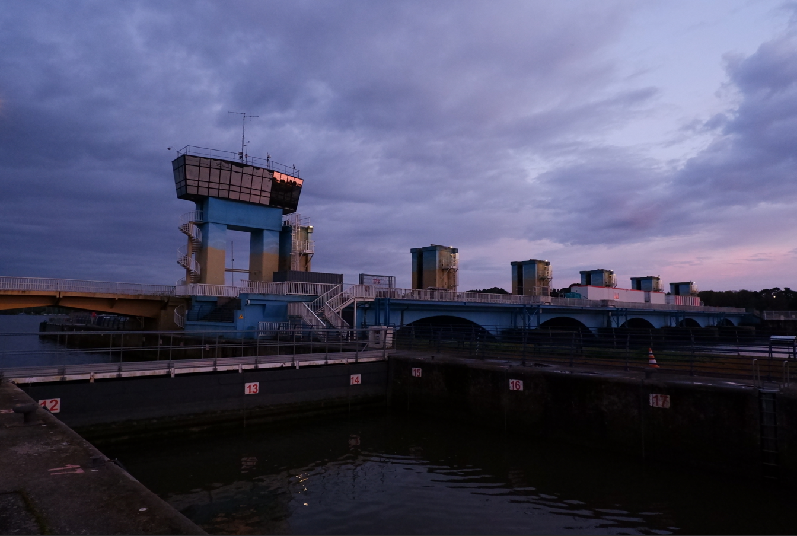

## ABOUT DIADROMOUS SPECIES

::::: columns
::: {.column .incremental width="40%"}
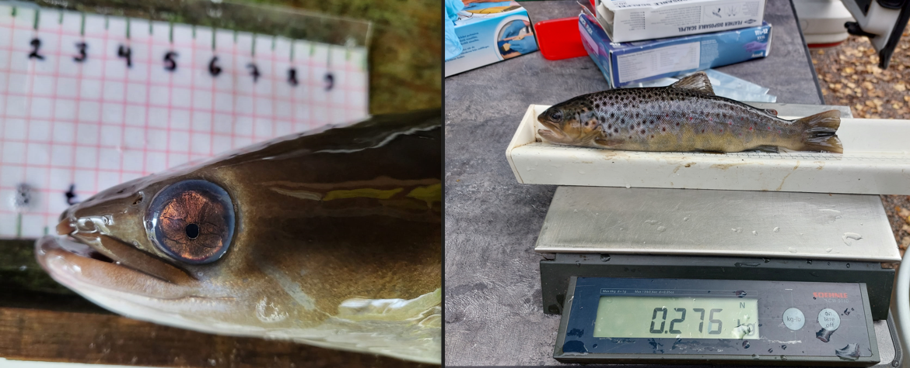{width="370"} 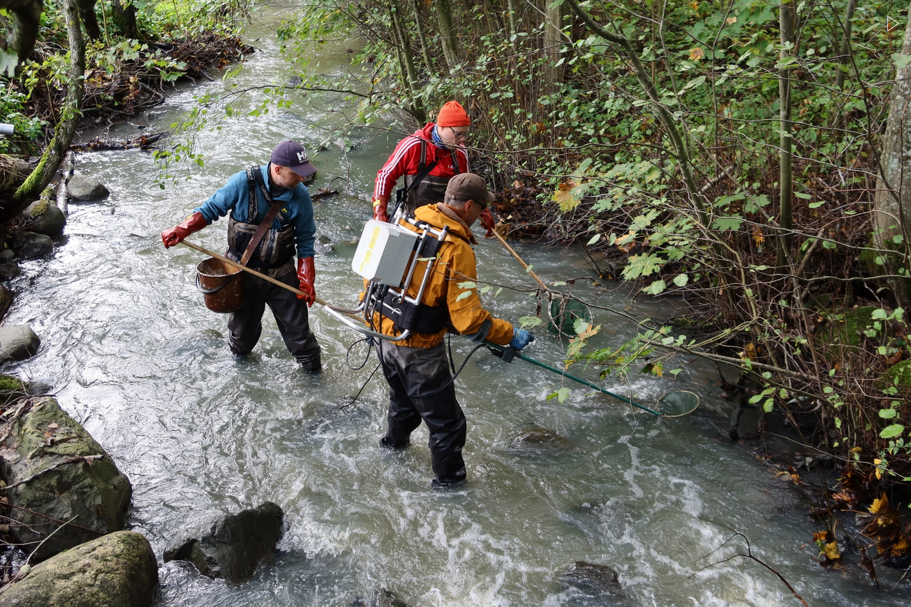{width="370"}
:::

::: {.column width="60%"}
[**Many diadromous species:**]{style="font-size:45px"}

-   Upstream migration, effects of dams, fishways, on habitat availability
-   Downstream migration (including, restocking/fishways), dam mortality
-   **Salmon, eel, trout** + shad, lamprey, etc
:::
:::::

# Habitat DB - the base for everything

::::: columns
::: {.column width="40%"}
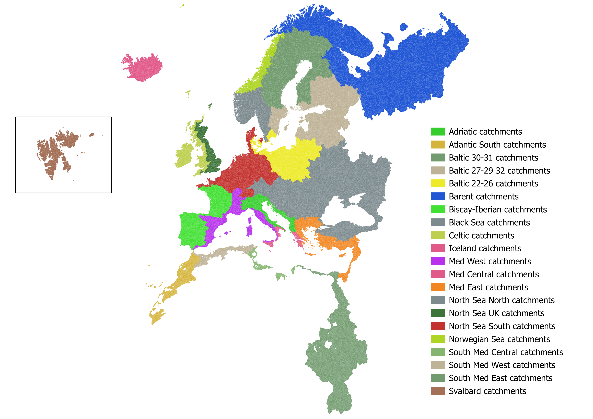{#fig-hdb}
:::

::: {.column .incremental width="60%"}
-   River network and catchments, all linking to marine areas used in ICES assessment
-   Hierchical structure
-   Everything is on Zenodo (https://zenodo.org/records/15856191)
:::
:::::

## Habitat DB hierarchical structure

{#fig-hierbast alt="WGBAST Hierarchical structure"}

## Habitat DB hierarchical structure : River

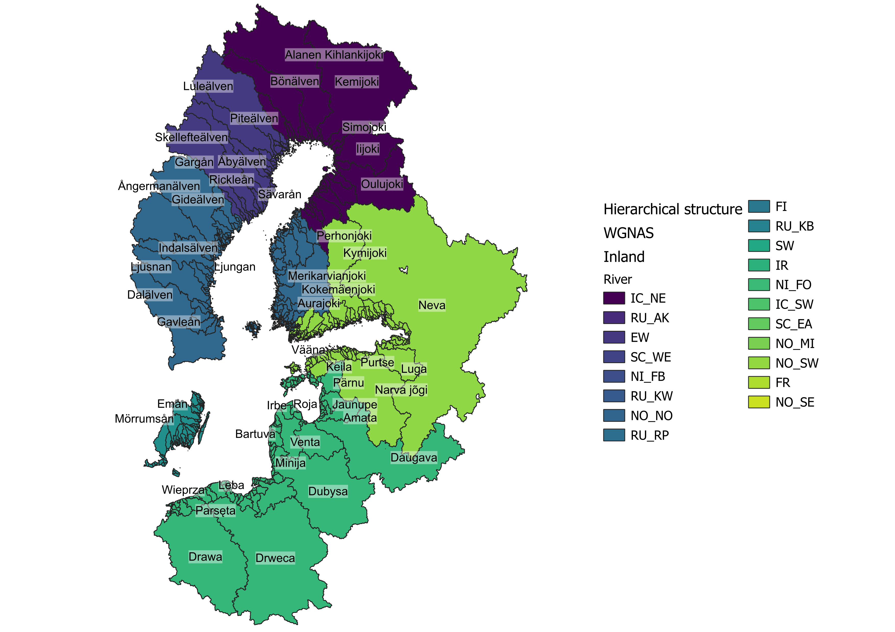

## This presentation

:::: columns
::: {.column .incremental width="40%"}
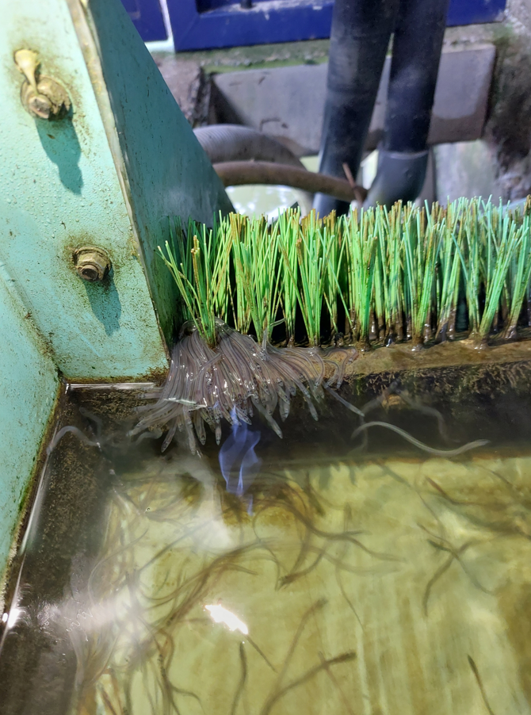{width="542"}

[**Regional and Global (Spatial) Models**]{style="font-size:45px"}

These use the habitat information, including dams and freshwater habitat
:::
::::

# Regional aspects, EDA examples

::::: columns
::: {.column .incremental width="40%"}
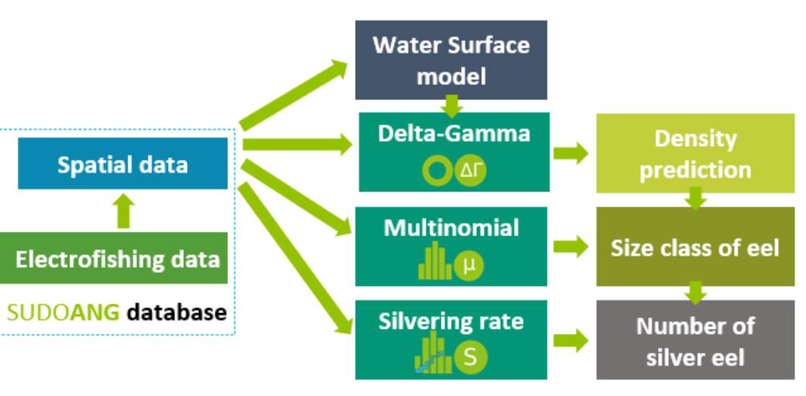
:::

::: {.column width="60%"}
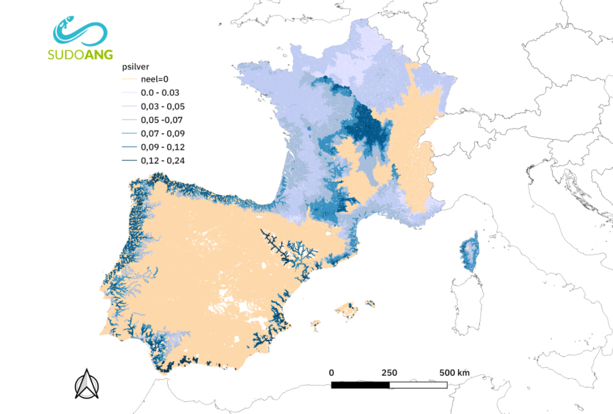
:::
:::::

# Regional aspects, EDA examples

-   Hydrographic network, obstacles and electrofishing information needed!

::: r-stack
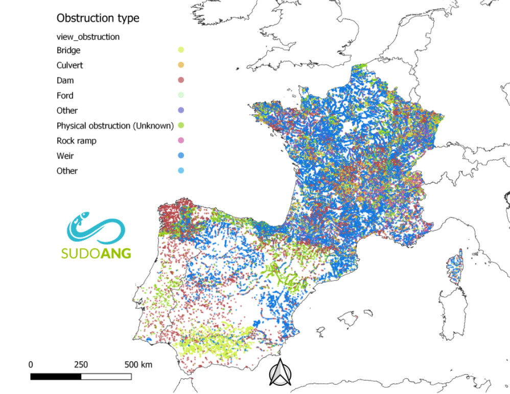{.fragment height="300"}

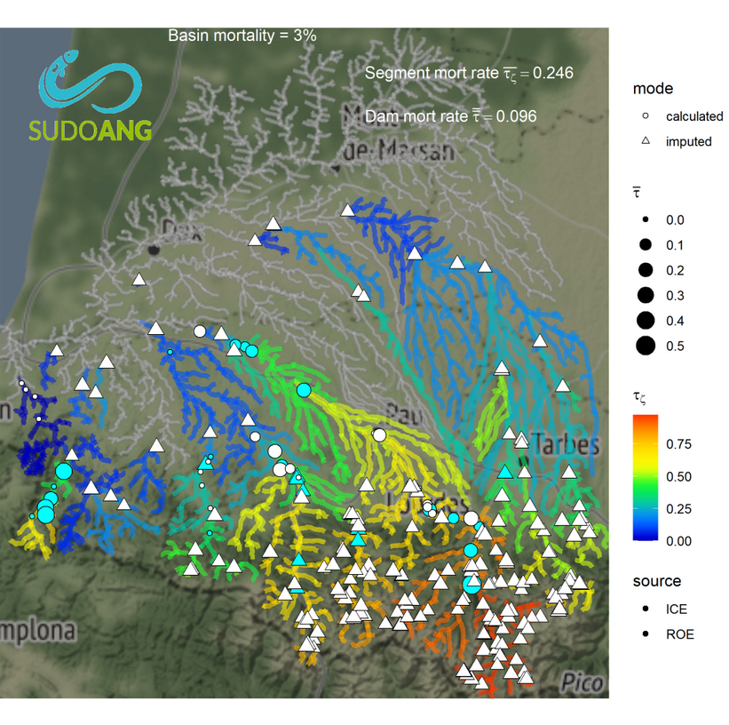{.fragment height="400"}
:::

# Regional aspects, EDA examples

-   To quantify mortality linked with dams (downstream migration):

    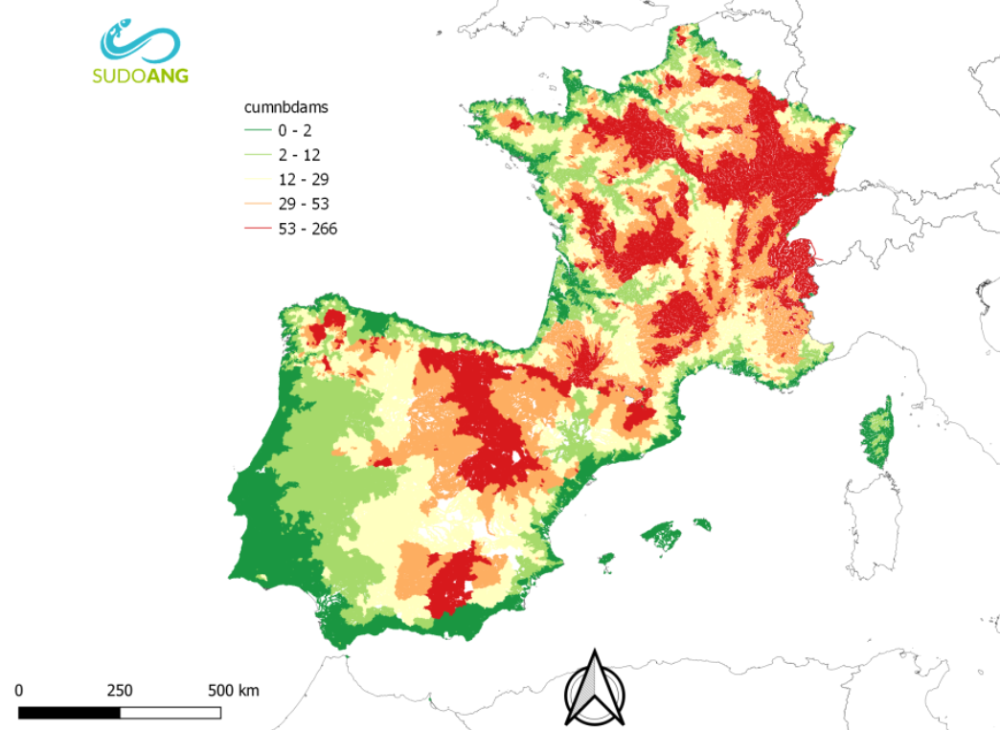

## This presentation

::::: columns
::: {.column .incremental width="40%"}
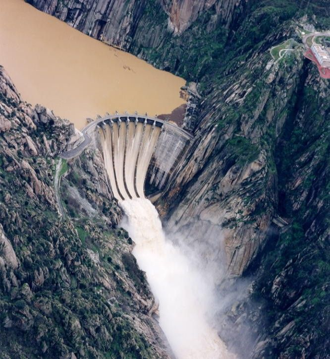
:::

::: {.column width="60%"}
[**Database development and:**]{style="font-size:45px"}

-   [**Migration obstacles**]{style="font-size:40px"}

For habitat availability, mortality, ...
:::
:::::

# DAM DATABASE

:::: columns
::: {.column width="50%"}
```{mermaid}
%%| fig-cap: Simplied structure of the dam database
flowchart TB
    A([Obstruction place]):::table
    %% Short Path
    A --> B([Obstruction]):::table
    B -->|Upstream| F([fish passage]):::table
    B -->|Downstream| C([Hydro Power Plant]):::table
    C --> D([Turbine]):::table    
    classDef table fill:#CD88
    classDef main fill:#268073,color:white
```
:::
::::

## DAM DATABASE : Obstruction place

::::: columns
::: {.column width="50%"}
```{mermaid}
%%| fig-cap: Simplied structure of the dam database
flowchart TB
    A([Obstruction place]):::main
    %% Short Path
    A --> B([Obstruction]):::table
    B -->|Upstream| F([fish passage]):::table
    B -->|Downstream| C([Hydro Power Plant]):::table
    C --> D([Turbine]):::table    
    classDef table fill:#CD88
    classDef main fill:#268073,color:white
```
:::

::: {.column width="50%"}
-   Obstruction place is a point on the map
-   It has a hierarchy (dam related to other dams in braided network)
-   It belongs to a country (by inheritance), so dam data are filled in and replaced at the national level
-   Class following AMBER + sudoang

```{mermaid}

flowchart TB
    A([Obstruction place]):::table
    %% Short Path
    A --> B([Obstuction place FR]):::table
    A --> C([Obstuction place ES]):::table 
    A --> D([Obstuction place ...]):::table      
    classDef table fill:#CD88
    classDef main fill:#268073,color:white
```
:::
:::::

## DAM DATABASE : Obstruction place

```{r}
#| label: tbl-obstruction_place
#| echo: FALSE
#| eval: TRUE
#| warning: FALSE
#| html-table-processing: none


# dam <-dbGetQuery(con_diaspara, "SELECT 
# op_placename,
# op_op_id,
# op_id_original,
# op_country
#  FROM dam_france.obstruction_place limit 500;")

# save(dam, file="data/presentation_dam_op.Rdata")
load(file="data/presentation_dam_op.Rdata")

 dam |> 
 DT::datatable(rownames = FALSE,
  options = list(
    pageLength = 7,        
    scrollX= TRUE   
  )
) |>
  htmltools::tagList(
   

    tags$style(HTML("
      /* Table cells */
      table.dataTable td {
        font-size: 0.6em;
      }

      /* Table headers */
      table.dataTable th {
        font-size: 0.65em;
      }

      /* Control bar: search input, pagination, etc. */
      .dataTables_wrapper .dataTables_filter,
      .dataTables_wrapper .dataTables_length,
      .dataTables_wrapper .dataTables_info,
      .dataTables_wrapper .dataTables_paginate {
        font-size: 0.70em;
      }
    "))

  )

```

## DAM DATABASE : Obstruction place

```{r}
#| label: fig-obstruction_place
#| echo: FALSE
#| eval: TRUE
#| warning: FALSE
#| fig-cap: "A subsample of the dam database in France"

# query <- "SELECT op_id_original,
#                  op_placename, 
#                  ob_height, 
#                  ot.no_code as type,                 
#                  geom 
#           FROM dam_france.obstruction_place op
#           JOIN dam_france.obstruction o
#              ON ob_op_id = op_id
#           JOIN nomenclature.obstruction_type ot
#              ON ob_obstruction_type_no_id = ot.no_id
#           JOIN refeel.tr_area_are are ON 
#           st_intersects(st_transform(op.geom, 4326), are.geom_polygon)
#           WHERE are_code = 'FR_Bret'
#           AND ob_ending_date = '2035-01-01'
#           "
# query2 <- "SELECT are1.are_id, are1.geom_line FROM refnas.tr_area_are are1 
#           JOIN refeel.tr_area_are are2 ON 
#           st_intersects(are1.geom_line, are2.geom_polygon)
#           WHERE are2.are_code = 'FR_Bret'
#           AND  are1.are_lev_code = 'River_section'"


# layer <- st_read(dsn = con_diaspara, query = query) |> 
#          sf::st_transform(4326) 
# layer_riv <- st_read(dsn = con_diaspara, query = query2) 


# save(layer, layer_riv, file = "data/dammap_presentation.Rdata")
load(file = "data/dammap_presentation.Rdata")
layer <- layer |>
          mutate(label = sprintf(
            '%s <br>	
             code: %s <br>
             type: %s <br>				
					   h: %1.2f,<br> ',
            stringi::stri_trans_general(layer$op_placename, "latin-ascii"),
            layer$op_id_original,
            layer$type,            
            layer$ob_height
          )) 
layer$size <-  1+log(layer$ob_height+1) #  range 1-13
layer$size[is.na(layer$size)] <- 0.01
layer$type[is.na(layer$type)]<-"NA"
layer$type <- as.factor(layer$type)
cols <- RColorBrewer::brewer.pal(length(levels(layer$type)),name ="Set1")
colorfun <- leaflet::colorFactor(cols, layer$type)


l <- leaflet::leaflet() |>
     leaflet::addPolylines(data= layer_riv, 
     opacity=0.5,
     fillOpacity = 0.2
     ) |>
     leaflet::addScaleBar(options = leaflet::scaleBarOptions(imperial = FALSE)) |>
     leaflet::addProviderTiles(leaflet::providers$CartoDB.DarkMatter) |>
     leaflet::addCircleMarkers(
        data = layer[1:500,],
        popup = ~label,
        color = ~colorfun(type),       
        radius = ~size       
      ) |>
      leaflet::addLegend(
        position="topright",
        colors = cols,
        labels = levels(layer$type),
        opacity = 1)
    
l

```

## DAM DATABASE : Physical obstruction

::::: columns
::: {.column width="50%"}
```{mermaid}
%%| fig-cap: Simplied structure of the dam database
flowchart TB
    A([Obstruction place]):::table
    %% Short Path
    A --> B([Obstruction]):::main
    B -->|Upstream| F([fish passage]):::table
    B -->|Downstream| C([Hydro Power Plant]):::table
    C --> D([Turbine]):::table    
    classDef table fill:#CD88
    classDef main fill:#268073,color:white
```
:::

::: {.column width="50%"}
-   Physical obstruction has date of start and end
-   Events (Erasement, change of height change dam period)
-   Fishway types
-   Downstream water depth
:::
:::::

## DAM DATABASE : Physical obstruction

```{r}
#| label: tbl-obstruction
#| echo: FALSE
#| eval: TRUE
#| warning: FALSE
#| html-table-processing: none


# dam_ob <-dbGetQuery(con_diaspara, "SELECT 
# * FROM dam_france.obstruction limit 100;")

# save(dam_ob, file="data/presentation_dam_ob.Rdata")
load(file="data/presentation_dam_ob.Rdata")

 dam_ob |> 
 DT::datatable(rownames = FALSE,
  options = list(
    pageLength = 5,        
    scrollX= TRUE   
  )
)|>
  htmltools::tagList(
   

     htmltools::tags$style(HTML("
      /* Table cells */
      table.dataTable td {
        font-size: 0.6em;
      }

      /* Table headers */
      table.dataTable th {
        font-size: 0.65em;
      }

      /* Control bar: search input, pagination, etc. */
      .dataTables_wrapper .dataTables_filter,
      .dataTables_wrapper .dataTables_length,
      .dataTables_wrapper .dataTables_info,
      .dataTables_wrapper .dataTables_paginate {
        font-size: 0.70em;
      }
    "))

  )

```

## DAM DATABASE : assessment of passability

```{mermaid}
%%| fig-cap: Simplied structure of the dam database
flowchart TB
    A([Obstruction place]):::table
    %% Short Path
    A --> B([Obstruction]):::table
    B -->|Upstream| F([fish passage]):::main
    B -->|Downstream| C([Hydro Power Plant]):::table
    C --> D([Turbine]):::table    
    classDef table fill:#CD88
    classDef main fill:#268073,color:white
```

## DAM DATABASE : assessment of passability

```{r}
#| label: tbl-fishway
#| echo: FALSE
#| eval: TRUE
#| warning: FALSE
#| html-table-processing: none


 dam_fi <-dbGetQuery(con_diaspara, "SELECT 
 fi_id_original, 
 species.no_name,
 fi_presence_pass,
 fi_date
  FROM dam_france.fishway  
  JOIN nomenclature.species on species.no_id=fi_species_id
  limit 100;")

 save(dam_fi, file="data/presentation_dam_fi.Rdata")
load(file="data/presentation_dam_fi.Rdata")

 dam_fi |> 
 DT::datatable(rownames = FALSE,
  options = list(
    pageLength = 5,        
    scrollX= TRUE   
  )
)|>
  htmltools::tagList(
   

     htmltools::tags$style(HTML("
      /* Table cells */
      table.dataTable td {
        font-size: 0.6em;
      }

      /* Table headers */
      table.dataTable th {
        font-size: 0.65em;
      }

      /* Control bar: search input, pagination, etc. */
      .dataTables_wrapper .dataTables_filter,
      .dataTables_wrapper .dataTables_length,
      .dataTables_wrapper .dataTables_info,
      .dataTables_wrapper .dataTables_paginate {
        font-size: 0.70em;
      }
    "))

  )

```

## DAM DATABASE : Hydro Power Plants

```{mermaid}
%%| fig-cap: Simplied structure of the dam database
flowchart TB
    A([Obstruction place]):::table
    %% Short Path
    A --> B([Obstruction]):::table
    B -->|Upstream| F([fish passage]):::table
    B -->|Downstream| C([Hydro Power Plant]):::main
    C --> D([Turbine]):::table    
    classDef table fill:#CD88
    classDef main fill:#268073,color:white
```

## DAM DATABASE : Hydro Power

```{r}
#| label: tbl-hpp
#| echo: FALSE
#| eval: TRUE
#| warning: FALSE
#| html-table-processing: none
#| tbl-cap: Hydropower plant table


 dam_hpp <-dbGetQuery(con_diaspara, "SELECT 
 *
  FROM dam_france.hpp   
  limit 100;")

 save(dam_hpp, file="data/presentation_dam_hpp.Rdata")
load(file="data/presentation_dam_hpp.Rdata")

 dam_hpp |> 
 DT::datatable(rownames = FALSE,
  options = list(
    pageLength = 5,        
    scrollX= TRUE   
  )
)|>
  htmltools::tagList(
   

     htmltools::tags$style(HTML("
      /* Table cells */
      table.dataTable td {
        font-size: 0.6em;
      }

      /* Table headers */
      table.dataTable th {
        font-size: 0.65em;
      }

      /* Control bar: search input, pagination, etc. */
      .dataTables_wrapper .dataTables_filter,
      .dataTables_wrapper .dataTables_length,
      .dataTables_wrapper .dataTables_info,
      .dataTables_wrapper .dataTables_paginate {
        font-size: 0.70em;
      }
    "))

  )

```

## DAM DATABASE : Turbines

```{mermaid}
%%| fig-cap: Simplied structure of the dam database
flowchart TB
    A([Obstruction place]):::table
    %% Short Path
    A --> B([Obstruction]):::table
    B -->|Upstream| F([fish passage]):::table
    B -->|Downstream| C([Hydro Power Plant]):::table
    C --> D([Turbine]):::main    
    classDef table fill:#CD88
    classDef main fill:#268073,color:white
```

## DAM DATABASE : Turbines

::::: columns
::: {.column width="50%"}
```{r}
#| label: tbl-turbines
#| echo: FALSE
#| eval: TRUE
#| warning: FALSE
#| html-table-processing: none
#| tbl-cap: Hydropower plant table


 dam_turb <-dbGetQuery(con_diaspara, "SELECT 
 *
  FROM dam_france.turbine  
  limit 100;")

 save(dam_turb, file="data/presentation_dam_turb.Rdata")
load(file="data/presentation_dam_turb.Rdata")

 dam_turb |> 
 DT::datatable(rownames = FALSE,
  options = list(
    pageLength = 5,        
    scrollX= TRUE   
  )
)|>
  htmltools::tagList(
   

     htmltools::tags$style(HTML("
      /* Table cells */
      table.dataTable td {
        font-size: 0.6em;
      }

      /* Table headers */
      table.dataTable th {
        font-size: 0.65em;
      }

      /* Control bar: search input, pagination, etc. */
      .dataTables_wrapper .dataTables_filter,
      .dataTables_wrapper .dataTables_length,
      .dataTables_wrapper .dataTables_info,
      .dataTables_wrapper .dataTables_paginate {
        font-size: 0.70em;
      }
    "))

  )

```
:::

::: {.column width="50%"}
<br> <br>

```{r}
#| label: tbl-turbines_type
#| echo: FALSE
#| eval: TRUE
#| warning: FALSE
#| html-table-processing: none
#| tbl-cap: Hydropower plant table


 turb_type <-dbGetQuery(con_diaspara, "SELECT 
 *
  FROM nomenclature.turbine_type;")

 save(turb_type, file="data/presentation_turb_type.Rdata")
load(file="data/presentation_turb_type.Rdata")

 turb_type |> 
 DT::datatable(rownames = FALSE,
  options = list(
    pageLength = 5,        
    scrollX= TRUE   
  )
)|>
  htmltools::tagList(
   

     htmltools::tags$style(HTML("
      /* Table cells */
      table.dataTable td {
        font-size: 0.6em;
      }

      /* Table headers */
      table.dataTable th {
        font-size: 0.65em;
      }

      /* Control bar: search input, pagination, etc. */
      .dataTables_wrapper .dataTables_filter,
      .dataTables_wrapper .dataTables_length,
      .dataTables_wrapper .dataTables_info,
      .dataTables_wrapper .dataTables_paginate {
        font-size: 0.70em;
      }
    "))

  )

```

## 
:::

## 
:::::

# Summary

-   The river network exists, it will be referenced by ICES working groups

-   Need to add migration obstacles data

-   Different species need same info, but there are also differences (up- & downstream migration, etc.)

# Thank you!