\listoftables

<!-- THIS IS INTRO FOR STOCKDB -->

# EXECUTIVE SUMMARY

The current poor status of several diadromous fish species, most notably the Atlantic salmon and the European eel, highlights the urgent need for effective management and scientifically robust assessment procedures. Achieving this requires high‑quality, coherent and accessible data, as conservation and management decisions can only be as reliable as the information on which they rely. Yet, despite the ecological and socio‑economic importance of these species, the data required to monitor their populations and pressures remain highly fragmented, scattered across institutions, stored in heterogeneous formats, and often maintained in locally developed systems. Such dispersion poses major limitations for transparency, reproducibility, long‑term maintenance, and ultimately for the provision of sound scientific advice.
Atlantic salmon and European eel share life cycles that span both continental and marine ecosystems, inside and outside Europe. Although populations behave as relatively independent units in freshwater, they are biologically mixed during their marine phases, which requires coordination at regional and international scales for data collection, assessment, and management. Moreover, these species face multiple anthropogenic impacts, including fisheries, habitat degradation, and fragmentation caused by dams and hydropower plants, further emphasizing the need for robust and harmonized data systems. 

In this context, the International Council for the Exploration of the Sea (ICES) plays a central role in providing independent, high‑quality scientific advice for fisheries management, coordinating international expert groups that evaluate stock status and develop methodologies to support evidence‑based decision making. However, current ICES working groups (WGEEL, WGNAS and WGBAST) rely on locally maintained, heterogeneous databases and spreadsheets, an approach that hampers operability, transparency and long‑term sustainability, and is incompatible with the future Transparent Assessment Framework (TAF) aspirations (an ICES methodology and platform developed by to ensure that scientific assessments of fishery resources are fully transparent, reproducible, and auditable). To address these challenges, DIASPARA has developed the DIASPARA Fish Stock Database (StockDB), a new standardized and centralized database designed to support the assessment of diadromous fish species. StockDB consolidates biological data, fisheries information, habitat descriptors, and impact metrics (including dam‑related pressures), integrating datasets from legacy ICES databases. 

To do so, our work was carried out in different steps.

 * The first was to review the databases and working procedures of three ICES expert groups related to diadromous species were analyzed: WGNAS, WGBAST and WGTRUTTA. These analyses, carried out after contacting and holding meetings with the experts involved in these groups, resulted in three dedicated reports:[WGNAS](https://diaspara.bordeaux-aquitaine.inrae.fr/deliverables/wp3/p4/rep1.html), [WGBAST](https://diaspara.bordeaux-aquitaine.inrae.fr/deliverables/wp3/p5/rep2.html), [WGTRUTTA](https://diaspara.bordeaux-aquitaine.inrae.fr/deliverables/wp3/p6/rep3.html). An analysis of the WGEEL database was not required, as the leaders of this work package have been directly involved in its development and maintenance, and therefore already have an in‑depth understanding of its structure and functioning.

* The second phase consisted of finding a database structure suiting the needs of all expert groups. ICES could only maintain one common structure for all diadromous working group, so we needed to merge all datasets into one database. The main structure of the database was presented and discussed, including potential improvements, during an online
DIASPARA meeting : [database structure](https://projets_eabx.pages.mia.inra.fr/diaspara/fr/deliverables/wp3/p2/diaspara_WP3_Tuesday_presentation.html#/section-1). This structure enables the efficient storage, harmonisation and retrieval of the data needed to run international stock assessment models used by the working groups responsible for producing advice or scientific reports on diadromous species. Its design builds on, and remains consistent with, the architectures previously developed for the WGEEL and WGNAS databases. The objective here was to remain as close to possible to the current working format of the different working groups, so as to be able to continue operating with the minimal changes on scripts and tools. 

* The third phase consisted in coding the whole database structure. It included referential tables (a set of standardized and controlled vocabularies) that would be compatible with vocabularies currently used in ICES. This part was done in constant contact with ICES data center to ensure the compatibility with ICES standards. Step by step we also tested that we could import all data into the stock database and ensuring that the resulting structure was fully operational and usable across all working groups, thereby complementing the earlier work of designing the database structure by validating it with real datasets and practical workflows. It's only when trying to practically import the data that missing elements were found, and that the final database structure was validated.

* At the end of this process, the diadromous fish database stores raw data (biometry, time series of abundance), preprocessed data used by models (e.g. landings at various scales, biomass ...), model parameters and outputs. 

For ease of use, the report is structured with four main parts.

  * The first describes some principle about the database and it's structure.
  * The second creates all the vocabularies (standard set of code alongside with their description used as reference for stage, species). Think of them as "dictionaries" of possible words and that the database would only be able to use those words as standard and not invent new ones.
  * The third refers to the ***Stock*** and holds values aggregated at the
scale of the assessment unit, or stock unit. 
  * The fourth is the ***Series and Trait*** and allows to have time series of data, group and individual life history trait data. This was previously coded in a separate report which has been merged into this main DIADROMOUS DATABASE report at the end of the project for ease of reading.

Additionally, to accommodate both structures, a habitat database was created using a hierarchical structure of the habitat of the migratory fishes (see [habitat report]()).
The script to create this report can be found in diaspara github [code of the report](https://github.com/DIASPARAproject/WP3_migdb/blob/main/R/stockdb.qmd), the SQL codes are found in the following link
 [SQL code](https://github.com/DIASPARAproject/WP3_migdb/tree/main/SQL).


::: {.callout-important appearance="simple"}
All the code (R, SQL), reports (Quarto), and presentations (Quarto) were produced in [DIASPARA migDB github repository](https://github.com/DIASPARAproject/WP3_migdb)

The code to this report is available [here](https://github.com/DIASPARAproject/WP3_migdb/blob/main/R/diadromousdb.qmd)

The SQL code is [here](https://github.com/DIASPARAproject/WP3_migdb/tree/main/SQL) 

All presentation, reports produced by WP3 are accessible online at the [diaspara website for WP3](
https://diaspara.bordeaux-aquitaine.inrae.fr/workpackage3.html)
:::

# HIERARCHICAL STRUCTURE OF THE DATABASE {#sec-hierarchical}

Tables are first created in a schema containing all tables, called `ref` or `dat`.
From these tables, when necessary, working group specific tables will be created.
They inherit from the mother table in the `dat` or `ref` schema. 
Querying a table in the `refbast`, or `refnas` schema will only return the data from the WGBAST, or
WGNAS working group. But querying a "mother" table in the `ref` or `dat` schema will return data from WGNAS or WGBAST.
Inheritance is a powerful to aggregate data, but requires caution when building tables, as the foreign keys (format links to other tables) need to be repeated across all inherited tables. A similar output will be obtained in SQL server in the future database by replacing the tables with views or partitioned views.

::: {.callout-note appearance="simple"}
<h3>Code for SQL Server </h3>
SQL server used by ICES does not use inheritance, the same structure (schema)
can be followed and the mother table will correspond to a view either as a UNION or
JOIN of the tables
:::

## Referential tables (vocabularies)

ICES vocabularies refer to the controlled lists of codes, reference terms, and standardized definitions maintained by the International Council for the Exploration of the Sea to ensure consistency and interoperability across all datasets submitted to and managed by ICES. These vocabularies include reference codes for sampling stations, species metadata, and other key data elements used in marine research and assessment. They are hosted on the [ICES Vocabulary Server](https://www.ices.dk/data/vocabularies/Pages/default.aspx), which acts as the central library linking all codes used in ICES data services and provides tools such as the Code Request application for users needing new reference codes. By enforcing standardized terminology and structured metadata, ICES vocabularies support high‑quality data integration, quality assurance, and harmonization across national and international monitoring programmes.

Within the project, referential tables are created for each data type, and sourced from ICES vocabularies. Checks are made
to ensure that the existing vocabularies cover the needs of the working group and the different diadromous species.

The structure might be either a full vocabulary, common to all working groups, or a more complex structure, ensuring that different items are used by different working groups (for instance life stages are very different between salmon and eel and cannot be shared). In the latter case, having working-group-specific tables allows to easily set up foreign key to restrict the values used within each working group. 


## Unicity constraints

Another important aspect to consider is the implementation of unique constraints, especially since some fields may contain null values. To preserve data integrity, several levels of unique constraints—supported by indexes—should be defined. These may include combinations such as:

* (year, age, area, parameter)

* (year, age, parameter)

* (year, area, parameter)

* (year, parameter)

This flexibility is necessary because age is used in WGNAS and WGBAST but not in WGEEL, and because WGBAST includes two additional fields not present in other databases: period (e.g., month, half‑year) along with the associated value and the estimation method. Using different structures in the inherited tables allows each working group to manage its specific requirements while still maintaining a largely shared and consistent core schema.
Within WGNAS, the presence of area × area matrices means that the area field may appear twice. This situation can be handled by introducing an additional column, needed for both WGNAS and WGBAST. In such cases, it may also be necessary to implement a trigger to enforce uniqueness on combinations such as (year, area, area, parameter) whenever duplicated area fields occur.

## Convention for creating the diaspara database

Along this document, the database will be named `DiadromousDB`. The
database is created with postgresSQL.

**Some rules**

-   By default, values are capitalised for the first letter e.g.
`Public` for the code in dataaccess.

-   Codes are capitalized, e.g working group names
WGEEL, WGNAS, or country codes.

-   Units are lowercase e.g. g, mm ...

-   Column naming: all integer used for primary keys are called `xxx_id` all columns containing 
text used for primary keys are called `xxx_code`, the column with definition, or description is always called `xxx_description` where xxx is the three letter code for the table.

-   All tables end with a 3 letter summary which allows to identify the
source of one column so the table dataaccess will be called
`tr_dataaccess_dta`. And the column for code will be named `dta_something`

-   Referential tables or dictionaries are called `tr_`(sometable),
tables build in conjunction from other tables and not in the
dictionaries are called `t_`(sometable).

-   Foreign keys are used instead of check constraints as check
constraint might not ensure the integrity of data after their
integration (only when new rows are created or modified).

-   Foreign keys are name `fk_columnname` where the column name is the
name in the table

-   Primary keys are names `tablename_pkey` (with the constraint
possibly refering to more than one column).

-   Other constraints are check constraints `ck_columnname` and unique
constraints `uk_columnname`

-   All tables and columns have a definition, we will ask the working
groups to check those.

-   Use of "snake_case": Column and table name are ALWAYS LOWERCASE, the underscore is only
used to separate type of table and table shortcode t_table_abc. In
column is separates table code abc_def_code (table abc will
reference the column def_code in table def). Some exceptions to this rule
are made when the table was imported straight from ICES

<!--
::: {.callout-caution appearance="simple"}
<h3>Another code in ICES </h3>
ICES uses CamelCase and not snake_case, but using upper case in postgres is
difficult, and requires the use of double quotes, when using SQL strings in 
R it then becomes very difficult to write SQL. So we followed a more postgres
compatible case here. This will change once the format will be created in ICES.
:::
-->


## Code to create the diaspara database


```{r init}
#| echo: FALSE
#| warning: FALSE
#| message: FALSE
#| results: 'hide'
#if (!grepl("montepomi", getwd())) {
if(Sys.info()[["user"]] == 'joliviero'){
  setwd("D:/workspace/DIASPARA_WP3_migdb/R")
  datawd <- "D:/DIASPARA/wgbast"
} else if (Sys.info()[["user"]] == 'cedric.briand'){
  setwd("C:/workspace/DIASPARA_WP3_migdb/R")
  datawd <- "C:/Users/cedric.briand/OneDrive - EPTB Eaux&Vilaine/Projets/DIASPARA/wgbast"
}
source("utilities/load_library.R")
load_library("tidyverse")
load_library("knitr")
load_library("kableExtra")
load_library("icesVocab")
load_library("readxl")
load_library("janitor")
load_library("skimr")
load_library("RPostgres")
load_library("yaml")
load_library("DBI")
load_library("ggplot2")
load_library("sf")
load_library("janitor") # clean_names
load_library("uuid")
cred <- read_yaml("../credentials.yml")
# con_diaspara_local <- dbConnect(Postgres(), 
#                           dbname = "diaspara",
#                           host = "localhost",
#                           port = 5432,
#                           user = cred$userdiaspara,
#                           password = cred$passworddiaspara)
con_diaspara <- dbConnect(Postgres(), 
                          dbname = cred$dbnamediaspara,
                          host = cred$host,
                          port = cred$port,
                          user = cred$userdiaspara,
                          password = cred$passworddiaspara)
# con_diaspara_admin <- dbConnect(Postgres(), 
#                                 dbname = cred$dbnamediaspara,
#                                 host = cred$hostdistant,
#                                 port = cred$port,
#                                 user = cred$userdistant,
#                                 password = cred$passworddistant)
# con_salmoglob <- dbConnect(Postgres(), 
#                            dbname = cred$dbnamesalmo,
#                            host = cred$hostdistant,
#                            port = cred$port,
#                            user = cred$usersalmo,
#                            password = cred$passwordsalmo)
# con_wgeel_distant <- dbConnect(Postgres(), 
#                                dbname = cred$dbnamedistant,
#                                host = cred$hostdistant,
#                                port = cred$port,
#                                user = cred$userdistant,
#                                password = cred$passworddistant)
# con_wgeel_local <- dbConnect(Postgres(), 
#                            dbname = "wgeel",
#                            host = "127.0.0.1",
#                            port = cred$port,
#                            user = cred$userdistant,
#                            password = cred$passwordsalmo)


```

The database can be created an run in localhost, check the wp3_habitat repository for code to
set up access to the database. 
Two roles are created, `diaspara_admin` and `diaspara_read` and users are 
given specific rights.

<!--
::: {.callout-note appearance="simple"}
<h3>DIASPARA technical note</h3>
When installing diaspara on a server with external connection, there is a need to edit the pb_hba.conf on the server if not in localhost to allow
access to diaspara.
:::
-->

```{r}
#| label: creatediasparadb
#| echo: TRUE
#| eval: FALSE
#| warning: FALSE
#| message: FALSE
#| code-fold: TRUE
#| code-summary: Code to create the diaspara DB

# dbExecute(con_diaspara_admin, "DROP schema if exists ref CASCADE;");
# dbExecute(con_diaspara_admin, "CREATE schema ref;")
# dbExecute(con_diaspara_admin, "GRANT ALL PRIVILEGES ON SCHEMA ref TO diaspara_admin ;")
# dbExecute(con_diaspara_admin, "GRANT ALL PRIVILEGES ON SCHEMA public TO diaspara_read ;")
# dbExecute(con_diaspara_admin, paste0("GRANT CONNECT ON DATABASE ",cred$dbnamediaspara," TO diaspara_read;"))
# dbExecute(con_diaspara_admin, paste0("ALTER DATABASE ",cred$dbnamediaspara," OWNER TO diaspara_admin;"))
# dbExecute(con_diaspara_admin, "DROP schema if exists refeel CASCADE;");
# dbExecute(con_diaspara_admin, "CREATE SCHEMA refeel;")
# dbExecute(con_diaspara_admin, "ALTER SCHEMA refeel OWNER TO diaspara_admin;")
# dbExecute(con_diaspara_admin, "DROP schema if exists refnas CASCADE;");
# dbExecute(con_diaspara_admin, "CREATE SCHEMA refnas;")
# dbExecute(con_diaspara_admin, "ALTER SCHEMA refnas OWNER TO diaspara_admin;")
# dbExecute(con_diaspara_admin, "DROP schema if exists refbast CASCADE;");
# dbExecute(con_diaspara_admin, "CREATE SCHEMA refbast;")
# dbExecute(con_diaspara_admin, "ALTER SCHEMA refbast OWNER TO diaspara_admin;")
# dbExecute(con_diaspara_admin, "DROP schema if exists reftrutta CASCADE;");
# dbExecute(con_diaspara_admin, "CREATE SCHEMA reftrutta;")
# dbExecute(con_diaspara_admin, "ALTER SCHEMA reftrutta OWNER TO diaspara_admin;")
# 
# # Create foreign data wrapper to wgeel database
# 
# dbExecute(con_diaspara_admin, "CREATE EXTENSION IF NOT EXISTS postgres_fdw;")
# 
# dbExecute(con_diaspara_admin,"
# CREATE SERVER wgeel_data_wrapper
#   FOREIGN DATA WRAPPER postgres_fdw
#   OPTIONS (host 'localhost', port '5432', dbname 'wgeel');")
# dbExecute(con_diaspara_admin,"
# CREATE SERVER wgnas_data_wrapper
#   FOREIGN DATA WRAPPER postgres_fdw
#   OPTIONS (host 'localhost', port '5432', dbname 'salmoglob');")
# dbExecute(con_diaspara_admin,"
# CREATE USER MAPPING FOR USER
#   SERVER wgeel_data_wrapper
#   OPTIONS (user 'postgres', password 'postgres');")
# dbExecute(con_diaspara_admin,"  
# CREATE SCHEMA refwgeel;")
# dbExecute(con_diaspara_admin,"IMPORT FOREIGN SCHEMA ref    
#     FROM SERVER wgeel_data_wrapper
#     INTO refwgeel;")
# 
# dbExecute(con_diaspara_admin, paste0("COMMENT ON DATABASE ",cred$dbnamediaspara," IS 'This database is named Frankenstein :-)'"))    
# dbExecute(con_diaspara_admin,
#           "GRANT ALL PRIVILEGES ON SCHEMA refwgeel TO diaspara_admin;")

```

<details>

<summary>SQL code to additional data schema</summary>

``` {.sql include="../SQL/1_schema.sql"}
```

</details>

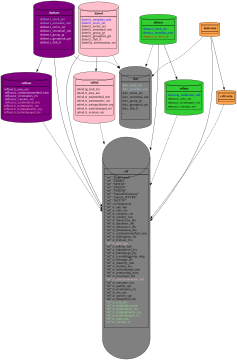{#fig-schema_diadromous_db .lightbox}


The database has been created with different schemas
(@fig-schema_diadromous_db). The main schema for dictionaries is ref, and a
schema is created per working group for specific referential tables. 
The schema `dat` is the common schema for all
data. For each working group, schema `datbast`, `dateel`, `datnas` are
created. The tables are created in dat and later similar or a bit
more complex tables (with some more columns) will be created using the
`INHERIT FROM` syntax, which will allow to have a hierarchical structure
in the db, and maintain the structure in a table common to all fishes.
Note that `dat` should not containt any data, but will hold all the views
and inherited tables coming from the different schema.

# CREATING REFERENTIALS

This script holds all referentials necessary for both the trait and the stock.

## species (tr_species_spe)

The first thing is to create a referential table for species. At the moment
the structure doesn't integrate schema for Alosa and Lamprey, but the species
have been created.
There are no codes in ICES vocab for **Alosa alosa**, **Alosa fallax**,
**Petromyzon marinus**, **Lampetra fluviatilis**.


```{r tbl-icesVocabspecies}
#| echo: TRUE
#| eval: TRUE
#| warning: FALSE
#| message: FALSE
#| tbl-cap: species in ICES
#| tbl-subcap :
#|    - Code found in IC_species
#|    - Three letter code for species. Should we use ang instead of ele ?
#| code-fold: TRUE
#| code-summary: Code used to create a referential table for species - code and queries to ICES
 
sp <- getCodeList("IC_species")

#The following lines show that there is no code in IC_species 
#grep("Lampetra", sp$description) # nothing
#grep("Petromyzon", sp$description) # nothing
#grep("Alosa",  sp$description) # nothing

bind_rows(
  ele <- getCodeDetail("IC_species","ELE")$detail,
  sal <- getCodeDetail("IC_species","SAL")$detail,
  trs <- getCodeDetail("IC_species","TRS")$detail) |>
  knitr::kable(caption = "Codes for migratory species in ICES, no code found for other species (Lamprey, Alosa ...)") |> kable_styling(bootstrap_options = c("striped", "hover", "condensed"))

if (file.exists("data/tr_species_spe_temp.Rdata")) {
  load("data/tr_species_spe_temp.Rdata") } else {
    species_list <- tibble(
      spe_code = c("127186", "126281", "127187", "126413", "126415", "101174", "101172"),
      spe_icspecieskey = c("SAL", "ELE", "TRS", NA,NA,NA,NA),
      spe_commonname = c("Atlantic salmon", "European eel", "Sea trout", "Twait shad", "Allis shad", "Sea lamprey", "European river lamprey"),
      spe_scientificname = c("Salmo salar", "Anguilla anguilla", "Salmo trutta", "Alosa alosa", "Alosa fallax", "Petromyzon marinus", "Lampetra fluviatilis")
    )
    tr_species_spe_temp <- species_list |>
      rowwise() |>
      mutate(
        spe_codeaphia = findAphia(spe_scientificname, latin = TRUE)
      ) |>
      ungroup()
    save(tr_species_spe_temp, file = "data/tr_species_spe_temp.Rdata")
  }
knitr::kable(tr_species_spe_temp) |> kable_styling(bootstrap_options = c("striped", "hover", "condensed"))

```

<details>

<summary>SQL code to create table `tr_species_spe`</summary>

``` {.sql include="../SQL/2_ref_tr_species_spe.sql"}
```

</details>

```{r}
#| label: species
#| echo: TRUE
#| eval: FALSE
#| warning: FALSE
#| message: FALSE
#| code-fold: TRUE
#| code-summary: Creating a referential table for species - code and queries to ICES
#| 
dbWriteTable(conn=con_diaspara, name = "tr_species_spe_temp", value = tr_species_spe_temp, overwrite = TRUE)
dbExecute(con_diaspara,"INSERT INTO ref.tr_species_spe SELECT * FROM tr_species_spe_temp")#7
dbExecute(con_diaspara,"DROP TABLE tr_species_spe_temp")
dbExecute(con_diaspara_admin, "COMMENT ON TABLE  ref.tr_species_spe IS 
'Table of fish species, spe_code using AphiaID as the reference with 
reference to ICES vocabularies.'")

```

</details>

```{r tbl-species}
#| echo: FALSE
#| eval: TRUE
#| warning: FALSE
#| message: FALSE
#| tbl-cap: Working groups table in the diaspara DB
tr_icworkinggroup_wkg <- dbGetQuery(con_diaspara, "SELECT * FROM ref.tr_species_spe")
knitr::kable(tr_icworkinggroup_wkg) |> kable_styling(bootstrap_options = c("striped", "hover", "condensed"))
```

{#fig-schema_tr_species_spe .lightbox}

## Working group (tr_icworkinggroup_wkg)

Species is necessary to separate data within the same working group (WGBAST works
on both Trout and Salmon). Furthermore, two working groups might be working on the
 same species. For this reason we need to have a "working group" entry in most of the tables.
 There is already a table for working group. The proposed table is @tbl-icworkinggroup.


::: {.callout-note appearance="simple"}
## Note
WGEEL name needs to be updated to JOINT EIFAAC/ICES/GFCM WORKING GROUP ON EEL and WGTRUTTA is an expert group, and, therefore, needs to be added to the lit separately. 

The working groups might change over time, referencing a working group
there is probably not the best. 
> Added stockkeylabel, this table is necessary to aggregate data, as species is not enough.
:::


<details>

<summary>SQL code to create table `tr_icworkinggroup_wkg`</summary>

``` {.sql include="../SQL/2_ref_tr_icworkinggroup_wkg.sql"}
```

</details>

```{r}
#| label: working_group
#| echo: TRUE
#| eval: FALSE
#| warning: FALSE
#| message: FALSE
#| code-fold: TRUE
#| code-summary: Code to create reference table for working groups 


# Using the jsonlite to download the guid also
tbl <- jsonlite::fromJSON(
  "https://vocab.ices.dk/services/api/Code/3f6fb38a-a3c5-4f5c-bf31-2045e12536ee")


temp_tr_icworkinggroup_wkg <- tbl |>
  select(key,description,guid) |>
  rename(wkg_code = key,
         wkg_description = description,
         wkg_icesguid = guid)|>
  filter(wkg_code %in% c("WGEEL", "WGNAS", "WGBAST"))
temp_tr_icworkinggroup_wkg <- bind_rows(temp_tr_icworkinggroup_wkg,
                                        data.frame(wkg_code="WKTRUTTA"))
temp_tr_icworkinggroup_wkg$wkg_stockkeylabel <-
  c("sal.27.22–31","ele.2737.nea","sal.neac.all",NA)
dbWriteTable(con_diaspara_admin, 
             "temp_tr_icworkinggroup_wkg", 
             temp_tr_icworkinggroup_wkg,
             overwrite = TRUE)

dbExecute(con_diaspara_admin, "INSERT INTO ref.tr_icworkinggroup_wkg 
          SELECT 
          wkg_code,
          wkg_description,
          wkg_icesguid::uuid,
          WKG_stockkeylabel
         FROM temp_tr_icworkinggroup_wkg;") #4
dbExecute(con_diaspara_admin, "DROP TABLE temp_tr_icworkinggroup_wkg;")


```

```{r tbl-icworkinggroup}
#| echo: FALSE
#| eval: TRUE
#| warning: FALSE
#| message: FALSE
#| tbl-cap: Working groups table in the diaspara DB
tr_icworkinggroup_wkg <- dbGetQuery(con_diaspara, "SELECT * FROM ref.tr_icworkinggroup_wkg")
knitr::kable(tr_icworkinggroup_wkg) |>
 kable_styling(bootstrap_options = c("striped", "hover", "condensed"))
```

{#fig-schema_tr_icworkinggroup_wkg .lightbox}

## Country (tr_country_cou)

Countries are taken from the WGEEL database, and
streamlined with ICES to further integrate North American countries.
 The shapefiles have been downloaded from
https://gisco-services.ec.europa.eu/distribution/v2/countries/download/#countries
source EuroGeographics and UN-FAO. Countries (@tbl-country) are ordered
from North to South starting from the Baltic and ending in the
Mediterranean, with American number being the highest in order.


<details>

<summary>SQL code to create table `tr_country_cou`</summary>

``` {.sql include="../SQL/2_ref_tr_country_cou.sql"}
```

</details>


```{r}
#| label: country
#| echo: TRUE
#| eval: FALSE
#| warning: FALSE
#| message: FALSE
#| code-fold: TRUE
#| code-summary: Code to create table tr_country_cou from wgeel and NUTS.


dbExecute(con_diaspara_admin,
          "INSERT INTO ref.tr_country_cou 
          SELECT * FROM refwgeel.tr_country_cou;") #40
# Add some constraints
dbExecute(con_diaspara_admin, "ALTER TABLE ref.tr_country_cou 
          ADD CONSTRAINT t_country_cou_pkey PRIMARY KEY (cou_code);")
dbExecute(con_diaspara_admin, "ALTER TABLE ref.tr_country_cou 
          ADD CONSTRAINT uk_cou_iso3code UNIQUE (cou_iso3code);")

# missing values from America downloaded from https://gisco-services.ec.europa.eu/distribution/v2/nuts/download/ref-nuts-2024-01m.gdb.zip
# uploaded to postgres

# the tables

# ref-countries-2024-01m — CNTR_RG_01M_2024_4326
# have been copied to folder area ref-countries was renamed
# ALTER TABLE area."ref-countries-2024-01m — CNTR_RG_01M_2024_4326" 
# RENAME TO "ref-countries-2024-01m-4326";


dbExecute(con_diaspara_admin,
          "INSERT INTO ref.tr_country_cou ( cou_code,
    cou_country,    
    cou_iso3code,
    geom, 
    cou_order)
SELECT \"CNTR_ID\" AS cou_code, \"NAME_ENGL\" AS cou_country,  \"ISO3_CODE\" 
AS cou_isocode, geom,
CASE WHEN \"CNTR_ID\" = 'GL' THEN 47
     WHEN \"CNTR_ID\" = 'CA' THEN 48
     ELSE 49 END AS cou_order
FROM  area.\"ref-countries-2024-01m-4326\"
WHERE \"CNTR_ID\" IN ('GL', 'CA', 'US');") #3

# Svalbard et Jan Mayen	SJM	NO Territory	
dbExecute(con_diaspara_admin,
          "INSERT INTO ref.tr_country_cou ( cou_code,
    cou_country,    
    cou_iso3code,
    geom, 
    cou_order)
SELECT \"CNTR_ID\" AS cou_code, \"NAME_ENGL\" AS cou_country,  \"ISO3_CODE\" 
AS cou_isocode, geom,
CASE WHEN \"CNTR_ID\" = 'GL' THEN 47
     WHEN \"CNTR_ID\" = 'CA' THEN 48
     ELSE 49 END AS cou_order
FROM  area.\"ref-countries-2024-01m-4326\"
WHERE \"CNTR_ID\" IN ('SJ');") #3

dbExecute(con_diaspara_admin,
          "UPDATE ref.tr_country_cou 
SET geom = nuts.geom  
FROM  area.\"ref-countries-2024-01m-4326\" nuts 
WHERE nuts.\"CNTR_ID\" = tr_country_cou.cou_code;") # 40
```

```{r tbl-country}
#| echo: TRUE
#| eval: TRUE
#| warning: FALSE
#| message: FALSE
#| tbl-cap: Country table in the diaspara DB
#| code-fold: TRUE
#| code-summary: Code display current referental table.
tr_country_cou <- dbGetQuery(con_diaspara, "SELECT cou_code,cou_country,cou_order, cou_iso3code FROM ref.tr_country_cou order by cou_order")
knitr::kable(tr_country_cou) |> kable_styling(bootstrap_options = c("striped", "hover", "condensed"))
```


```{r fig-country}
#| echo: TRUE
#| eval: FALSE
#| warning: FALSE
#| message: FALSE
#| code-fold: TRUE
#| code-summary: Code to create map from table in R
#| fig-cap: Map of countries in the diaspara DB &copy; [EuroGeographics](https://gisco-services.ec.europa.eu/distribution/v2/nuts/download/)

if (file.exists("data/country_sf.Rdata")) load("data/country_sf.Rdata") else {
  country_sf <- sf::st_read(con_diaspara,
                            query = "SELECT cou_code, ST_MakeValid(geom) 
                          from ref.tr_country_cou") |>
    sf::st_transform(4326) 
  save(country_sf, file="data/country_sf.Rdata")
}
#see here : https://stackoverflow.com/questions/70756215/
#plot-geodata-on-the-globe-perspective-in-r
# Note there is a problem of geometry for some of the polygons, and this require 
# ST_Makevalid before intersection

# projection string used for the polygons & ocean background
crs_string <- "+proj=ortho +lon_0=-30 +lat_0=30"

# background for the globe - center buffered by earth radius
ocean <- sf::st_point(x = c(0,0)) |>
  sf::st_buffer(dist = 6371000) |>
  sf::st_sfc(crs = crs_string)
country_sf2 <-  country_sf |> 
  sf::st_intersection(ocean |> sf::st_transform(4326)) |> 
  # select visible area only
  sf::st_transform(crs = crs_string) # reproject to ortho
# now the action!
g <- ggplot(data = country_sf2) +
  geom_sf(data = ocean, fill = "aliceblue", color = NA) + # background first
  geom_sf(aes(fill = cou_code), lwd = .1) + # now land over the oceans
  scale_fill_discrete(guide = "none") +
  theme_void()

# this part is used to avoid long computations
png(filename="images/fig-country.png", bg="transparent")
print(g)
dev.off()

```

](images/fig-country.png "A planisphere with countries in migdb"){#fig-country}

## Unit (tr_units_uni)

<details>

<summary>SQL code to create tables</summary>

``` {.sql include="../SQL/2_ref_tr_units_uni.sql"}
```
</details>


<details>
<summary>Creating the unit from wgeel and checking ICES code</summary>
</details>

To create the units table, we started from the existing WGEEL table, and we later added
some elements for WGBAST. In addition, to standardize our table, all codes where checked againt several existing ICES vocabularies.
We used the `p06` as the most common source. The source code in ICES table,
its id, and the source table are presented in the table.

</details>

```{r}
#| label: unit
#| echo: TRUE
#| eval: FALSE
#| warning: FALSE
#| message: FALSE
#| code-fold: TRUE
#| code-summary: Code to insert existing values from WGEEL
dbExecute(con_diaspara_admin,"INSERT INTO ref.tr_units_uni (
uni_code, uni_description)
SELECT * FROM refwgeel.tr_units_uni;")#25

dbExecute(con_diaspara_admin, "UPDATE ref.tr_units_uni set uni_icesvalue='KGXX' 
          where uni_code = 'kg';") 
dbExecute(con_diaspara_admin, "UPDATE ref.tr_units_uni set uni_icesvalue='MTON'
          where uni_code = 't';") 
dbExecute(con_diaspara_admin, "UPDATE ref.tr_units_uni set uni_icesvalue='UCNT' 
          where uni_code = 'nr';") 
dbExecute(con_diaspara_admin, "UPDATE ref.tr_units_uni set uni_icesvalue='UGRM' 
          where uni_code = 'g';")
dbExecute(con_diaspara_admin, "UPDATE ref.tr_units_uni set uni_icesvalue='UPMS'
          where uni_code = 'nr/m2';")
dbExecute(con_diaspara_admin, "UPDATE ref.tr_units_uni set uni_icesvalue='UPMM' 
          where uni_code = 'nr/m3';")
dbExecute(con_diaspara_admin, "UPDATE ref.tr_units_uni set uni_icesvalue='UYRS' 
          where uni_code = 'nr year';")
dbExecute(con_diaspara_admin, "UPDATE ref.tr_units_uni set uni_icesvalue='UXMM' 
          where uni_code = 'mm';")
dbExecute(con_diaspara_admin, "UPDATE ref.tr_units_uni set uni_icesvalue='NGPG' 
          where uni_code = 'ng/g';")
dbExecute(con_diaspara_admin, "UPDATE ref.tr_units_uni set uni_icesvalue='HCTR' 
          where uni_code = 'ha';")
dbExecute(con_diaspara_admin, "UPDATE ref.tr_units_uni set uni_icesvalue='UTAA' 
          where uni_code = 'nr day';")
dbExecute(con_diaspara_admin, "UPDATE ref.tr_units_uni set uni_icesvalue='NOPH'
          where uni_code = 'nr/h';")
dbExecute(con_diaspara_admin, "UPDATE ref.tr_units_uni set uni_icesvalue='NGPG'
          where uni_code = 'ng/g';")
dbExecute(con_diaspara_admin, "UPDATE ref.tr_units_uni set uni_icesvalue='UPCT'
          where uni_code = 'percent';")
dbExecute(con_diaspara_admin, "UPDATE ref.tr_units_uni set 
          (uni_icesvalue, uni_description)=
          ('XXXX', 'Not applicable (without unit)')
          where uni_code = 'wo';")          

dbExecute(con_diaspara_admin, "INSERT INTO ref.tr_units_uni 
          VALUES ('year-1', 'Per year', 'XXPY');")          
dbExecute(con_diaspara_admin, "INSERT INTO ref.tr_units_uni 
          VALUES ('s', 'Seconds', 'UTBB');")


p06 <- icesVocab::getCodeList('p06')
SamplingUnit <- icesVocab::getCodeList('SamplingUnit')
MUNIT <- icesVocab::getCodeList('MUNIT')
uni <- dbGetQuery(con_diaspara_admin, "SELECT * FROM ref.tr_units_uni;")
tempuni <- inner_join(uni, p06, by=join_by(uni_icesvalue==Key))
dbWriteTable(con_diaspara_admin, "tempuni", tempuni, overwrite=TRUE)
dbExecute(con_diaspara_admin, "UPDATE ref.tr_units_uni 
set uni_icesguid = \"GUID\"::uuid
          FROM tempuni 
          where tempuni.uni_icesvalue=tr_units_uni.uni_icesvalue;") #16
dbExecute(con_diaspara_admin, "DROP TABLE tempuni;")

dbExecute(con_diaspara_admin,
          "UPDATE ref.tr_units_uni set uni_icestablesource = 'p06' where uni_icesvalue 
IS NOT NULL AND
uni_icestablesource IS NULL;") # 16

query <- sprintf("INSERT INTO ref.tr_units_uni (uni_code,uni_description, uni_icesvalue, uni_icestablesource,uni_icesguid) VALUES ('%s','%s','%s','%s','%s'::uuid);", 
                 "gd", 
                 "Gear days for fyke/trap nets",
                 "gd", 
                 "MUNIT",
                 "bf0570b7-45f2-41c7-9a46-de912a2b9ad4")              
dbExecute(con_diaspara_admin,  query)


dbExecute(con_diaspara_admin, "UPDATE ref.tr_units_uni set uni_icesvalue='idx', 
          uni_icestablesource = 'MUNIT',
          uni_icesguid ='87a9cf7f-fff4-4712-b693-76eec1403254'::uuid
          where uni_code = 'index';")

# p06[grep('Ton',p06$Description),c("Description","Key")] 
# p06[grep('Without',tolower(p06$Description)),c("Description","Key")] 
# p06[grep('nanogram',tolower(p06$Description)),c("Description","Key")]
# p06[grep('index',tolower(p06$Description)),c("Description","Key")]
# p06[grep('hour',tolower(p06$Description)),c("Description","Key")]
# p06[grep('kilogram',tolower(p06$Description)),c("Description","Key")]
# p06[grep('nanogram',tolower(p06$Description)),c("Description","Key")]
# p06[grep('haul',tolower(p06$Description)),c("Description","Key")]

dbExecute(con_diaspara_admin, "COMMENT ON TABLE ref.tr_units_uni IS 
'Table of units, values from tables MUNIT and p06 have corresponding ICES code.'")
dbExecute(con_diaspara_admin, "COMMENT ON COLUMN ref.tr_units_uni.uni_code IS 
'Unit code, lowercase, nr number, otherwise standard units.'")
dbExecute(con_diaspara_admin, "COMMENT ON COLUMN ref.tr_units_uni.uni_description
 IS 'Unit code, lowercase, nr number, otherwise standard units.'")
dbExecute(con_diaspara_admin, "COMMENT ON COLUMN ref.tr_units_uni.uni_icesvalue IS 
'ICES code standard from the British Oceanographic Data Centre (p06) or MUNIT 
table.';") 
dbExecute(con_diaspara_admin, 
          "COMMENT ON COLUMN ref.tr_units_uni.uni_icestablesource IS 
'Table source in ICES.';") 
dbExecute(con_diaspara_admin, 
          "COMMENT ON COLUMN ref.tr_units_uni.uni_icesguid IS 
'GUID, type https://vocab.ices.dk/?codetypeguid=<guidcode> to get access to the 
vocab in ICES.';") 
dbExecute(con_diaspara_admin, "GRANT ALL ON TABLE ref.tr_units_uni 
          to diaspara_admin;")
dbExecute(con_diaspara_admin, "GRANT SELECT ON TABLE ref.tr_units_uni 
          to diaspara_read;")
#for WGBAST
#
query <- sprintf("INSERT INTO ref.tr_units_uni (uni_code,uni_description, uni_icesvalue, uni_icestablesource,uni_icesguid) VALUES ('%s','%s','%s','%s','%s'::uuid);", 
                 "nd", 
                 "Net-days (fisheries)",
                 "nd", 
                 "MUNIT",
                 "f2783f1c-defa-4551-a9e3-1cfa173a0b9f")              
dbExecute(con_diaspara_admin,  query)

```


```{r}
#| label: tbl-unit
#| echo: TRUE
#| eval: TRUE
#| warning: FALSE
#| message: FALSE
#| tbl-cap: tr_units_uni table, check missing values currently not found in ICES Vocab
#| code-fold: TRUE
#| code-summary: Code to show table

dbGetQuery(con_diaspara, "SELECT * FROM ref.tr_units_uni;")|> 
knitr::kable() |>
 kable_styling(bootstrap_options = c("striped", "hover", "condensed"))
```


::: {.callout-note appearance="simple"}
<h3>ICES is modifying the code </h3>
Work is currently in progress to integrate the codes for unit in ICES. 
An issue is open and discussed in the ICES git Data Information Group.
[WGEEL: New MUNIT codes \#737](https://github.com/ices-eg/DIG/issues/737)
:::


{#fig-schema_tr_units_uni .lightbox}


## Parameters

We need to store input or output parameters of the stock assessment models, these are
often multidimensional arrays. To do so we use variables names that store 
variables, reduced to their lower level (e.g. 3
dimensional arrays with dimensions \[area, year, stage\] will be
translated as many lines with the corresponding values in columns area,
year, and stage), and the identifier of the variable will be used for
all the lines necessary to store this dataset. When arrays have only two dimensions, then only two columns are used. 

The values in some columns can also be left empty if it does not correspond to the actual dimension of the data, 
for instance some arrays have nothing to do with age, and in that case there is nothing to store.
 The parameters will be described by their metadata as illustrated in
@fig-metadata

{#fig-metadata .lightbox}

We can have a look at the metadata in the analysis done on the WGNAS
database "Salmoglob" [WGNAS
description](https://projets_eabx.pages.mia.inra.fr/diaspara/fr/deliverables/wp3/p4/wgnas_salmoglob_description.html#metadata).

In Salmoglob, we had a problem with some columns holding data corresponding to different data types . For instance a column could hold either year, or age. 
Another issue was that some arrays integrated in the database have twice the same column reported (e.g. a matrix holding transition from an area to another area. This was solved by using an
additional column where data can be of several types (see tg_additional_add in @sec-additional).
The description could be used within a type
[array](https://www.postgresql.org/docs/current/arrays.html). But as SQL server
does not work with arrays, and the SQL database will be stored in ICES, we chose not to use those arrays.

<details>

<summary>Checking stock codes using icesASD and icesSD
packages</summary>

```{r tbl-advice}
#| echo: TRUE
#| eval: FALSE
#| warning: FALSE
#| message: FALSE
#| tbl-cap: Access to the advice using icesAdvice

# install.packages('icesAdvice', repos = c('https://ices-tools-prod.r-universe.dev', 'https://cloud.r-project.org'))
# install.packages("icesSD", repos = c("https://ices-tools-prod.r-universe.dev", "https://cloud.r-project.org"))

library('icesAdvice')
library('icesSAG')
library('icesSD')
# this does not give the 
advice <- getAdviceViewRecord()
advice[grepl('ele',advice$stockCode),
       c('adviceDOI', 'stockCode','assessmentyear')] |> kable
sd <- mapply(getSD, year= 2020:2024, SIMPLIFY=FALSE)
sd <- do.call(rbind,sd)
ww <- grepl('ele',sd$StockKeyLabel) | grepl('Salmo',sd$speciesScientificName)
sd[ww,] |> kable()

```

</details>


## Object dimension (tr_objectdimension_odi)

Parameters can have different dimensions :

* single value (scalar)
* vector (1D)
* matrix (2D)
* arrays (3D)

These dimensions are specified in table @tbl-objectdimension, and later in this report used in metadata.

<details>

<summary>SQL code to create tables</summary>

``` {.sql include="../SQL/2_ref_tr_objectdimension_odi.sql"}
```

</details>

```{r}
#| label: tbl-objectdimension
#| echo: FALSE
#| eval: TRUE
#| warning: FALSE
#| message: FALSE
#| tbl-cap: Object type
#| code-fold: TRUE
#| code-summary: Code to show table
dbGetQuery(con_diaspara, "SELECT * FROM ref.tr_objectdimension_odi;")|> knitr::kable() |> kable_styling(bootstrap_options = c("striped", "hover", "condensed"))


```

## Type of parm / data (tr_bayestype_bty)

The stock model use parameters as inputs and produce parameter outputs. Some paramaters are constants, some are considered as data entry, some are outputs, and some others are not necessarily used in the model itself but necessary for comparision or graphical purpose (e.g. Conservation Limits).
In the salmoglob metadata (WGNAS), two tables hold similar information [`status`](https://diaspara.bordeaux-aquitaine.inrae.fr/deliverables/wp3/p4/wgnas_salmoglob_description.html#tbl-globaldata2-8) and [`nimble`](https://diaspara.bordeaux-aquitaine.inrae.fr/deliverables/wp3/p4/wgnas_salmoglob_description.html#tbl-globaldata2-2).
These entries have been grouped in the `tr_bayestype_bty` table.

<details>

<summary>SQL code to create tables</summary>

``` {.sql include="../SQL/2_ref_tr_bayestype_bty.sql"}
```

</details>

```{r}
#| label: tbl-bayestype
#| echo: FALSE
#| eval: TRUE
#| warning: FALSE
#| message: FALSE
#| tbl-cap: Nimble
#| code-fold: TRUE
#| code-summary: Code to show table
dbGetQuery(con_diaspara, "SELECT * FROM ref.tr_bayestype_bty;")|> knitr::kable() |> kable_styling(bootstrap_options = c("striped", "hover", "condensed"))

```

## Version (tr_version_ver)

Currently in the salmoglob information about
version only correspond to different versions of the same parameter 
[see WGNAS analysis report](https://diaspara.bordeaux-aquitaine.inrae.fr/deliverables/wp3/p4/wgnas_salmoglob_description.html#version). 
The  `database` only contains the variables used to run the salmoglob model, at
the time of the working group, any updated value is copied to the `database_archive`
which then contains historical values.
From this, it might be possible to rebuild historical states of the database but 
it is not straightforward, as the archive database can hold, for the same year,
multiple values of the same variable, if the corrections or updates were made
several times.
The dates (column date_time) used in the `database` and `database_archive` give information
about the latest update. An analysis with Pierre Yves Hernwann on unique values for
tupples \[version, year, type, age, area, location, metric, var_mod\] shows that some 
duplicates are present in the archive database in 2021 and 2022, so by using the 
latest date in the year it is possible to reproduce the state of the database
at the moment of the working group.
Still it was agreed that a clear versioning would ease up the work (as in WGEEL).
It was also agreed that metadata should also contain information about historical
variables For instance we create a new variable, so we know when it was
introduced. So the version column was added to we added to both metadata 
(`t_metadata_met`) table and stock table (`t_stock_sto`). 
Some variables might get deprecated over
time.


::: {.callout-note appearance="simple"}
<h3>TODO ICES </h3>

The DB will be held in ICES server. We will need a procedure to save the
database at each working group to be able to run past versions of the
model. This means keeping a database_archive for each working groups. 
It's a straightforward copy of the `t_stock_sto` for each working group.

:::

<details>

<summary>SQL code to create tables</summary>

``` {.sql include="../SQL/2_ref_tr_version_ver.sql"}
```

</details>


```{r }
#| label: tr_version_ver_insert
#| echo: TRUE
#| eval: FALSE
#| warning: FALSE
#| message: FALSE
#| code-fold: TRUE
#| code-summary: Code to insert values into the tr_version_ver table

#sd <-do.call(rbind,mapply(icesSD::getSD, year= 2020:2024, SIMPLIFY=FALSE))
#sd[grepl('Working Group on North Atlantic Salmon',sd$ExpertGroupDescription),]


tr_version_ver <- data.frame(
  ver_code = paste0("WGNAS-",2020:2024,"-1"),
  ver_year = 2020:2024,
  ver_spe_code = "127186",
  ver_wkg_code = "WGNAS",
  ver_datacalldoi=c(NA,NA,NA,NA,"https://doi.org/10.17895/ices.pub.25071005.v3"), 
  ver_stockkeylabel =c("sal.neac.all"), # sugested by Hilaire. 
  # TODO FIND other DOI (mail sent to ICES)
  ver_version=c(1,1,1,1,1), # TODO WGNAS check that there is just one version per year
  ver_description=c(NA,NA,NA,NA,NA)) # TODO WGNAS provide model description

DBI::dbWriteTable(con_diaspara_admin, "temp_tr_version_ver", tr_version_ver, 
                  overwrite = TRUE)
dbExecute(con_diaspara_admin, "INSERT INTO refnas.tr_version_ver(ver_code, ver_year, ver_spe_code, ver_stockkeylabel, ver_datacalldoi, ver_version, ver_description, ver_wkg_code) SELECT ver_code, ver_year, ver_spe_code, ver_stockkeylabel, ver_datacalldoi, ver_version::integer, ver_description, ver_wkg_code FROM temp_tr_version_ver;") # 5
DBI::dbExecute(con_diaspara_admin, "DROP TABLE temp_tr_version_ver;")

```


```{r}
#| label: tbl-version
#| echo: FALSE
#| eval: TRUE
#| warning: FALSE
#| message: FALSE
#| tbl-cap: Version
#| code-fold: TRUE
#| code-summary: Code to show table
dbGetQuery(con_diaspara, "SELECT * FROM ref.tr_version_ver;")|> knitr::kable() |> kable_styling(bootstrap_options = c("striped", "hover", "condensed"))

```


::: {.callout-note appearance="simple"}
<h3>TODO ICES</h3>

[datacall (see link in ICES
webpage)](https://data.ices.dk/DataCalls/listDataCalls) are not yet part
of a vocabulary accessible to external users in ICES. 
A demand had been made to make them public
:::


## Statistic (or metric) (tr_statistic_sta)

This table describes the type of statistic (or metric) returned by the parameter. The name metric has not
been used to avoid confusion with the "metric DB".

<details>

<summary>SQL code to create tables</summary>

``` {.sql include="../SQL/2_ref_tr_statistic_sta.sql"}
```

</details>

```{r tbl-statistic}
#| echo: FALSE
#| eval: TRUE
#| warning: FALSE
#| message: FALSE
#| tbl-cap : Statistic (metric) possible value of parameters
#| code-fold: TRUE
#| code-summary: Code to display table
dbGetQuery(con_diaspara, "SELECT * FROM ref.tr_statistic_sta;")|> 
knitr::kable() |>
 kable_styling(bootstrap_options = c("striped", "hover", "condensed"))

```

::: {.callout-note appearance="simple"}
<h3>NOTE</h3>

This list currenly correspond to the needs of both WGNAS and WGBAST.
 But the statistic can be NULL, for instance in case of a number of fish released, 
 none of the above (@tbl-statistic) would apply. 
:::

## Category (tr_category_cat)

Categories @Tbl-category were in the salmoglob metadata, here they were
simplified to be able to get groups of parameters, for instance all parameters 
dealing with catch.

<details>

<summary>SQL code to create tables</summary>

``` {.sql include="../SQL/2_ref_tr_category_cat.sql"}
```

</details>

```{r}
#| label: tbl-category
#| echo: FALSE
#| eval: TRUE
#| warning: FALSE
#| message: FALSE
#| tbl-cap: category of parameters
dbGetQuery(con_diaspara, "SELECT * FROM ref.tr_category_cat;")|> knitr::kable() |> kable_styling(bootstrap_options = c("striped", "hover", "condensed"))

```

## Destination (tr_destination_dest)

This table was added for WGBAST. The idea is "what becomes of this fish".
It allows to integrate discards, releases and seal damages.

<details>

<summary>SQL code to create tables</summary>

``` {.sql include="../SQL/2_ref_tr_destination_des.sql"}
```

</details>

```{r}
#| label: tbl-tr_destination_des
#| echo: FALSE
#| eval: TRUE
#| warning: FALSE
#| message: FALSE
#| tbl-cap: category of parameters
dbGetQuery(con_diaspara, "SELECT * FROM ref.tr_destination_des;") |> 
  knitr::kable() |> kable_styling(bootstrap_options = c("striped", "hover", "condensed"))

```

::: {.callout-note appearance="simple"}
<h3>NOTE DIASPARA</h3>

It was noted that naming the table as "outcome" wasn't ideal as it can be confused to others, so we've followed this suggestion
:::


## Habitat level (tr_habitatlevel_lev)

In the habitat database created by DIASPARA, various levels of regional aggregation have been used. They are embedded within each other like russian dolls. The habitat level correspond to the level of grouping, from stock(s) to river.
Depending on the species habitat levels and their hierarchy can differ. An example for this difference is that for Salmon the stock is at the level of a river while the eel is a single stock distributed all over its geographic range.
The levels used in the habitat database are described in table @tbl-habitatlevellevel.

This table has been created in the [habitat report](https://diaspara.bordeaux-aquitaine.inrae.fr/deliverables/wp3/p8hab/habitatdb.html).

<details>

<summary>SQL code to create tables</summary>

``` {.sql include="../SQL/2_ref_tr_habitatlevel_lev.sql"}
```

</details>

```{r}
#| label: tr_habitatlevel_lev 
#| echo: TRUE
#| eval: FALSE
#| warning: FALSE
#| message: FALSE
#| code-fold: TRUE
#| code-summary: Code to fill in tr_habitatlevel_lev


dbExecute(con_diaspara_admin,
          "INSERT INTO ref.tr_habitatlevel_lev VALUES( 
  'Panpopulation',
  'This is the highest geographic level for assessement.'  
  );")

dbExecute(con_diaspara_admin,
          "INSERT INTO ref.tr_habitatlevel_lev VALUES( 
  'Complex',
  'Corresponds to large sublevels at which the Panpopulation is assessed, e.g.
  NAC NEC for WGNAST, Gulf of Bothnia for WGBAST, Mediterranean for WGEEL.'  
  );")

dbExecute(con_diaspara_admin,
          "INSERT INTO ref.tr_habitatlevel_lev VALUES( 
  'Stock',
  'Correspond to stock units for which advices are provided in ICES, this can be the level of the panpopulation,
  or another level e.g. .'  
  );")

dbExecute(con_diaspara_admin,
          "INSERT INTO ref.tr_habitatlevel_lev VALUES( 
  'Country',
  'Corresponds to one or more units, but in almost all stocks
  this level is relevant to split data.'
  );")


dbExecute(con_diaspara_admin,
          "INSERT INTO ref.tr_habitatlevel_lev VALUES( 
  'EMU',
  'Administrative unit for eel, the hierarchical next level is country.'
  );")

# note this can be unit or Asssessment unit it can have two meanings ...
dbExecute(con_diaspara_admin,
          "INSERT INTO ref.tr_habitatlevel_lev VALUES( 
  'Assessment_unit',
  'Corresponds to an assessment unit in the Baltic sea, and area for  
  WGNAS, and EMU for WGEEL.'
  );")

dbExecute(con_diaspara_admin,
          "INSERT INTO ref.tr_habitatlevel_lev VALUES( 
  'Regional',
  'Corresponds to subunits of stock assessment units or 
  basins grouping several river. Although it is not used yet for
  some models, regional genetic difference or difference in stock
  dynamic support collecting a regional level.'
  );")

dbExecute(con_diaspara_admin,
          "INSERT INTO ref.tr_habitatlevel_lev VALUES( 
  'River',
  'One river is a unit corresponding practically almost always to a watershed.'
  );")

dbExecute(con_diaspara_admin,
          "INSERT INTO ref.tr_habitatlevel_lev VALUES( 
  'River_section',
  'Section of river, only a part of a basin, for instance to separate between
  wild and mixed river category in the Baltic.'
  );")

dbExecute(con_diaspara_admin,
          "INSERT INTO ref.tr_habitatlevel_lev VALUES( 
  'Major',
  'Major fishing areas from ICES.'
  );")

dbExecute(con_diaspara_admin,
          "INSERT INTO ref.tr_habitatlevel_lev VALUES( 
  'Subarea',
  'Subarea from ICES, FAO and NAFO'
  );")

dbExecute(con_diaspara_admin,
          "INSERT INTO ref.tr_habitatlevel_lev VALUES( 
  'Division',
  'Division from ICES, GFCM and NAFO'
  );")

dbExecute(con_diaspara_admin,
          "INSERT INTO ref.tr_habitatlevel_lev VALUES( 
  'Subdivision',
  'Subdivision level from ICES, GFCM and NAFO'
  );")

dbExecute(con_diaspara_admin,
          "INSERT INTO ref.tr_habitatlevel_lev VALUES( 
  'Lagoons',
  'Shallow body of water seperated from a larger body of water by a narrow landform'
  );")

dbExecute(con_diaspara_admin,
          "INSERT INTO ref.tr_habitatlevel_lev VALUES( 
  'Subdivision_grouping',
  'Groups of subdivision from ICES used in the Baltic'
  );")

dbExecute(con_diaspara_admin,"UPDATE ref.tr_habitatlevel_lev
	SET lev_description='Corresponds to an assessment unit in the Baltic sea, and area for WGNAS, and EMU for WGEEL.'
	WHERE lev_code='Assessment_unit'"); # remove spaces ...


```

```{r}
#| label: tbl-habitatlevellevel
#| echo: FALSE
#| eval: TRUE
#| warning: FALSE
#| message: FALSE
#| tbl-cap: Geographical level tr_habitatlevel_lev
dbGetQuery(con_diaspara, "SELECT * FROM ref.tr_habitatlevel_lev;")|> 
knitr::kable() |> 
kable_styling(bootstrap_options = c("striped", "hover", "condensed"))

```


### Area (tr_area_are)

This table has been created in the diadromous database as we needed reference for various geographical grouping used thoughout the different databases. However, most of the work was done in the [habitat report](https://diaspara.bordeaux-aquitaine.inrae.fr/deliverables/wp3/p8hab/habitatdb.html) for the full habitat referential creation.


<details>

<summary>SQL code to create tables</summary>

``` {.sql include="../SQL/2_ref_tr_area_are.sql"}
```

</details>


```{r}
#| label: tbl-area
#| echo: FALSE
#| eval: TRUE
#| warning: FALSE
#| message: FALSE
#| tbl-cap: Geographic areas
dbGetQuery(con_diaspara, "SELECT are_id,
   are_are_id,
   are_code,
   are_lev_code,
   are_wkg_code,
   are_ismarine FROM ref.tr_area_are limit 10;")|>
  knitr::kable() |>
  kable_styling(bootstrap_options = c("striped", "hover", "condensed"))

```

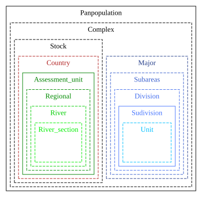{#fig-area_hierarchy}

::: {.callout-note appearance="simple"}
<h3>NOTE DIASPARA</h3>

Areas are specific to each working group (see @fig-schema_tr_area_are)
:::

::: {layout-nrow=2}
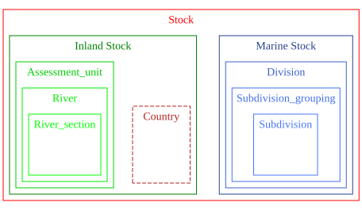{#fig-area_hierarchy_bast}

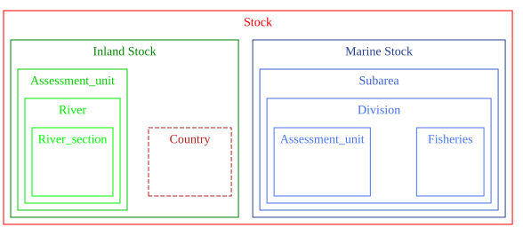{#fig-area_hierarchy_nas1}

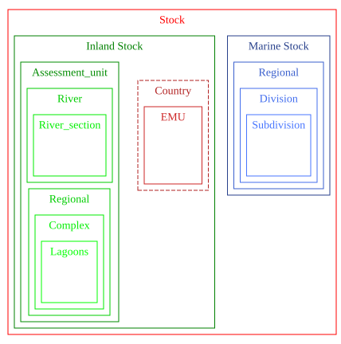{#fig-area_hierarchy_wgeel}
:::

{#fig-schema_tr_area_are .lightbox}

## Data access (tr_dataaccess_dta)

Type of data Public, or Restricted

<details>

<summary>SQL code to create tables</summary>

``` {.sql include="../SQL/2_ref_tr_dataaccess_dta.sql"}
```

</details>

```{r}
#| label: access
#| echo: TRUE
#| eval: FALSE
#| warning: FALSE
#| message: FALSE
#| code-fold: TRUE
#| code-summary: Code to create dataaccess tr_dataaccess_dta


tr_dataaccess_dta <- dbGetQuery(con_diaspara_admin, 
                                "SELECT * FROM refwgeel.tr_dataaccess_dta")

dbExecute(con_diaspara_admin,
          "INSERT INTO ref.tr_dataaccess_dta 
  SELECT * FROM refwgeel.tr_dataaccess_dta
  ;")#2


```

```{r}
#| label: tbl-dataaccess
#| echo: FALSE
#| eval: TRUE
#| warning: FALSE
#| message: FALSE
#| tbl-cap: Data access
dbGetQuery(con_diaspara, "SELECT * FROM ref.tr_dataaccess_dta ;")|>
  knitr::kable() |>
  kable_styling(bootstrap_options = c("striped", "hover", "condensed"))
```

{#fig-schema_tr_dataaccess_dta .lightbox}

## Missing data (tr_missvalueqal_mis)


<details>

<summary>SQL code to create tables</summary>

``` {.sql include="../SQL/2_ref_tr_missvalueqal_mis.sql"}
```

</details>


```{r}
#| label: missvaluequal
#| echo: TRUE
#| eval: FALSE
#| warning: FALSE
#| message: FALSE
#| code-fold: TRUE
#| code-summary: Code to create tr_missvalueqal_mis


dbExecute(con_diaspara_admin,
          "INSERT INTO ref.tr_missvalueqal_mis 
SELECT
'NR',
'Not reported',	
'Data or activity exist but numbers are not reported to authorities (for example for commercial confidentiality reasons).';")
dbExecute(con_diaspara_admin,
          "INSERT INTO ref.tr_missvalueqal_mis 
SELECT
'NC',	
'Not collected',	
'Activity / habitat exists but data are not collected by authorities (for example where a fishery exists but the catch data are not collected at the relevant level or at all).';")
dbExecute(con_diaspara_admin,
          "INSERT INTO ref.tr_missvalueqal_mis 
SELECT
'NP',	
'Not pertinent',
'Where the question asked does not apply to the individual case (for example where catch data are absent as there is no fishery or where a habitat type does not exist in a stock unit).';")


```

```{r}
#| label: tbl-missvaluequal
#| echo: FALSE
#| eval: TRUE
#| warning: FALSE
#| message: FALSE
#| tbl-cap: Code for missing values
dbGetQuery(con_diaspara, "SELECT * FROM ref.tr_missvalueqal_mis;") |> 
  knitr::kable() |> 
  kable_styling(bootstrap_options = c("striped", "hover", "condensed"))

```

::: {.callout-caution appearance="simple"}
<h3>TODO ICES</h3>

This is used in the t_stock_sto table by both WGEEL and WGBAST. 
Either a value is provided or this field has to be provided (conditional 
mandatory in the format).
:::


## Life stages (tr_lifestage_lfs)

Life stages cannot easily be shared among all species, they are species
specific. Often similar between Sea trout and Salmon, but there is a
large gap between a leptocephalus and a parr.


### Considerations about the database structure

For life stage, unlike in other referentials, using working-group-specific life stages would lead to confusion. WGBAST and WGNAS would
share the same stages for salmon. So unlike in many other tables, the
referentials will not use inheritance (see paragraph @sec-hierarchical
for more details on inheritance). This means that we will create a table
grouping all life stages and then we will only select the relevant ones
at working group levels. For instance currently WGEEL does not use the
`Egg` or `Parr` stages. It will be listed in the `ref.tr_lifestage_lfs`
table but not in the `refeel.tr_lifestage_lfs` table. So the working
group referentials, `refnas`, `refbast`, `refeel` ... will have
`tr_lifestage_lfs` tables with a foreign key to `ref.tr_lifestage_lfs`,
and a subset of values used by the working group.

### The lifestages in working group databases


Stages use are described in WGNAS metadata [paragraph life stage of the
WGNAS description
report](file:///C:/workspace/DIASPARA_WP3_migdb/R/wgnas_salmoglob_description.html#developmental-stage)
and WGBAST reports (though for the WGBAST's "young fish" -data this concept is mixed with
age) [paragraph life stage of the WGBAST description
report](file:///C:/workspace/DIASPARA_WP3_migdb/R/wgbast_database_description.html#age).
So they are not used as a separate column to describe the data. But in
the eel database they are and so we will need to add this dimension to
the table structure.

<!--
::: {.callout-tip appearance="simple"}
<h3>Adding a stage dimension</h3>

Currently the stage is used by WGEEL, not by WGNAS and not directly in WGBAST.
Indeed for WGBAST there is no column stage in landings data. 
There is an age column in the juvenile data used to describe the number released from
hatchery at various stages ([age in the juvenile database](https://diaspara.bordeaux-aquitaine.inrae.fr/deliverables/wp3/p5/wgbast_database_description.html#tbl-readyoungfishdbage)). 
Spatial information, and information about the age are used to split the dataset, not the stage, but the different datasets (landings, juvenile) do correspond to different stages.
We have chosen to add stages everywhere and populate the column using the metadata
even if for WGNAS there is no practical use the information is not used currently.
:::
-->

### Simplifying the stage column in WGNAS

The work was initially done with the stage column in the WGNAS salmoglob database.
In this column,  the information relies on a combination of life stage and spatial location
 (e.g; post smolt and location at sea,  returning adult in seawater, in
freshwater...) @ices_second_2024. 
To deal with these spatio-temporal elements that are not stages, 
we simplified the stages table, removed
elements which are not stages. Parameters still hold the spatio temporal
information in metadata. 
Here we are focusing on the stock DB
which will group information, but the individual metric database might
require more details that the simple adult stage. For this reason, we
will add the maturity scale from ICES in the DB.

### Some stages are a mixture of several stages.

In some cases, a mixture of stages are used. Many fyke net fisheries for
eel will not distinguish between yellow and silver eel stage and WGEEL
uses the `YS` stage. Some historical trap series did not distinguish
between small yellow eels and glass eel, or the glass eel ascending are
in a late stage. In that case the `GY`stage is used to count the
recruits.


::: {.callout-tip appearance="simple"}
<h3>Stages OG and QG for WGEEL</h3>
Ongrown eel (OG) and quarantined glass eel (QG) are used to describe the stages of glass eel
or small yellow eels as they are released. They will be marked as deprecated for the stock, but they will probably be used in the release database that needs to be created for EDA.
:::


### Code to create the stage table

The code for creating `tr_lifestage_lfs` is shown below, it also
includes the import of the WGEEL stage table.

<details>

<summary>SQL code to create table tr_lifestage_lfs</summary>

``` {.sql include="../SQL/2_ref_tr_lifestage_lfs.sql"}
```

</details>

### Existing stages in ICES dictionaries

You can run the following code to see the candidate tables in ICES, in summary:
none fitted and this part is skipped to shorten the report. 

```{r }
#| echo: TRUE
#| eval: FALSE
#| warning: FALSE
#| code-fold: TRUE
#| message: FALSE
#| tbl-cap: ICES vocabularies for life stages
#| tbl-subcap: 
#|   - Possible match for stage in ICES vocab.
#|   - TS_MATURITY table
#|   - DevScale table
#|   - Devstage scale table, this seems to be about shrimp (berried seems to an egg which looks at you with eyes in shrimps....)
#| label: tbl-maturityvocab

types <- icesVocab::getCodeTypeList()
types[grep('stage', tolower(types$Description)),]|> kable()
TS_MATURITY <- icesVocab::getCodeList('TS_MATURITY')
TS_DevStage <- icesVocab::getCodeList('TS_DevStage')
# Devstage is 1 to 15 => no use
DevScale <- icesVocab::getCodeList('DevScale')
# At the present the codetypes target Eggs and Larvae surveys
# This is a description of scales types using different publications => not for use()
kable(TS_MATURITY, caption = "TS_MATURITY") |> kable_styling(bootstrap_options = c("striped", "hover", "condensed")) 
kable(TS_DevStage, caption = "Devstage scale, this seems to be about shrimp (berried seems to an egg which looks at you with eyes in shrimps....)") |> kable_styling(bootstrap_options = c("striped", "hover", "condensed")) 
```

### Importing the lifestages for Salmon

Some of the definitions come from [Ontology
portal](https://bioportal.bioontology.org/ontologies/SALMON).

```{r import_tr_lifestage_lfs_sal}
#| echo: TRUE
#| eval: FALSE
#| warning: FALSE
#| message: FALSE
#| code-fold: TRUE
#| code-summary: Code to import stages from WGBAST and WGNAS databases.


# below the definition of Smolt, post-smolt and Adult provided by Etienne.
lfs <- tribble(
  ~lfs_code, ~lfs_name, ~lfs_spe_code, ~lfs_description, 
  ~lfs_icesvalue, ~lfs_icesguid, ~lfs_icestablesource,
  "E",   "Egg", "127186" , "In fish, the term egg usually refers to female haploid gametes.", 
  "E",   "0424ae90-03aa-4e73-8cda-e8745d0b8158", "TS_DevStage",
  "EE",   "Eyed egg", "127186" , "Eyed eggs are fertilized eggs that have developed to the stage where the eyes of the fish can easily be seen with naked eyes through the translucent egg shell. They might be used for stocking purpose.", 
  NA,  NA , NA,
  "ALV",   "Alevin with the yolk sac", "127186" , "Larval salmon that have hatched but have not yet completely absorbed their yolk sacs and usually have not yet emerged from the gravel.  http://purl.dataone.org/odo/SALMON_00000403", 
  NA,  NA , NA,
  "FR",   "Fry", "127186" , "A young salmonid at the post-larval stage who has resorbed the yolk sac but remains buried in the gravel.  The stage starts at the end of dependence on the yolk sac as the primary source of nutrition to dispersal from the redd.", 
  NA,  NA , NA,
  "P", "Parr", "127186", 
  "A young salmonid with parr-marks before migration to the sea and after dispersal from the redd. 	http://purl.dataone.org/odo/SALMON_00000649",
  NA, NA, NA,
  "SM", "Smolt", "127186", "A young salmonid which has undergone the transformation to adapt to salt water, has developed silvery coloring on its sides, obscuring the parr marks, and is about to migrate or has just migrated into the sea.",
  NA, NA, NA,
  "PS", "Post Smolt", "127186", "A salmonid at sea, after its migration to the sea as smolt. For salmon it usually refer to fishes during their between the smolt migration in spring and the first winter at sea.",
  NA, NA, NA,
  "A", "Adult", "127186", " Salmonids that have fully developed morphological and meristic characters and that have attained sexual maturity. For salmon this might refer to fishes during their migration back to coastal waters for the reproduction, or to spawning adults in freshwater. More details can be given on the sexual maturity of the fish using the maturity scale.", NA, NA, NA,
  "AL", "All stages", "127186", "All life stages are concerned.", NA, NA, NA,
  "_", "No life stage", "127186", "Reserved when the life stage makes no sense for the variable stored in the database, e.g. a parameter setting the number of years in the model", NA, NA, NA
)
dbWriteTable(con_diaspara_admin, "temp_lfs", lfs, overwrite = TRUE)
dbExecute(con_diaspara_admin, "DELETE FROM ref.tr_lifestage_lfs;")#24
dbExecute(con_diaspara_admin, "INSERT INTO ref.tr_lifestage_lfs 
    ( lfs_code, lfs_name, lfs_spe_code, lfs_description, lfs_icesvalue, lfs_icesguid, lfs_icestablesource)
    SELECT 
     lfs_code, 
     lfs_name, 
     lfs_spe_code,
     lfs_description,
     lfs_icesvalue, 
     lfs_icesguid::uuid, 
     lfs_icestablesource
     FROM temp_lfs;")
dbExecute(con_diaspara_admin, "DROP TABLE temp_lfs")

```

### Import lifestages for eel

```{r import_tr_lifestage_lfs_eel}
#| echo: TRUE
#| eval: FALSE
#| warning: FALSE
#| message: FALSE
#| code-fold: TRUE
#| code-summary: Code to import stages from WGEEL databases.


dbExecute(con_diaspara_admin,"DELETE FROM ref.tr_lifestage_lfs WHERE lfs_spe_code ='126281';")
dbExecute(con_diaspara_admin, "INSERT INTO ref.tr_lifestage_lfs (lfs_code,lfs_name,lfs_description, lfs_spe_code)
SELECT lfs_code,initcap(lfs_name),lfs_definition, '126281' 
FROM refwgeel.tr_lifestage_lfs ;") # 8

```

### Import lifestages for trutta

```{r import_tr_lifestage_lfs_trutta}
#| echo: TRUE
#| eval: FALSE
#| warning: FALSE
#| message: FALSE
#| code-fold: TRUE
#| code-summary: Code to import stages from WGEEL databases.


dbExecute(con_diaspara_admin, "INSERT INTO ref.tr_lifestage_lfs 
    (lfs_code, lfs_name, lfs_spe_code, lfs_description, lfs_icesvalue, lfs_icesguid, lfs_icestablesource)
    SELECT 
    lfs_code, 
    lfs_name, 
    '127187' AS lfs_spe_code,
    lfs_description,
    lfs_icesvalue, 
    lfs_icesguid::uuid, 
    lfs_icestablesource
    FROM ref.tr_lifestage_lfs WHERE lfs_spe_code = '127186';")


```


### Content of the tr_lifestage_lfs table

```{r tbl_tr_lifestage_lfs}
#| echo: TRUE
#| eval: TRUE
#| warning: FALSE
#| message: FALSE
#| code-fold: TRUE
#| tbl-cap: Content of the lifestage table

dbGetQuery(con_diaspara, "SELECT * FROM ref.tr_lifestage_lfs;") |> 
DT::datatable(rownames = FALSE,
  options = list(
    pageLength = 7,        
    scrollX= TRUE   
  ))
```

::: {.callout-tip appearance="note"}
<h3> Follow up in ICES vocab</h3>
This issue has been created in ICES data governance :
[DIASPARA: Diadromous fish life stages \#885](https://github.com/ices-eg/DIG/issues/885)
:::

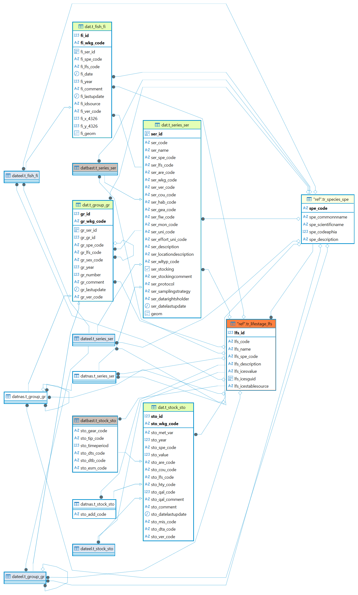{#fig-schema_tr_lifestage_lfs .lightbox}

## Maturity (ts_maturity_mat)

In Salmoglob, information about the stage mixes information on stage and maturity.
The use of Universal sexual maturity scale for all fish (SMSF) vocabulary has been made mandatory for all working groups.
For this reason a vocab on maturity was created. 
It will probably rarely be used in eel as all the eel caught even on their way to the ocean are always immature, the maturation occuring later during the spawning migration. 
However, this information is necessary for Salmon, for which both the location and the maturity will define the spatio temporal elements in life cycle, to be integrated as processes in the model. So for instance, some parameters will describe sexually mature individuals caught at sea, or in freshwater during their spawning migration.

<details>

<summary>SQL code to create table `tr_maturity_mat`</summary>

``` {.sql include="../SQL/2_ref_tr_maturity_mat.sql"}
```

</details>


since 2020 and WGBIOP [@ices_wgbiop_2024] has revised the referential
and emphasized the need of its use for a consistent stock assessment.

In the report the stages are defined as following in
[Maturitstage](https://vocab.ices.dk/?CodeTypeRelID=1510&CodeID=197374).

| State | Stage | Possible sub-stages |
|------------------------|------------------------|------------------------|
| SI. Sexually immature | A. Immature |  |
| SM. Sexually mature | B. Developing | Ba. Developing but functionally immature (first-time developer) |
|  |  | Bb. Developing and functionally mature |
|  | C. Spawning | Ca. Actively spawning |
|  |  | Cb. Spawning |
|  | D. Regressing/Regenerating | Da. Regressing |
|  |  | Db. Regenerating |
|  | E. Omitted spawning |  |
|  | F. Abnormal |  |

Table SMSF (WKMATCH 2012 maturity scale revised). Source:
\[\@ices_wbbiop_2024\].

Of note the following comments by WGBIOP :

-   The substage Ba identifies a sexually mature but functionally
immature (virgin developing for the first time) fish which is not
going to contribute to the current upcoming spawning season. Either
it is uncertain if the fish will make it for the upcoming spawning
season as it is a long time to the current upcoming spawning season
(i.e., if maturity is assessed 8 months prior to the spawning season
it is unsure if the first time developer will be ready to spawn in 8
months time), or the time between assessing the maturity stage and
the current upcoming spawning season is too short to fully develop
the oocytes (i.e., if it takes 6 months to fully develop oocytes from
previtellogenic to eggs and a Ba (see table below) fish is found 3 months prior to the
current upcoming spawning season, it will not have enough time to
develop the oocytes).

-   the substage Bb identifies a developing and functionally mature
(first or repeat spawner!) fish which, in most of the cases is
going to contribute to the current spawning season. This stage has
visible oocytes and grainy appearance of the gonads on the
macroscopic scale, and vitellogenic oocytes on the histological key.

Following this report and the comments made by ICES data center the
following codes are proposed (Table @tbl-tr_maturity_mat).

```{r import_tr_maturity_mat}
#| echo: TRUE
#| eval: FALSE
#| warning: FALSE
#| message: FALSE
#| code-fold: TRUE
#| code-summary: Code to import maturity from ICES.

maturity <- icesVocab::getCodeList('TS_MATURITY')

maturity <- maturity |> 
  rename("mat_icesguid"="GUID",  "mat_icesvalue" = "Key", "mat_description" = "Description") |> 
  select ( mat_icesvalue, mat_icesguid, mat_description) |>
  filter(mat_icesvalue %in% c("A","B","Ba","Bb","C","Ca","Cb","D","Da","Db","E", "F")) |>
  mutate(mat_icestablesource = "TS_MATURITY",
         mat_id = 1:12,
         mat_code = mat_icesvalue) |>
  select(mat_id, mat_code, mat_description, mat_icesvalue, mat_icesguid, mat_icestablesource)

DBI::dbWriteTable(con_diaspara_admin, "temp_maturity", maturity, overwrite = TRUE)


DBI::dbExecute(con_diaspara_admin, "INSERT INTO ref.tr_maturity_mat
(mat_id, mat_code, mat_description, mat_icesvalue, mat_icesguid, mat_icestablesource)
SELECT mat_id, mat_code, mat_description, mat_icesvalue, mat_icesguid::uuid, mat_icestablesource
FROM temp_maturity")# 12


DBI::dbExecute(con_diaspara_admin, "DROP table temp_maturity")
```

```{r}
#| label: tbl-tr_maturity_mat
#| echo: TRUE
#| eval: TRUE
#| warning: FALSE
#| message: FALSE
#| code-fold: TRUE
#| tbl-cap: Table of maturity codes
dbGetQuery(con_diaspara, "SELECT * FROM ref.tr_maturity_mat;") |> 
  knitr::kable() |> 
  kable_styling(bootstrap_options = c("striped", "hover", "condensed"))

```


::: {.callout-caution appearance="simple"}
## Add maturity to metadata in WGNAS
We still have to modify the metadata in WGNAS, create a new column for maturity and
link it. This has to be done by WGNAS :
[Metadata : integrate the maturity referential #27](https://github.com/DIASPARAproject/WP3_migdb/issues/27)

:::

## Habitat type (tr_habitattype_hty)

This table (@tbl-habitat_type_vocab) is used in RDBES, and those
stages are consistent with WGBAST and WGEEL. When creating habitat types
for WGEEL, we tried to follow the ICES vocab at the time, so it's
mostly similar except that `C` (coastal) in WGEEL is
`C (WFD Coastal water)` in WLTYP but is also reported as
`MC (Marine Coastal)` in the RDBES and freshwater is `F` instead of
`FW`. WGBAST separates Marine Open `O` (instead of `MO`), Marine coastal
`C` (instead of `MC`) and rivers `R` (instead of `FW)`. In the report it
is said that `S` sea is used when it is not possible to distinguish
between coastal and marine open, but the code is not in the database (If
I'm not wrong see [WGBAST database description - catch
habitat](https://projets_eabx.pages.mia.inra.fr/diaspara/fr/deliverables/wp3/p5/wgbast_database_description.html#catch-habitat)).
Other elements in this vocab will not be used (e.g. `TT`, `Beach`, ...).
Currently the
[RDBES](https://vocab.ices.dk/?CodeTypeRelID=212&CodeID=249075) uses the
following codes from `FW  Fresh water`, `MC   Marine water (coast)`,
`MO Marine water (open sea)`, `MC   Marine water (coast)` and
`NA  Not applicable`.


```{r }
#| echo: TRUE
#| eval: TRUE
#| warning: FALSE
#| code-fold: TRUE
#| message: FALSE
#| tbl-cap: ICES vocabularies for habiat type (table WLTYP)
#| label: tbl-habitat_type_vocab


WLTYP <- icesVocab::getCodeList('WLTYP')

# At the present the codetypes target Eggs and Larvae surveys
# This is a description of scales types using different publications => not for use()
kable(WLTYP, caption = "WLTYP") |> kable_styling(bootstrap_options = c("striped", "hover", "condensed")) 
```

### Code to create the habitat type table.

The code for creating `tr_habitat_type` is shown below.

<details>

<summary>SQL code to create table `tr_habitat_type`</summary>

``` {.sql include="../SQL/2_ref_tr_habitattype_hty.sql"}
```

</details>

### Import the habitat type

The codes are imported in Table @tbl-tr_habitattype_hty.

```{r import_tr_habitat_type}
#| echo: TRUE
#| eval: FALSE
#| warning: FALSE
#| message: FALSE
#| code-fold: TRUE
#| code-summary: Code to import habitat from ICES. 

habitat <- icesVocab::getCodeList('WLTYP')

habitat <- habitat |> 
  rename("hty_icesguid"="GUID",  "hty_icesvalue" = "Key", "hty_description" = "Description") |> 
  select ( hty_icesvalue, hty_icesguid, hty_description) |>
  filter(hty_icesvalue %in% c("MC","MO","FW","T")) |>
  mutate(hty_icestablesource = "TS_habitat",
         hty_id = 1:4,
         hty_code = hty_icesvalue) |>
  select(hty_id, hty_code, hty_description, hty_icesvalue, hty_icesguid, hty_icestablesource)

DBI::dbWriteTable(con_diaspara_admin, "temp_habitat", habitat, overwrite = TRUE)


DBI::dbExecute(con_diaspara_admin, "INSERT INTO ref.tr_habitattype_hty
(hty_id, hty_code, hty_description, hty_icesvalue, hty_icesguid, hty_icestablesource)
SELECT hty_id, hty_code, hty_description, hty_icesvalue, hty_icesguid::uuid, hty_icestablesource
FROM temp_habitat")# 4


DBI::dbExecute(con_diaspara_admin, "DROP table temp_habitat")
```

-   The following table is proposed (Table @tbl-tr_habitattype_hty).

```{r}
#| label: tbl-tr_habitattype_hty
#| echo: TRUE
#| eval: TRUE
#| warning: FALSE
#| message: FALSE
#| code-fold: TRUE
#| tbl-cap: Table of habitat types
dbGetQuery(con_diaspara, "SELECT * FROM ref.tr_habitattype_hty;") |> 
  knitr::kable() |> 
  kable_styling(bootstrap_options = c("striped", "hover", "condensed"))

```

## Quality (tr_quality_qal)

#### Quality and Archiving Procedures Across Working Groups

The Working Group on Eel (WGEEL) employs a dedicated quality‑coding system to document both the reliability of submitted data and any modifications applied during processing. This system, implemented through the table tbl‑tr_quality_qalwgeel, enables the group to flag records as high quality, modified, subject to warnings, missing, or otherwise problematic. It also serves as a mechanism for retaining historical information associated with each data point.
In contrast, ICES does not routinely retain archived versions of submitted datasets. 
The Working Group on North Atlantic Salmon (WGNAS) adopts a different approach: elements from each annual assessment are systematically copied into an archive table, while only the most up‑to‑date data are maintained in the active database used for current analyses. Consequently, the SalmoGlob database—constructed from WGNAS data—contains exclusively the records relevant to the current assessment year.
A structured comparison between the active and archived datasets is conducted within the WGNAS Shiny visualisation tool. This comparison is used to identify variables that are missing or that exhibit substantial deviations from the previous year's values. The results provide an essential quality‑control checkpoint, ensuring the consistency and reliability of input data prior to executing the more complex modelling procedures.


::: {#tbl-tr_quality_qalwgeel}

Table tr_quality_qal used by the wgeel 

| qal_id | qal_level | qal_text |
|-------------------|----------------------------|-------------------------|
| 1 | good quality | the data passed the quality checks of the wgeel |
| 2 | modified | The wgeel has modified that data |
| 4 | warnings | The data is used by the wgeel, but there are warnings on its quality (see comments) |
| 0 | missing | missing data |
| 3 | bad quality | The data has been judged of too poor quality to be used by the wgeel, it is not used |
| 18 | discarded_wgeel_2018 | This data has either been removed from the database in favour of new data, or corresponds to new data not kept in the database during datacall 2018 |
| 19 | discarded_wgeel_2019 | This data has either been removed from the database in favour of new data, or corresponds to new data not kept in the database during datacall 2019 |
| 20 | discarded_wgeel_2020 | This data has either been removed from the database in favour of new data, or corresponds to new data not kept in the database during datacall 2020 |
| 21 | discarded_wgeel_2021 | This data has either been removed from the database in favour of new data, or corresponds to new data not kept in the database during datacall 2021 |
| -21 | discarded 2021 biom mort | This data has either been removed from the database in favour of new data, this has been done systematically in 2021 for biomass and mortality types |
| 22 | discarded_wgeel_2022 | This data has either been removed from the database in favour of new data, or corresponds to new data not kept in the database during datacall 2022 |
| 23 | discarded_wgeel 2023 | This data has either been removed from the database in favour of new data, or corresponds to new data not kept in the database during datacall 2023 |
| 24 | discarded_wgeel 2024 | This data has either been removed from the database in favour of new data, or corresponds to new data not kept in the database during datacall 2024 |

:::

Considering the heavy reliance of WGEEL on the quality flag, and the importance of an archive database for WGNAS processes, it was decided to keep both but to shift to the quality flag code a standard vocabulary from ICES [seadatanet](https://vocab.ices.dk/?codetypeguid=036cc995-415d-4859-8f2d-739c12d84250).
This shift from the working group format to the new format implies breaking changes summarized below.


::: {.callout-caution appearance="simple"}


- 0 in wgeel becomes 9
- 1 is OK
- 2 becomes 5
- 3 becomes 4
- 4 becomes 3

Values other than 0 1 2 3 4 will have to be ignored and considered as historical.
Note that currently those are still kept in the database, but in the future we'll copy them in another table for archive data. Figure @fig-schema_tr_quality_qal shows which tables 
will be updated after the change.
:::


### Code to create the table

The code for creating `tr_quality_qal` is shown below.

<details>

<summary>SQL code to create table `tr_quality_qal`</summary>

``` {.sql include="../SQL/2_ref_tr_quality_qal.sql"}
```

</details>

### Import the quality code

The codes are imported in @tbl-tr_quality_qal using the following
code :

```{r import_tr_quality_qal}
#| echo: TRUE
#| eval: FALSE
#| warning: FALSE
#| message: FALSE
#| code-fold: TRUE
#| code-summary: Code to import quality from WGEEL and SeaDataNet flags


 SDN_FLAGS<- icesVocab::getCodeList('SDN_FLAGS')
dbWriteTable(conn = con_diaspara,name = "temp_sdn_flags", value = SDN_FLAGS) 
# old code deprecated, see next sql
# dbExecute(con_diaspara_admin,"DELETE FROM ref.tr_quality_qal;")
# dbExecute(con_diaspara, "ALTER TABLE ref.tr")
# 
# dbExecute(con_diaspara_admin, "INSERT INTO ref.tr_quality_qal (qal_code, qal_description, qal_definition, qal_kept)
# SELECT qal_id, qal_level, qal_text, qal_kept FROM refwgeel.tr_quality_qal ;")
# # 13
# # changing one definition linked to wgeel
# dbExecute(con_diaspara_admin, "UPDATE ref.tr_quality_qal set qal_definition = 'the data passed the quality checks and is considered as good quality' WHERE qal_code = 1")
# # This one only causes problems.... Remove.
# dbExecute(con_diaspara_admin, "DELETE FROM ref.tr_quality_qal WHERE qal_code = 0")

```

<details>

<summary>SQL code to modify table `tr_quality_qal`</summary>

``` {.sql include="../SQL/2_ref_tr_quality_qal_modification.sql"}
```

</details>


```{r}
#| label: tbl-tr_quality_qal
#| echo: TRUE
#| eval: TRUE
#| warning: FALSE
#| message: FALSE
#| code-fold: TRUE
#| tbl-cap: Table of quality
dbGetQuery(con_diaspara, "SELECT * FROM ref.tr_quality_qal;") |> 
  knitr::kable() |> 
  kable_styling(bootstrap_options = c("striped", "hover", "condensed"))

```


{#fig-schema_tr_quality_qal .lightbox}

## Age (tr_age_age)


The code for creating `tr_age_age` (Table @tbl-tr_age_age) is shown below.

<details>

<summary>SQL code to create table `tr_age_age`</summary>

``` {.sql include="../SQL/2_ref_tr_age_age.sql"}
```

</details>

```{r}
#| label: tbl-tr_age_age
#| echo: TRUE
#| eval: TRUE
#| warning: FALSE
#| message: FALSE
#| code-fold: TRUE
#| tbl-cap: Table of age
dbGetQuery(con_diaspara, "SELECT * FROM ref.tr_age_age;") |> 
  knitr::kable() |> 
  kable_styling(bootstrap_options = c("striped", "hover", "condensed"))

```


## Sex (tr_sex_sex)

There is a referential about [sex](https://vocab.ices.dk/?codetypeguid=4efe3145-65ee-46c7-bca1-3ce9f10101de) in ICES see Table @tbl-vocabsex.

```{r }
#| echo: TRUE
#| eval: TRUE
#| warning: FALSE
#| code-fold: TRUE
#| message: FALSE
#| tbl-cap: ICES vocabularies for sex
#| label: tbl-vocabsex


TS_SEXCO <- icesVocab::getCodeList('SEXCO')
kable(TS_SEXCO, caption = "TS_SEXCO") |> kable_styling(bootstrap_options = c("striped", "hover", "condensed")) 
```

<details>

<summary>SQL code to create table `tr_sex_sex`</summary>

``` {.sql include="../SQL/2_ref_tr_sex_sex.sql"}
```

</details>

```{r import_tr_sex_sex}
#| echo: TRUE
#| eval: FALSE
#| warning: FALSE
#| message: FALSE
#| code-fold: TRUE
#| code-summary: Code to import sex codes from ICES. 

sex <- icesVocab::getCodeList('SEXCO')

sex <- sex |> 
  rename("sex_icesguid"="GUID",  "sex_icesvalue" = "Key", "sex_description" = "Description") |> 
  select ( sex_icesvalue, sex_icesguid, sex_description) |>
  mutate(sex_icestablesource = "SEXCO",
         sex_id = 1:7,
         sex_code = sex_icesvalue) |>
  select(sex_id, sex_code, sex_description, sex_icesvalue, sex_icesguid, sex_icestablesource)

DBI::dbWriteTable(con_diaspara_admin, "temp_sex", sex, overwrite = TRUE)


DBI::dbExecute(con_diaspara_admin, "INSERT INTO ref.tr_sex_sex
(sex_id, sex_code, sex_description, sex_icesvalue, sex_icesguid, sex_icestablesource)
SELECT sex_id, sex_code, sex_description, sex_icesvalue, sex_icesguid::uuid, sex_icestablesource
FROM temp_sex")# 4


DBI::dbExecute(con_diaspara_admin, "DROP table temp_sex")
```
```{r}
#| label: tbl-tr_sex_sex
#| echo: TRUE
#| eval: TRUE
#| warning: FALSE
#| message: FALSE
#| code-fold: TRUE
#| tbl-cap: Table of sex
dbGetQuery(con_diaspara, "SELECT * FROM ref.tr_sex_sex;") |> 
  knitr::kable() |> 
  kable_styling(bootstrap_options = c("striped", "hover", "condensed"))

```
## Gear (ref.tr_gear_gea)

The gears dictionary is set by FAO and used in EU 
[link](https://www.europarl.europa.eu/RegData/etudes/STUD/2024/759320/IPOL_STU(2024)759320_EN.pdf). There is a gear dictionary in ICES but it's used to describe the type of
engine on experimental trawling surveys.
There might be a need to include more passive engine like trap and fishways.

<details>

<summary>SQL code to create table `tr_gear_gea`</summary>

``` {.sql include="../SQL/2_ref_tr_gear_gea.sql"}
```

</details>


```{r import_tr_gear_gea}
#| echo: TRUE
#| eval: FALSE
#| warning: FALSE
#| message: FALSE
#| code-fold: TRUE
#| code-summary: Code to import gear codes from WGEEL 

gea <- dbGetQuery(con_wgeel_distant, "SELECT * FROM ref.tr_gear_gea")

gea <- gea |> 
  rename("gea_code"="gea_issscfg_code",  "gea_description" = "gea_name_en") |> 
  select(-gea_id) |>
  arrange(gea_code) |>
  mutate(gea_icestablesource = NA,
         gea_icesvalue = NA,
         gea_icesguid = as.character(NA),
         gea_id = 1:nrow(gea)
  ) |>
  select(gea_id, gea_code, gea_description, gea_icesvalue, gea_icesguid, gea_icestablesource)

DBI::dbWriteTable(con_diaspara_admin, "temp_gear", gea, overwrite = TRUE)


DBI::dbExecute(con_diaspara_admin, "INSERT INTO ref.tr_gear_gea
(gea_id, gea_code, gea_description, gea_icesvalue, gea_icesguid, gea_icestablesource)
SELECT gea_id, gea_code, gea_description, gea_icesvalue, gea_icesguid::uuid, gea_icestablesource
FROM temp_gear")# 60


DBI::dbExecute(con_diaspara_admin, "DROP table temp_gear")


```
```{r}
#| label: tbl-tr_gear_gea
#| echo: TRUE
#| eval: TRUE
#| warning: FALSE
#| message: FALSE
#| code-fold: TRUE
#| tbl-cap: Table of gears
dbGetQuery(con_diaspara, "SELECT * FROM ref.tr_gear_gea;") |> 
  knitr::kable() |> 
  kable_styling(bootstrap_options = c("striped", "hover", "condensed"))

```

:::{.callout-tip appearance="simple" appearance="simple"}
## Other dictionaries in ICES
The [geartype](https://vocab.ices.dk/?codetypeguid=6f65b819-57ca-4904-a961-2d55699008d5)
which corresponds to metier 4 is sourced by the DCF and maintained by
the JRC (contact can be provided by ICES). 
The Sampler type [SMTYP](https://vocab.ices.dk/?codetypeguid=e034756c-999a-40cb-8b4e-e44229a4a9b6)
provides a dictionary of the scientific gear used in monitoring, this one can be updated 
:::

:::{.callout-tip appearance="simple" appearance="simple"}
## Other source of definition (if needed)
 Method used to monitor eel in the Mediterranean are referenced in detail in this 
 [report](https://openknowledge.fao.org/handle/20.500.14283/cc7252en).
:::


 

## ICES areas

We have create entries in the table \`tr_fishingarea_fia for FAO major
fishing area (27, 21, 37, 34, 31).

-   27 Atlantic, Northeast
-   21 Atlantic, Northwest
-   37 Mediterranean and Black Sea
-   34 Atlantic Eastern Central
-   31 Atlantic, Western Central

source : GFCM geographical subareas
https://www.fao.org/gfcm/data/maps/gsas/fr/
https://gfcmsitestorage.blob.core.windows.net/website/5.Data/ArcGIS/GSAs_simplified_updated_division%20(2).zip

source : NAFO divisions https://www.nafo.int/Data/GIS
https://www.nafo.int/Portals/0/GIS/Divisions.zip

source : ICES statistical areas
https://gis.ices.dk/shapefiles/ICES_areas.zip
https://gis.ices.dk/geonetwork/srv/eng/catalog.search#/metadata/c784a0a3-752f-4b50-b02f-f225f6c815eb

The rest of the world was found on a computer. Cannot trace the
source: it's exactly the same for NAFO but changed in the Med and ICES.
For some reason, it was not complete in the table from wgeel, so have to
download it again to postgres.

Values for geom have been updated from ICES areas, the new boundaries
are different, however, there are more than the previous ones. The
values for Areas and Subareas have not been updated but these are for
wide maps so we'll leave it as it is.

```{r}
#| label: fishingareas
#| echo: TRUE
#| eval: FALSE
#| warning: FALSE
#| message: FALSE
#| code-fold: TRUE
#| code-summary: Code to create reference fishing area maps 

dbExecute(con_diaspara_admin, "DROP TABLE IF EXISTS ref.tr_fishingarea_fia 
CASCADE;")
dbExecute(con_diaspara_admin,
          "
  CREATE TABLE ref.tr_fishingarea_fia
  (  
    fia_level TEXT,
    fia_code TEXT,
    fia_status numeric,
    fia_ocean TEXT,
    fia_subocean TEXT,
    fia_area TEXT,
    fia_subarea TEXT,
    fia_division TEXT,
    fia_subdivision TEXT,
    fia_unit TEXT,
    fia_name TEXT NULL,
    geom geometry(MultiPolygon,4326),
    CONSTRAINT tr_fishingarea_fia_pkey PRIMARY KEY (fia_code),
    CONSTRAINT uk_fia_subdivision UNIQUE (fia_unit)
  )
  ;
")


# start with initial FAO dataset

#area_all <- dbGetQuery(con_diaspara_admin, "SELECT * FROM area.\"FAO_AREAS\"
# WHERE f_area IN ('21','27','31','34','37') ;")

# In this table all geom are mixed from unit to division.
# It only make sense to extract for a unique f_level


# TODO add species, wk
dbExecute(con_diaspara_admin, "INSERT INTO ref.tr_fishingarea_fia
SELECT
   initcap(f_level) AS fia_level, 
   f_code AS  fia_code,
   f_status AS  fia_status,
   ocean AS  fia_ocean,
   subocean AS  fia_subocean,
   f_area AS  fia_area,
   f_subarea AS  fia_subarea,
   f_division AS  fia_division,
   f_subdivis AS  fia_subdivision,
   f_subunit AS  fia_unit,
   NULL as fia_name,
   geom 
  FROM area.\"FAO_AREAS\"
  WHERE f_area IN ('21','27','31','34','37') 
") # 187

# Replace values ices
dbExecute(con_diaspara_admin, "UPDATE ref.tr_fishingarea_fia
    set geom = st_transform(are.geom, 4326)
    FROM
    area.\"ICES_Areas_20160601_cut_dense_3857\" are
    WHERE area_full = fia_code;") # 66
# Replace values NAFO (nothing to do ...)


# Replace values GFCM
dbExecute(con_diaspara_admin, "INSERT INTO ref.tr_fishingarea_fia
SELECT 
'Subdivision' AS fia_level, 
f_gsa AS fia_code,
1 AS fia_status,
'Atlantic' AS fia_ocean, 
3 AS fia_subocean, 
f_area, 
f_subarea, 
f_division, 
f_gsa AS fia_subdivision,
NULL AS fia_unit,
smu_name AS fia_name,
geom
FROM area.\"GSAs_simplified_division\";") # 32

dbExecute(con_diaspara_admin, "GRANT ALL ON ref.tr_fishingarea_fia 
          TO diaspara_admin;")
dbExecute(con_diaspara_admin, "GRANT SELECT ON ref.tr_fishingarea_fia 
          TO diaspara_read;")

dbExecute(con_diaspara_admin, "COMMENT ON TABLE ref.tr_fishingarea_fia 
IS 'Table of fishing areas, attention, different levels of geometry
details are present in the table, area, subarea, division, subdivision, unit,
most query will use WHERE 
 fia_level = ''Subdivision''';")
```

```{r fig-fishingareas_major}
#| echo: TRUE
#| eval: FALSE
#| warning: FALSE
#| message: FALSE
#| code-fold: TRUE
#| code-summary: Coderedce  to create a map of fishing areas at Major level
#| fig-cap: Map of ICES fishing areas at Major level, source NAFO, FAO, ICES, GFCM.

library(rnaturalearth)
world <- ne_countries(scale = "small", returnclass = "sf")


if (file.exists("data/fishingareas_major.Rdata")) 
  load("data/fishingareas_major.Rdata") else {
    fishing_areas_major <- sf::st_read(con_diaspara,
                                       query = "SELECT fia_code, ST_MakeValid(geom) 
                          from ref.tr_fishingarea_fia
                          WHERE fia_level = 'Major'") |>
      sf::st_transform(4326) 
    save(fishing_areas_major, file="data/fishing_areas_major.Rdata")
  }
load("data/country_sf.Rdata")
crs_string <- "+proj=ortho +lon_0=-30 +lat_0=30"

ocean <- sf::st_point(x = c(0,0)) |>
  sf::st_buffer(dist = 6371000) |>
  sf::st_sfc(crs = crs_string)
area_sf2 <-  fishing_areas_major |> 
  sf::st_intersection(ocean |> sf::st_transform(4326)) |> 
  sf::st_transform(crs = crs_string) 

country_sf2 <-  country_sf |> 
  sf::st_intersection(ocean |> sf::st_transform(4326)) |> 
  sf::st_transform(crs = crs_string) 


g <- ggplot() + 
  geom_sf(data = ocean, fill = "deepskyblue4", color = NA) + 
  geom_sf(data = area_sf2, aes(fill = fia_code), color="white", lwd = .1) + 
  geom_sf(data = world, fill="black", color="grey20") + 
  geom_sf(data= country_sf2 , fill= "grey10",color="grey30")  +
  theme_void()
#scale_fill_discrete(guide = "none") +


# this part is used to avoid long computations
png(filename="images/fig-fishingareas_major.png",width=600, height=600, res=300, bg="transparent")
print(g)
dev.off()


```

{#fig-fishingareas_major}

```{r fig-fishingareas_subarea}
#| echo: TRUE
#| eval: FALSE
#| warning: FALSE
#| message: FALSE
#| code-fold: TRUE
#| code-summary: Code to create a map of fishing areas at Subarea level
#| fig-cap: Map of ICES fishing areas at Subarea level, source NAFO, FAO, ICES, GFCM.

if (file.exists("data/fishingareas_subarea.Rdata")) load("data/fishingareas_subarea.Rdata") else {
  fishing_areas_subarea <- sf::st_read(con_diaspara,
                                       query = "SELECT fia_code, ST_MakeValid(geom) 
                          from ref.tr_fishingarea_fia
                          WHERE fia_level = 'Subarea'") |>
    sf::st_transform(4326) 
  save(fishing_areas_subarea, file="data/fishing_areas_subarea.Rdata")
}
crs_string <- "+proj=ortho +lon_0=-30 +lat_0=30"

area_sf2 <-  fishing_areas_subarea |> 
  sf::st_intersection(ocean |> sf::st_transform(4326)) |> 
  sf::st_transform(crs = crs_string) # reproject to ortho

g <- ggplot() + 
  geom_sf(data = ocean, fill = "deepskyblue4", color = NA) + 
  geom_sf(data = area_sf2, aes(fill = fia_code), color="white", lwd = .1) + 
  geom_sf(data = world, fill="black", color="grey20") + 
  geom_sf(data= country_sf2 , fill= "grey10",color="grey30")  +
  scale_fill_discrete(guide = "none")  +
  theme_void()

# this part is used to avoid long computations
png(filename="images/fig-fishingareas_subarea.png", bg="transparent")
print(g)
dev.off()

```

{#fig-fishingareas_subarea}

```{r fig-fishingareas_division}
#| echo: TRUE
#| eval: FALSE
#| warning: FALSE
#| message: FALSE
#| code-fold: TRUE
#| code-summary: Code to create a map of fishing areas at Division level
#| fig-cap: Map of ICES fishing areas at Division level, source NAFO, FAO, ICES, GFCM.

if (file.exists("data/fishingareas_division.Rdata")) load("data/fishingareas_division.Rdata") else {
  fishing_areas_division <- sf::st_read(con_diaspara,
                                        query = "SELECT fia_code, ST_MakeValid(geom) 
                          from ref.tr_fishingarea_fia
                          WHERE fia_level = 'Division'") |>
    sf::st_transform(4326) 
  save(fishing_areas_division, file="data/fishing_areas_division.Rdata")
}

crs_string <- "+proj=ortho +lon_0=-30 +lat_0=30"


ocean <- sf::st_point(x = c(0,0)) |>
  sf::st_buffer(dist = 6371000) |>
  sf::st_sfc(crs = crs_string)

area_sf2 <-  fishing_areas_division |> 
  sf::st_intersection(ocean |> sf::st_transform(4326)) |> 
  sf::st_transform(crs = crs_string) 

g <- ggplot() + 
  geom_sf(data = ocean, fill = "deepskyblue4", color = NA) + 
  geom_sf(data = area_sf2, aes(fill = fia_code), color="white", lwd = .1) + 
  geom_sf(data = world, fill="black", color="grey20") + 
  geom_sf(data= country_sf2 , fill= "grey10",color="grey30")  +
  scale_fill_discrete(guide = "none") +
  theme_void()

png(filename="images/fig-fishingareas_division.png", bg="transparent")
print(g)
dev.off() 

```

{#fig-fishingareas_division}

```{r fig-fishingareas_subdivision}
#| echo: TRUE
#| eval: FALSE
#| warning: FALSE
#| message: FALSE
#| code-fold: TRUE
#| code-summary: Code to create a map of fishing areas at subdivision level
#| fig-cap: Map of ICES fishing areas at subdivision level, source NAFO, FAO, ICES, GFCM.

if (file.exists("data/fishingareas_subdivision.Rdata")) load("data/fishingareas_subdivision.Rdata") else {
  fishing_areas_subdivision <- sf::st_read(con_diaspara,
                                           query = "SELECT fia_code, ST_MakeValid(geom) 
                          from ref.tr_fishingarea_fia
                          WHERE fia_level = 'Subdivision'") |>
    sf::st_transform(4326) 
  save(fishing_areas_subdivision, file="data/fishing_areas_subdivision.Rdata")
}

crs_string <- "+proj=ortho +lon_0=-30 +lat_0=30"


ocean <- sf::st_point(x = c(0,0)) |>
  sf::st_buffer(dist = 6371000) |>
  sf::st_sfc(crs = crs_string)

area_sf2 <-  fishing_areas_subdivision |> 
  sf::st_intersection(ocean |> sf::st_transform(4326)) |> 
  sf::st_transform(crs = crs_string) 

g <- ggplot() + 
  geom_sf(data = ocean, fill = "deepskyblue4", color = NA) + 
  geom_sf(data = area_sf2, aes(fill = fia_code), color= "white", lwd = .1) + 
  geom_sf(data = world, fill="black", color="grey20") + 
  geom_sf(data= country_sf2 , fill= "grey10",color="grey30")  +
  scale_fill_discrete(guide = "none") +
  theme_void()

png(filename="images/fig-fishingareas_subdivision.png", bg="transparent")
print(g)
dev.off() 
```

{#fig-fishingareas_subdivision}

## Time period (ref.tr_timeperiod_tip)

WGBAST reports data per month, quarter, or half year.
There is a vocabulary for quarters but not yet for half of year. 


<details>

<summary>SQL code to create table `tr_timeperiod_tip`</summary>

``` {.sql include="../SQL/2_ref_tr_timeperiod_tip.sql"}
```

</details>


```{r import_tr_timeperiod_tip}
#| echo: TRUE
#| eval: FALSE
#| warning: FALSE
#| message: FALSE
#| code-fold: TRUE
#| code-summary: Code to import timeperiod codes

tp <- icesVocab::getCodeList('IC_SeasonType')
#I don't want this I want a code
tip <- data.frame(tip_id=1:4, 
tip_code = c(tp$Key, "Half of Year"), 
tip_description = c("Monthly data, from 1 to 12",  "Quarterly data from 1 to 4", "Year value of timeperiod should be NULL and year column filled", "Half of year, either from 1 to 6 (included)=1, or from month 7 to 12 (included)=2"), 
 tip_icesvalue = c(tp$Key,NA),
 tip_icesguid = c(tp$Guid,NA),
 tip_icestablesource =c(rep("IC_SeasonType", 3), NA))|>
  select(tip_id, tip_code, tip_description, tip_icesvalue, tip_icesguid, tip_icestablesource)
tip$tip_icesguid <- as.character(tip$tip_icesguid)
DBI::dbWriteTable(con_diaspara_admin, "temp_tipr", tip, overwrite = TRUE)
DBI::dbExecute(con_diaspara_admin, "DELETE FROM ref.tr_timeperiod_tip")
DBI::dbExecute(con_diaspara_admin, "INSERT INTO ref.tr_timeperiod_tip
(tip_id, tip_code, tip_description, tip_icesvalue, tip_icesguid, tip_icestablesource)
SELECT tip_id, tip_code, tip_description, tip_icesvalue, tip_icesguid::uuid, tip_icestablesource
FROM temp_tipr")# 4
DBI::dbExecute(con_diaspara_admin, "DROP table temp_tipr")

```

```{r}
#| label: tbl-tr_timeperiod_tip
#| echo: TRUE
#| eval: TRUE
#| warning: FALSE
#| message: FALSE
#| code-fold: TRUE
#| tbl-cap: Table of gears
dbGetQuery(con_diaspara, "SELECT * FROM ref.tr_timeperiod_tip;") |> 
  knitr::kable() |> 
  kable_styling(bootstrap_options = c("striped", "hover", "condensed"))

```

::: {.callout-warning appearance="simple"}
## Only in WGBAST
Currently the time period are not used in WGEEL and WGNAS (where time period
is always year), the referential is only used in WGBAST.
:::

## Data source (ref.tr_datasource_dts) {#sec-datasource}


The source of  data is included in WGBAST see: [WBAST description](https://diaspara.bordeaux-aquitaine.inrae.fr/deliverables/wp3/p5/wgbast_database_description.html#source-of-fishery-data).
The vocab described here adapts this vocab to ICES DataSource vocab and proposes new entries from WGBAST.

ICES data centre indicated that the current way of handling estimated data
is to separate the source of data and the type of estimation. For instance, this structure 
is followed currently in RDBES. So a catch can come from logbook: it is estimated,
and when estimated, a method must be provided (estimation method).


<details>

<summary>SQL code to create table `tr_datasource_dts`</summary>

``` {.sql include="../SQL/2_ref_tr_datasource_dts.sql"}
```

</details>


```{r import_tr_datasource_dts}
#| echo: TRUE
#| eval: FALSE
#| warning: FALSE
#| message: FALSE
#| code-fold: TRUE
#| code-summary: Code to import datasource codes

dts <- icesVocab::getCodeList('DataSource')
# 
dts <- dts |>
  rename("dts_icesguid"="Guid",  "dts_code" = "Key", "dts_description" = "Description") |> 
  select ( dts_code, dts_icesguid, dts_description)  |>
  mutate(dts_icestablesource = "DataSource",
         dts_id = 1:nrow(dts),
         dts_icesvalue = dts_code) |>
  select(dts_id, dts_code, dts_description, dts_icesvalue, dts_icesguid, dts_icestablesource)


DBI::dbWriteTable(con_diaspara_admin, "temp_dtsr", dts, overwrite = TRUE)
DBI::dbExecute(con_diaspara_admin, "DELETE FROM ref.tr_datasource_dts")
DBI::dbExecute(con_diaspara_admin, "INSERT INTO ref.tr_datasource_dts
(dts_id, dts_code, dts_description, dts_icesvalue, dts_icesguid, dts_icestablesource)
SELECT dts_id, dts_code, dts_description, dts_icesvalue, dts_icesguid::uuid, dts_icestablesource
FROM temp_dtsr")# 14
DBI::dbExecute(con_diaspara_admin, "DROP table temp_dtsr")
DBI::dbExecute(con_diaspara_admin, "INSERT INTO ref.tr_datasource_dts (dts_id,dts_code,dts_description)
	VALUES (15,'Smolt','Smolt count');")
DBI::dbExecute(con_diaspara_admin, "INSERT INTO ref.tr_datasource_dts (dts_id,dts_code,dts_description)
	VALUES (16,'Parr','Parr densities (electrofishing)');")
DBI::dbExecute(con_diaspara_admin, "INSERT INTO ref.tr_datasource_dts (dts_id,dts_code,dts_description)
	VALUES (17,'Spawner','Spawner count');")
DBI::dbExecute(con_diaspara_admin, "INSERT INTO ref.tr_datasource_dts (dts_id,dts_code,dts_description)
	VALUES (18,'Stocking','Stocking data');")


```


```{r}
#| label: tbl-tr_datasource_dts
#| echo: TRUE
#| eval: TRUE
#| warning: FALSE
#| message: FALSE
#| code-fold: TRUE
#| tbl-cap: Table of source of data used by WGBAST, some of the values might fit in there but some will need a work by national expert (EST estimated has no correspondance) though it might be extrapolated by some of the comments. The smolt estimation methods are those reported in the young fish table.

dbGetQuery(con_diaspara, "SELECT * FROM ref.tr_datasource_dts;") |> 
  knitr::kable() |> 
  kable_styling(bootstrap_options = c("striped", "hover", "condensed"))

```


## Data basis (ref.tr_databasis_dtb)


<details>

<summary>SQL code to create table `tr_databasis_dtb`</summary>

``` {.sql include="../SQL/2_ref_tr_databasis_dtb.sql"}
```

</details>

```{r import_tr_databasis_dtb}
#| echo: TRUE
#| eval: FALSE
#| warning: FALSE
#| message: FALSE
#| code-fold: TRUE
#| code-summary: Code to import databasis codes

dtb <- icesVocab::getCodeList('DataBasis')
# 
dtb <- dtb |>
  rename("dtb_icesguid"="Guid",  "dtb_code" = "Key", "dtb_description" = "Description") |> 
  select ( dtb_code, dtb_icesguid, dtb_description)  |>
  mutate(dtb_icestablesource = "DataBasis",
         dtb_id = 1:nrow(dtb),
         dtb_icesvalue = dtb_code) |>
  select(dtb_id, dtb_code, dtb_description, dtb_icesvalue, dtb_icesguid, dtb_icestablesource)


DBI::dbWriteTable(con_diaspara_admin, "temp_dtbr", dtb, overwrite = TRUE)
DBI::dbExecute(con_diaspara_admin, "INSERT INTO ref.tr_databasis_dtb
(dtb_id, dtb_code, dtb_description, dtb_icesvalue, dtb_icesguid, dtb_icestablesource)
SELECT dtb_id, dtb_code, dtb_description, dtb_icesvalue, dtb_icesguid::uuid, dtb_icestablesource
FROM temp_dtbr")# 5
DBI::dbExecute(con_diaspara_admin, "DROP table temp_dtbr")

```


## Data estimation method ref.tr_estimationmethod_esm 

This table will be inherited, we are proposing working group specific estimation
methods. Typically estimation methods of WGBAST. These will only be used if
sto_dtb_code = 'Estimated'. 

1. Complete count of smolts.
2. Sampling of smolts and estimate of total smolt run size.
3. Estimate of smolt run from parr production by relation developed in the same river.
4. Estimate of smolt run from parr production by relation developed in another river.
5. Inference of smolt production from data derived from similar rivers in the region.
6. Count of spawners.
7. Estimate inferred from stocking of reared fish in the river.
8. Salmon catch, exploitation and survival estimate.

<details>

<summary>SQL code to create table `ref.tr_estimationmethod_esm`</summary>

``` {.sql include="../SQL/2_ref_tr_estimationmethod_esm.sql"}
```

</details>


::: {.callout-warning appearance="simple"}
## This data type is currently only used in WGBAST

Currently the estimation method has only been used in WGBAST. Maybe it could be extended by creating a similar table in the WGNAS in the future.
:::

::: {.callout-note appearance="simple"}
## Note

The estimation method are inherited, so there is a common table
and estimation methods are created in daughter tables in each working group,
 they are inherited. See @sec-datbast.tr_estimationmethod_esm
:::


## Station (and ICES related vocabs) {#sec-station}


The trait data need to be related to  sampling stations. These rely on a set of vocabularies (EDMO, PRGOV, ...) liseted hereafter.
To include the stations, we need two referential tables: the first one is the Station dictionary and the second is the relation Dictionary (which relates stations together). Both are maintained at ICES.  The following vocabs existing
in ICES have been integrated in the diadromous DB to ensure standardisation with ICES 
vocabs.


### SemanticRelation


```{r tbl-icesVocabRelation}
#| echo: TRUE
#| eval: TRUE
#| warning: FALSE
#| message: FALSE
#| code-fold: TRUE
#| code-summary: Code to show SemanticRelation.
#| tbl-cap: Semantic relation
SemanticRelation <- getCodeList("SemanticRelation")
knitr::kable(SemanticRelation)|>
  kable_styling(bootstrap_options = c("striped", "hover", "condensed"))

```
```{r icesVocabRelation}
#| echo: TRUE
#| eval: FALSE
#| warning: FALSE
#| message: FALSE
#| code-fold: TRUE
#| code-summary: Code to import relation.
#| tbl-cap: Semantic relation
dbWriteTable(con_diaspara, "SemanticRelation", PRGOV)
dbExecute(con_diaspara, 'ALTER TABLE "SemanticRelation" SET SCHEMA ref;') 
dbExecute(con_diaspara,
          'ALTER TABLE ref."SemanticRelation" ADD CONSTRAINT semanticrelation_pkey PRIMARY KEY ("Key");') 

```

### PRGOV

```{r tbl-icesPRGOV}
#| echo: TRUE
#| eval: TRUE
#| warning: FALSE
#| message: FALSE
#| code-fold: TRUE
#| code-summary: Code to show PRGOV.
#| tbl-cap: Program Governance for the Station Dictionary (10 first lines)


PRGOV <- getCodeList("PRGOV")
knitr::kable(PRGOV)|>
  kable_styling(bootstrap_options = c("striped", "hover", "condensed"))
```

```{r icesPRGOV}
#| echo: TRUE
#| eval: FALSE
#| warning: FALSE
#| message: FALSE
#| code-fold: TRUE
#| code-summary: Code to import PRGOV.
#| tbl-cap: Program Governance for the Station Dictionary
dbWriteTable(con_diaspara, "PRGOV", PRGOV)
dbExecute(con_diaspara, 'ALTER TABLE "PRGOV" SET SCHEMA ref;') 
dbExecute(con_diaspara, 
          'ALTER TABLE ref."PRGOV" ADD CONSTRAINT prgov_pkey PRIMARY KEY ("Key");') 
```

### EDMO

```{r tbl-icesEDMO}
#| echo: TRUE
#| eval: TRUE
#| warning: FALSE
#| message: FALSE
#| code-fold: TRUE
#| code-summary: Code to show EDMO.
#| tbl-cap: European Directory of Marine Organisations (EDMO)


EDMO <- getCodeList("EDMO")|>slice_head(n=10)  |>
  knitr::kable() |>
  kable_styling(bootstrap_options = c("striped", "hover", "condensed"))
```


:::{.callout-tip appearance="simple"}
## Addings institutions to the EDMO
To request a new EDMO, an organisation needs to send an email to info@maris.nl
:::


```{r icesEDMO}
#| echo: TRUE
#| eval: FALSE
#| warning: FALSE
#| message: FALSE
#| code-fold: TRUE
#| code-summary: Code to import EDMO.
#| tbl-cap: European Directory of Marine Organisations (EDMO)

dbWriteTable(con_diaspara, "EDMO", EDMO)
dbExecute(con_diaspara, 'ALTER TABLE "EDMO" SET SCHEMA ref;')  
dbExecute(con_diaspara, 
          'ALTER TABLE ref."EDMO" ADD CONSTRAINT edmo_pkey PRIMARY KEY ("Key");')  
```

### PURPM

```{r tbl-icesPURPM}
#| echo: TRUE
#| eval: TRUE
#| warning: FALSE
#| message: FALSE
#| code-fold: TRUE
#| code-summary: Code to show PURPM.
#| tbl-cap: Purpose of Monitoring


PURPM <- getCodeList("PURPM")
knitr::kable(PURPM)|>
  kable_styling(bootstrap_options = c("striped", "hover", "condensed"))
```

```{r icesPURPM}
#| echo: TRUE
#| eval: FALSE
#| warning: FALSE
#| message: FALSE
#| code-fold: TRUE
#| code-summary: Code to import PURPM.
dbWriteTable(con_diaspara, "PURPM", PURPM)
dbExecute(con_diaspara, 'ALTER TABLE "PURPM" SET SCHEMA ref;')
dbExecute(con_diaspara, 
          'ALTER TABLE ref."PURPM" ADD CONSTRAINT purm_pkey PRIMARY KEY ("Key");')    
```

### DTYPE

```{r tbl-icesStation_DTYPE}
#| echo: TRUE
#| eval: TRUE
#| warning: FALSE
#| message: FALSE
#| code-fold: TRUE
#| code-summary: Code to show icesStation_DTYPE.
#| tbl-cap: Station dictionary data type
Station_DTYPE <- getCodeList("Station_DTYPE")
knitr::kable(Station_DTYPE)|>
  kable_styling(bootstrap_options = c("striped", "hover", "condensed"))
```

```{r icesStation_DTYPE}
#| echo: TRUE
#| eval: FALSE
#| warning: FALSE
#| message: FALSE
#| code-fold: TRUE
#| code-summary: Code to import icesStation_DTYPE.

dbWriteTable(con_diaspara, "Station_DTYPE", Station_DTYPE)
dbExecute(con_diaspara, 'ALTER TABLE "Station_DTYPE" SET SCHEMA ref;')  
dbExecute(con_diaspara, 
          'ALTER TABLE ref."Station_DTYPE" ADD CONSTRAINT station_dtype_pkey PRIMARY KEY ("Key");') 
```

### WLTYP

```{r tbl-icesStation_WLTYP}
#| echo: TRUE
#| eval: TRUE
#| warning: FALSE
#| message: FALSE
#| code-fold: TRUE
#| code-summary: Code to show ices WLTYP.
#| tbl-cap: Water and Land Station Type
WLTYP <- getCodeList("WLTYP")
knitr::kable(WLTYP)|>
  kable_styling(bootstrap_options = c("striped", "hover", "condensed"))
```
```{r icesStation_WLTYP}
#| echo: TRUE
#| eval: FALSE
#| warning: FALSE
#| message: FALSE
#| code-fold: TRUE
#| code-summary: Code to import ices WLTYP.

dbExecute(con_diaspara, 'DROP TABLE IF EXISTS ref."WLTYP";')
WLTYP$Key[is.na(WLTYP$Key)] <- "NA"
dbWriteTable(con_diaspara, "WLTYP", WLTYP)
dbExecute(con_diaspara, 
          'ALTER TABLE "WLTYP" SET SCHEMA ref;') 
dbExecute(con_diaspara, 
          'ALTER TABLE ref."WLTYP" ADD CONSTRAINT wltype_pkey PRIMARY KEY ("Key");') 

```

### MSTAT


```{r tbl-icesStation_MSTAT}
#| echo: TRUE
#| eval: TRUE
#| warning: FALSE
#| message: FALSE
#| code-fold: TRUE
#| code-summary: Code to show ices MSTAT.
#| tbl-cap: Type of monitoring station


MSTAT <- getCodeList("MSTAT")
knitr::kable(MSTAT)|>
  kable_styling(bootstrap_options = c("striped", "hover", "condensed"))
```

```{r icesStation_MSTAT}
#| echo: TRUE
#| eval: FALSE
#| warning: FALSE
#| message: FALSE
#| code-fold: TRUE
#| code-summary: Code to import ices MSTAT.
dbWriteTable(con_diaspara, "MSTAT", MSTAT)
dbExecute(con_diaspara, 
          'ALTER TABLE ref."MSTAT" ADD CONSTRAINT mstat_pkey PRIMARY KEY ("Key");')   
```


### Deprecated


```{r tbl-icesStation_Deprecated}
#| echo: TRUE
#| eval: TRUE
#| warning: FALSE
#| message: FALSE
#| code-fold: TRUE
#| code-summary: Code to show ices Deprecated.
#| tbl-cap: Deprecated
Deprecated <- getCodeList("Deprecated")
knitr::kable(Deprecated)|>
  kable_styling(bootstrap_options = c("striped", "hover", "condensed"))
```

## Fishway type ref.tr_fishway_fiw
<!-- why do we need fishway here? this db is about metric. we could potentially make a link to the dam db if required but do we need more -->

Exchanges with ICES on the development of a format for the trait dataset have shown the need to either standardize the content of some of the columns describing the series. This has been done either through removing some columns in the table describing the location, or protocols and replacing them with a writted document attached with a DOI (a reference to a document online on the ICES website describing each of the series). Other elements, like fishway have been standardised.


<details>

<summary>SQL code to create table `tr_fishway_fiw` </summary>

``` {.sql include="../SQL/trait_04_ref_tr_fishway_fiw.sql"}
```

</details>


```{r tbl-fishway}
#| echo: TRUE
#| eval: TRUE
#| warning: FALSE
#| message: FALSE
#| code-fold: TRUE
#| code-summary: Code to show fishway table (to be imported in ICES vocab).
#| tbl-cap: Fishway vocab proposed to ICES.

habitat <- dbGetQuery(con_diaspara, "SELECT * FROM ref.tr_fishway_fiw;")
knitr::kable(habitat)|>
  kable_styling(bootstrap_options = c("striped", "hover", "condensed"))
```

## Fish migration monitoring  ref.tr_monitoring_mon

A monitoring device can be a trap or a camera in a fishway, or any tools used to sample or monitor the migration. If the migration is monitored as part of a fishing operation (sampling on a barrier or fyke net used for commercial fishery), then it is possible to use the gear type column and ignore the monitoring column. The monitoring device are attached to scientific monitoring, mostly in fishways, but devices likes accoustic sonars make exception.

<details>

<summary>SQL code to create table `tr_monitoring_mon`</summary>

``` {.sql include="../SQL/trait_05_ref_tr_monitoring_mon.sql"}
```

</details>


```{r tbl-monitoring}
#| echo: TRUE
#| eval: TRUE
#| warning: FALSE
#| message: FALSE
#| code-fold: TRUE
#| code-summary: Code to show fishway table (to be imported in ICES vocab).
#| tbl-cap: Fishway vocab proposed to ICES.

habitat <- dbGetQuery(con_diaspara, 
                      "SELECT * FROM ref.tr_monitoring_mon;")
knitr::kable(habitat)|>
  kable_styling(bootstrap_options = c("striped", "hover", "condensed"))
```

## Fish Traits  ref.tr_trait_tra


Trait is referring to a characteristics of a fish (there are different method,
or different measurements for different species).
The trait can be, either qualitative or quantitative.
The trait is measured by a method, the measure (either categorical
eg. sex = 'Male') or quantitative e.g. (length_mm = 150) might be accompanied by a method.
For instance a fish is measured for length as fork length or total length,
in the individual_trait table, the fish will be related to three columns,
the code of the length parameter in the trait table, the quantitative value,
and the method used.


<!-- HILAIRE you say "a trait is measured by a method", but a same trend can be measures with different method, e.g. sex can be measured by visual inspection or other method, so the question in this ref table, a same trait has as many rows as method or do we have a trait table, and a method table? Depending on this choice, in the indiviudaltrait table, we should either refer to a traitxmethod id, or to both a trait id and a method id -->

<!-- CEDRIC Good point, it depends on the constraint you put, if you put a  constraint with a unique value for one fish on both trait and method, then you can have several trait for one fish. This is risky though when coming to data analysis. You may end up multiplying some measures for the same fish. I would rather have a unique trait and no duplicates -->

<details>

<summary>SQL code to create tables `ref.tr_trait_tra` and refeel.tg_trait_tra</summary>

``` {.sql include="../SQL/trait_06_ref_tr_trait_tra.sql"}
```

</details>

<!--
:::{.callout-warning appearance="simple"}
## have different structures.
This is a technical note to indicate that refeel.tg_trait_tra is not inherited from ref.tr_trait_tra : 
are different. 
The first has nothing inside, it's a shell for inheritance.
Tables `ref.tr_traitnumeric_trn` and `ref.tr_traitqualitative_trq` are inherited from `ref.tr_trait_tra`.
They in turn are inherited from tables `refeel.tr_traitnumeric_trn` and `refeel.tr_traitqualitative_trq`.
So the values entered in `refeel.tr_traitqualitative_trq` appear when running a select query from
`ref.tr_trait_tra` even if they are not physically in these tables, and foreign key constraint
to `ref.tr_trait_tra` would return no value there.
Now if I inherit `refeel.tr_trait_tra` the values will get to `ref.tr_trait_tra` from two sources
and I will double the lines there. Also, physically data are not there. So I still cannot
use it as a reference table. So the table refeel.tg_trait_tra is not inherited, it's a grouping
table with the values actually physically there.
:::
-->

## Numeric fish trait (tr_traitnumeric_trn)

Trait can be either qualitative or quantitative (numeric). Both tables are inherited from 
`tr_trait_tra`. 

<details>

<summary>SQL code to create tables `ref.tr_traitnumeric_trn` and `refeel.tr_traitnumeric_trn` </summary>

``` {.sql include="../SQL/trait_06_ref_tr_traitnumeric_trn.sql"}
```


```{r refeel_tr_traitnumeric_trn_insert}
#| echo: TRUE
#| eval: FALSE
#| warning: FALSE
#| message: FALSE
#| code-fold: TRUE
#| code-summary: Code to import numeric trait.

tra <- dbGetQuery(con_wgeel_local, "SELECT * FROM ref.tr_traittype_mty ;")
# we will include group trait names later
tra <- tra[(!grepl("mean", tra$mty_name) | 
              tra$mty_name =='eye_diam_meanmm' |
              tra$mty_name == 'teq'),]
# we will also include method later
tra <- tra[!grepl("method", tra$mty_name),]
res <- dbGetQuery(con_diaspara, "SELECT * FROM ref.tr_trait_tra")
#clipr::write_clip(colnames(res))
tranum <- data.frame(
  "tra_id" = tra$mty_id,
  "tra_code" = stringi::stri_trans_totitle(tra$mty_name),
  "tra_description" = tra$mty_description,
  "tra_wkg_code" = 'WGEEL',
  "Tra_spe_code" = 'ANG',
  "trn_uni_code" = tra$mty_uni_tra_indivorgroup"=stringi::stri_trans_totitle(tra$mty_group),
  "tra_qualitativeornumeric"='Numeric',
  "trn_minvalue" = tra$mty_min,
  "trn_maxvalue" = tra$mty_max)


# the proportions will be numeric for group and qualitative for individual (
# e.g. evex presence)

tranum$tra_indivorgroup=="Both" & grepl("proportion",tranum$tra_code),
  tra_indivorgroup")] <- "Group"


# view(tranum)
# fix names
tranum$tra_description[tranum$tra_code=="Lengthmm"] <-
  'Total body length in millimeters (mm) or mean total body length for group'
tranum$tra_description[tranum$tra_code=="Differentiated_proportion"] <-
  'Proportion of differentiated eel (between 0 and 1)'

tranum$tra_description[tranum$tra_code=="Female_proportion"] <-
  'Female proportion in the population female/(male+female) for group (between 0 and 1)'
tranum$tra_description[tranum$tra_code=="Anguillicola_proportion"] <-
  'Prevalence of Anguillicola in proportion in group (between 0 and 1)'
tranum$tra_description[tranum$tra_code=="Evex_proportion"] <-
  'EVE and EVEX proportion in the group (between 0 and 1)'
tranum$tra_description[tranum$tra_code=="Hva_proportion"] <-
  'HVA proportion in the group (between 0 and 1)'
# duplicated, now two methods
tranum <- tranum[tranum$tra_id!=11,] 
tranum$tra_description[tranum$tra_id==10] <-
  "Lipid percentage or mean muscle lipid percentage for group"
tranum[tranum$tra_id==10,"tra_code"] <- "Muscle_lipid"

dbWriteTable(con_diaspara_admin, "tr_traitnumeric_trn_temp", tranum, overwrite =TRUE)
dbExecute(con_diaspara_admin, "DELETE FROM refeel.tr_traitnumeric_trn")
dbExecute(con_diaspara_admin, "INSERT INTO refeel.tr_traitnumeric_trn(
tra_id,
tra_code,
tra_wkg_code,
tra_spe_code,
tra_descritra_indivorgroup,
trn_uni_code,
tra_qualitativeornumeric,
trn_minvalue,
trn_maxvalue)
SELECT 
tra_id,
tra_code,
'WGEEL',
'ANG',
tra_descritra_indivorgroup,
trn_uni_code,
tra_qualitativeornumeric,
trn_minvalue,
trn_maxvalue
 FROM tr_traitnumeric_trn_temp") #18


dbExecute(con_diaspara_admin, 
          "INSERT INTO refeel.tr_traitnumeric_trn (tra_id,tra_code,tra_description,
 tra_wkg_code,tra_stra_indivorgroup,
 tra_qualitativeornumeric,
 trn_uni_code,trn_minvalue,trn_maxvalue)
	VALUES (27,'Eye_diam_vert_mm','Eye diameter (vertical) in mm','WGEEL',
  'ANG','Individual','Numeric','mm',1,15);
INSERT INTO refeel.tr_traitnumeric_trn (tra_id,tra_code,tra_description,
tra_wkg_code,tra_stra_indivorgroup,tra_qualitativeornumeric,
trn_uni_code,trn_minvalue,trn_maxvalue)
	VALUES (28,'Eye_diam_horiz_mm','Eye diameter (horizontal) in mm',
  'WGEEL','ANG','Individual','Numeric','mm',1,15);
") #18


dbExecute(con_diaspara_admin,  "UPDATE refeel.tr_traitnumeric_trn
	SET tra_code='Eye_diam_mean_mm'
	WHERE tra_id=4;")

```


```{r}
#| label: tbl-refeel.tr_traitnumeric_trn
#| echo: FALSE
#| eval: TRUE
#| warning: FALSE
#| message: FALSE
#| code-fold: TRUE
#| code-summary: Code to show trait numeric table.
#| tbl-cap: Quantitative parameters parameters
dbGetQuery(con_diaspara, "SELECT * FROM refeel.tr_traitnumeric_trn;") |>
  knitr::kable()|>
  kable_styling(bootstrap_options = c("striped", "hover", "condensed"))

```

</details>

## Qualitative fish trait (tr_traitqualitative_trq)

<details>

<summary>SQL code to create table `ref.tr_traitqualitative_trq` and `refeel.tr_traitqualitative_trq` </summary>

``` {.sql include="../SQL/trait_06_ref_tr_traitqualitative_trq.sql"}
```
</details>

```{r refeel_tr_traitqualitative_trq_insert}
#| echo: TRUE
#| eval: FALSE
#| warning: FALSE
#| message: FALSE
#| code-fold: TRUE
#| code-summary: Code to import qualitative table.

tra <- dbGetQuery(con_wgeel_local, "SELECT * FROM ref.tr_traittype_mty ;")
# we will include group trait names later
tra <- tra[grepl("is_", tra$mty_individual_name) |
             grepl("presence", tra$mty_individual_name),]
# we will also include method later

#clipr::write_clip(colnames(res))
traqal <- data.frame(
  "tra_id" = tra$mty_id,
  "tra_code" = stringi::stri_trans_totitle(tra$mty_individual_name),
  "tra_description" = tra$mty_description,
  "tra_wkg_code" = 'WGEEL',
  "Tra_spe_code" = 'ANG',
  "tra_uni_code" = tra$mty_uni_code,
  "tra_typemetric"='Individual',
  "tra_qualitativeornumeric"='Qualitative'
)


# the proportions will be numeric for group and qualitative for individual (
# e.g. evex presence)

traqal$tra_code <- gsub("\\s*_\\([^\\)]+\\)", "", traqal$tra_code)
traqal$tra_code[traqal$tra_code=="Is_female"] <- "Sex"
traqal$tra_individualname <- traqal$tra_code

# fix names

traqal$tra_description[traqal$tra_code=="Is_differentiated"] <- 
  'Is the eel differentiated (Y Yes, N No, NA Not applicable,P probable, U Unknown)'
traqal$tra_description[traqal$tra_code=="Sex"] <-
  'Sex (F Female,
 H Hermaphordite,
I Immature attempt made,M Male, 
T Transitional, 
U Undetermined no attempt made, 
X Mixed)'
traqal$tra_description[traqal$tra_code=="Anguillicola_presence"] <-
  'Presence of Anguillicola (Y Yes, N No, NA Not applicable,P probable, U Unknown)'
traqal$tra_description[traqal$tra_code=="Evex_presence"] <-
  'EVE or EVEX presence (Y Yes, N No, NA Not applicable,P probable, U Unknown)'
traqal$tra_description[traqal$tra_code=="Hva_presence"] <-
  'HVA presence (Y Yes, N No, NA Not applicable,P probable, U Unknown)'
# view(traqal)

dbWriteTable(con_diaspara_admin, "tr_traitqualitative_trq_temp",
             traqal, overwrite =TRUE)
dbExecute(con_diaspara_admin, "DELETE FROM refeel.tr_traitqualitative_trq");
dbExecute(con_diaspara_admin, "INSERT INTO refeel.tr_traitqualitative_trq(
tra_id,
tra_code,
tra_wkg_code,
tra_spe_code,
tra_description,
tra_indivorgroup,
tra_qualitativeornumeric)
SELECT 
tra_id,
tra_code,
'WGEEL',
'ANG',
tra_description,
tra_indivorgroup,
tra_qualitativeornumeric
 FROM tr_traitqualitative_trq_temp") #5
# TODO add group name


dbExecute(con_diaspara_admin, "INSERT INTO refeel.tr_traitqualitative_trq(
tra_id,
tra_code,
tra_wkg_code,
tra_spe_code,
tra_description,
tra_indivorgroup,
tra_qualitativeornumeric)
SELECT 
29,
'Pigment_stage',
'WGEEL',
'ANG',
'Pigmentation stage according to Elie, 1982',
'Individual',
'Qualitative'") 
# duplicated for variables which were both group and 
dbExecute(con_diaspara_admin,
          "UPDATE refeel.tr_traitqualitative_trq SET tra_id = 34 
 WHERE tra_code='Hva_presence';")
dbExecute(con_diaspara_admin, 
          "UPDATE refeel.tr_traitqualitative_trq SET tra_id = 33 
WHERE tra_code='Evex_presence';")
dbExecute(con_diaspara_admin, 
          "UPDATE refeel.tr_traitqualitative_trq SET tra_id= 32 
WHERE tra_code='Anguillicola_presence';")
dbExecute(con_diaspara_admin, 
          "UPDATE refeel.tr_traitqualitative_trq SET tra_id= 31 
WHERE tra_code='Is_differentiated'")
dbExecute(con_diaspara_admin,
          "UPDATE refeel.tr_traitqualitative_trq SET tra_id= 30 
 WHERE tra_code='Sex';")
```

```{r}
#| label: tbl-tr_traitqualitative_trq
#| echo: FALSE
#| eval: TRUE
#| warning: FALSE
#| message: FALSE
#| code-fold: TRUE
#| code-summary: Code to show qualitative trait table.
#| tbl-cap: Qualitative parameters
dbGetQuery(con_diaspara,
           "SELECT * FROM refeel.tr_traitqualitative_trq;") |> 
  knitr::kable() |>
  kable_styling(bootstrap_options = c("striped", "hover", "condensed"))

```


## Values of Qualitative fish trait (tr_traitvaluequal_trv)

The qualitative traits have a limited set of discrete values, 
this table contains the discrete values.


<details>

<summary>SQL code to create tables `ref.tr_traitqualvalue_trv` and `refeel.tr_traitqualvalue_trv`</summary>

``` {.sql include="../SQL/trait_08_ref_tr_traitvaluequal_trv.sql"}
```
</details>


```{r tbl-refeel_tr_traitvalueqal_trv}
#| echo: TRUE
#| eval: FALSE
#| warning: FALSE
#| message: FALSE
#| code-fold: TRUE
#| code-summary: Code to import trait values for qualitative parm.
#| tbl-cap: Table of possible qualitative trait values

trv <- dbGetQuery(con_diaspara, "SELECT * FROM refeel.tr_traitvaluequal_trv;")
trq <- dbGetQuery(con_diaspara, "SELECT * FROM refeel.tr_traitqualitative_trq;")
#clipr::write_clip(colnames(trv))
trq <- data.frame(
  "trv_id"=1:(13+5*4+7),
  "trv_trq_code"=c(
    rep(trq$tra_code[1],13),
    rep(trq$tra_code[2],5),
    rep(trq$tra_code[3],5),
    rep(trq$tra_code[4],5),
    rep(trq$tra_code[5],5),
    rep(trq$tra_code[6],7)),
  "trv_code"=c(c("VA","VB","VIA0","VIA1","VIA2",
                 "VIA3","VIA4","VIB","VII", "mix_VIA1_VIA4",
                 "mix_VA_VB", "U","NA"),
               rep(c("N","NA","U","Y","P"),4),
               c("F","I","M","T","U","X","H")),
  "trv_description" = c(
    "No pigmentation except a spot on the caudal fin",
    "Early development of the pigmentation on the skull,
   no superficial piment beyond the cerebral spot.",
   "Development of dorsal pigmentation along the base of dorsal fin",
   "The dosal pigmentation is complete from head to tail",
   "Presence of medio lateral pigmentation but
   it does not reach the beginning of the dorsal fin",
   "The medio-lateral pigmentation reaches the beginning of the dorsal fin",
   "Ventro lateral pigmentation distributed along the myosepta. 
  Pigments are still distinct.",
  "Pigments are no longer distinct in the ventro lateral region",
  "Loss of transparency, the abdominal cavity takes a silvery color.
  Generalised development of yellow eel pigment cells",
  "Development of surface and branchiostegal pigmentation",
  "No or early pigmentation",
  "Glass eels, but pigmentation stage is unknown",
  "Not available",
  rep(c("No","Not Applicable", "Unknown","Yes", "Probable"), 4),
  "Female", "Immature - attempt made but sex could not be destinguished",
  "Male", "Transitional", "Undetermined - no attempt made", "Mixed",
  "Hermaphrodite"
  ))
dbWriteTable(con_diaspara_admin, "tr_traitvaluequal_trv_temp", trq,
             overwrite =TRUE)
dbExecute(con_diaspara_admin, "DELETE FROM refeel.tr_traitvaluequal_trv");
dbExecute(con_diaspara_admin, "INSERT INTO refeel.tr_traitvaluequal_trv
SELECT 
trv_id,
trv_trq_code,
trv_code,
trv_description,
'WGEEL',
'ANG'
 FROM tr_traitvaluequal_trv_temp;") #40

```

```{r}
#| label: tbl-tr_traitvalueqal_trv
#| echo: TRUE
#| eval: TRUE
#| warning: FALSE
#| message: FALSE
#| code-fold: TRUE
#| code-summary: Code to show trait value table.
#| tbl-cap: Values for qualitative parameters
dbGetQuery(con_diaspara, "SELECT * FROM refeel.tr_traitvaluequal_trv;") |>
  knitr::kable() |>
  kable_styling(bootstrap_options = c("striped", "hover", "condensed"))

```


## Fish trait measurement method

Currently in the wgeel database, the traits table value contains one column for value which can store numeric or integer. When it is integer, then, the trait id (mty_id) refers either to a category (e.g sex, or is differenciated), or a method (sexed using size, sexed after gonadal inspection). 
In the new database, the method will be stored in a different column in the group or individual traits. This table references the methods proposed.
Again these methods will be working group specific so we create an inherited table.

<details>

<summary>SQL code to create tables `ref.tr_traitmethod_trm` and `refeel.tr_traitmethod_trm`</summary>

``` {.sql include="../SQL/trait_07_ref_tr_traitmethod_trm.sql"}
```

</details>


```{r ref_tr_traitmethod_trm_insert}
#| echo: TRUE
#| eval: FALSE
#| warning: FALSE
#| message: FALSE
#| code-fold: TRUE
#| code-summary: Code to import traitmethod table.

tra <- dbGetQuery(con_wgeel_local, "SELECT * FROM ref.tr_metrictype_mty ;")
tra <- tra[grepl("method", tra$mty_name), ]
res <- dbGetQuery(con_diaspara, "SELECT * FROM ref.tr_traitmethod_trm")
clipr::write_clip(colnames(res))
traitmethod <- data.frame(
  "trm_id" = 1:6,
  "trm_tra_code" = c(
    "Gonadal_inspection",
    "Length_based_sex",
    "Anguillicola_stereomicroscope_count",
    "Anguillicola_visual_count",       
    "Muscle_lipid_fatmeter",
    "Muscle_lipid_gravimeter"
  ),
  "trm_wkg_code" = rep("WGEEL", 6),
  "trm_spe_code" = rep("ANG", 6),
  "trm_description" = c(
    "The eel is dissected and the gonads are inpected, 
    In males, the testes  appear as thin, ribbon-like, whitish structures. 
    In females, the ovaries are larger, lobed, and more granular,
     often yellowish or pinkish depending on maturity. 
     Many eels pass through an intersexual phase
      (Here refered as Mixed to align with ICES Vocab), 
      where gonads show both ovarian and testicular tissue. 
      This is part of their natural development", # nolint
    "The size at silvering of eels depends on the sex. 
    Males are found within the 25-45 cm range, and females are found over 45 cm.
     There is an overlap of sexes arround ",# nolint
    "Anguillicola count using a dissecting microscope,
     this allows to detect early-stage infections or small larvae",
    "Anguillicola visual count",
    "Non invasive estimation of the fat content 
    by measuring the dielectric properties of tissues, 
    this method requires a calibration.",# nolint
    "Gravimeter, muscle tissues are dried and the lipids 
    are extracted using solvents, the extracted fat is dried and weighted" # nolint
  )
)

dbWriteTable(con_diaspara_admin, "tr_traitmethod_trm_temp", traitmethod, overwrite = TRUE)
dbExecute(con_diaspara_admin, "DELETE FROM refeel.tr_traitmethod_trm")
dbExecute(con_diaspara_admin, "INSERT INTO refeel.tr_traitmethod_trm
SELECT
trm_id,
trm_tra_code,
trm_wkg_code,
trm_spe_code,
trm_description
 FROM tr_traitmethod_trm_temp") # 6
```

```{r tbl-ref_tr_traitmethod_trm}
#| echo: TRUE
#| eval: TRUE
#| warning: FALSE
#| message: FALSE
#| code-fold: TRUE
#| code-summary: Code to show trait measurement method table.
#| tbl-cap: Trait table, check how this will be imported ...

trm <- dbGetQuery(con_diaspara, "SELECT * FROM ref.tr_traitmethod_trm;")
knitr::kable(trm)|>
  kable_styling(bootstrap_options = c("striped", "hover", "condensed"))
```


# STOCK

The stock data structure contains elements that will be used to support the working group
stock assessment. It stores population‑level information such as abundance, recruitment, landings, or parameters allowing to run the stock assessment models in WGBAST or WGNAS. These data are aggregated at the regional level, most often the assessment unit used in the models (#fig-diad1).


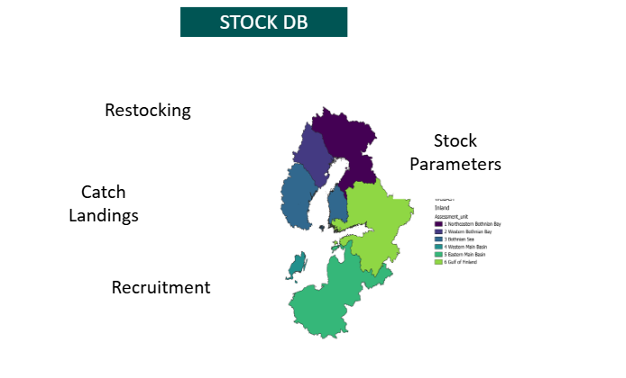{#fig-diad1}

The following section demonstrates the use of the DIADROMOUS database by testing the integration of stock data from three diadroumous working groups. 

## WGNAS 

The first attempt to create the stock data structure was based on WGNAS, it was further validated with WGEEL and WGBAST. Hence, the code to create the "core" or "mother" tables used for
inheritance is done in the WGNAS section.
The WGNAS database is created in schemas refnas and datnas (see @sec-hierarchical).
This section contains the code to import WGNAS to the DIADROMOUS DB.

### Metadata (dat.t_metadata_met) (all groups)

Metatadata is a working group specific table describing the parameters used as entry in the stock 
table. One parameter refers to a quantity or model variable. This quantity is generally assessed at the regional scale (Stock unit (WGNAS), Stock assessment unit WGBAST, EMU or in the future stock subunit or region (WGEEL). The metadata table aims at providing a full description of this parameter, including its dimension, the stage, maturity, age, etc.
Using parameters and metadata allow to handle the complexity, and the diversity of model elements, while providing a common structure for all data between the different working groups (@fig-diad1.3).

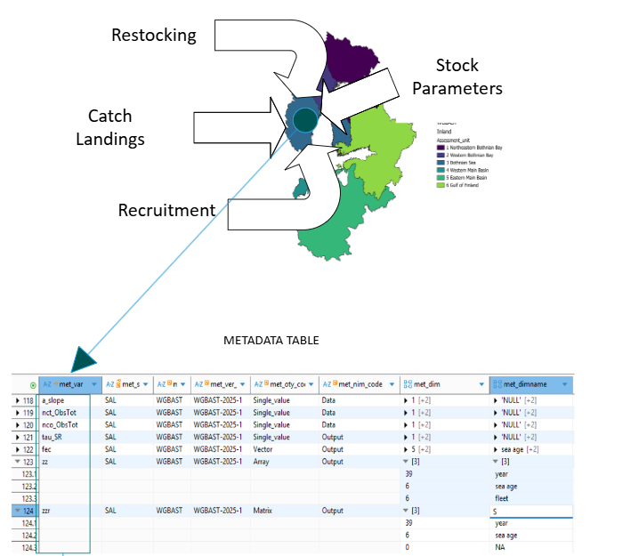{#fig-diad1.3}

One table is created as a template for all tables in the different working groups.
The code used to create metadata is listed below.

<details>

<summary>SQL code to create table `dat.t_metadata_met`</summary>

``` {.sql include="../SQL/4_dat_t_metadata_met.sql"}
```

</details>


```{r}
#| label: tbl-metadata
#| echo: FALSE
#| eval: TRUE
#| warning: FALSE
#| tbl-cap: metadata

dbGetQuery(con_diaspara, "SELECT * FROM dat.t_metadata_met;") |> DT::datatable(callback = DT::JS('table.page("next").draw(false);', rownames = FALSE))

```

### Create and import the metadata table from WGNAS

<details>

<summary>Creating the referential for WGNAS</summary>

``` {.sql include="../SQL/5_datnas_t_metadata_met.sql"}
```

</details>

```{r datnas.t_metadata_met}
#| echo: TRUE
#| eval: FALSE
#| warning: FALSE
#| message: FALSE
#| code-fold: TRUE
#| code-summary: Code to import metadata to datnas ...


# t_metadata_met

metadata <- dbGetQuery(con_salmoglob, "SELECT * FROM metadata")

res <- dbGetQuery(con_diaspara, "SELECT * FROM datnas.t_metadata_met;")
#clipr::write_clip(colnames(res))

# unique(metadata$metric)
# dbGetQuery(con_diaspara, "SELECT * FROM ref.tr_statistic_sta")

t_metadata_met <-
  data.frame(
    met_var = metadata$var_mod,
    met_spe_code = "127186",
    met_wkg_code = "WGNAS",
    met_ver_code = "SAL-2024-1", # no data on version in metadata
    met_odi_code = metadata$type_object,
    met_bty_code =  case_when(
      "Data_nimble"== metadata$nimble ~ "Data",
      "Const_nimble" == metadata$nimble ~ "Parameter constant",
      "Output" == metadata$nimble ~ "Output",
      "other" == metadata$nimble ~ "Other",
      .default = NA),
    met_dim = paste0(
      "{", metadata$dim1, ",",
      replace_na(metadata$dim2, 0), ",",
      replace_na(metadata$dim3, 0), "}"
    ),
    met_dimname = paste0(
      "{'", metadata$name_dim1, "',",
      ifelse(metadata$name_dim2 == "", "NULL", paste0("'", metadata$name_dim2, "'")), ",",
      ifelse(metadata$name_dim3 == "", "NULL", paste0("'", metadata$name_dim3, "'")), "}"
    ),
    met_modelstage = metadata$model_stage,
    met_type = metadata$type,
    met_location = metadata$locations,
    met_fishery = metadata$fishery,
    met_sta_code = case_when(metadata$metric == "Standard deviation" ~ "SD",
                             metadata$metric == "Coefficient of variation" ~ "CV",
                             .default = metadata$metric
    ),
    met_des_code = NA,
    met_uni_code = NA, # (TODO)
    met_cat_code = case_when(
      grepl("Origin distribution in sea catches", metadata$type) ~ "Other",
      grepl("catch", metadata$type) ~ "Catch",
      grepl("harvest rates", metadata$type) ~ "Mortality",
      grepl("Survival rate", metadata$type) ~ "Mortality",
      grepl("Returns", metadata$type) ~ "Count",
      grepl("Fecundity", metadata$type) ~ "Life trait",
      grepl("Sex ratio", metadata$type) ~ "Life trait",
      grepl("Maturation rate", metadata$type) ~ "Life trait",
      grepl("Proportion", metadata$type) ~ "Other",
      grepl("Stocking", metadata$type) ~ "Count",
      grepl("Smolt age structure", metadata$type) ~ "Life trait",
      grepl("Time spent", metadata$type) ~ "Life trait",
      grepl("Conservation limits", metadata$type) ~ "Conservation limit",
      grepl("Abundance", metadata$type) ~ "Count",
      grepl("Demographic transitions", metadata$type) ~ "Other",
      grepl("year", metadata$type) ~ "Other",
      grepl("Number of SU", metadata$type) ~ "Other",
      grepl("Prior", metadata$type) ~ "Other",
      grepl("Number of SU", metadata$type) ~ "Other",
      .default = NA
    ),
    met_definition = metadata$definition,
    met_deprecated = NA
    
  )

res <- dbWriteTable(con_diaspara_admin, "t_metadata_met_temp", 
                    t_metadata_met, overwrite = TRUE)
dbExecute(con_diaspara_admin, "INSERT INTO datnas.t_metadata_met 
SELECT 
 met_var,
 met_spe_code,
 met_wkg_code,
 met_ver_code,
 upper(substring(met_odi_code from 1 for 1)) ||
          substring(met_odi_code from 2 for length(met_odi_code)), 
 met_bty_code,
 met_dim::INTEGER[], 
 met_dimname::TEXT[], 
 met_modelstage, 
 met_type,
 met_location, 
 met_fishery, 
 met_sta_code, 
 met_des_code, 
 met_uni_code,
 met_cat_code, 
 met_definition, 
 met_deprecated
FROM t_metadata_met_temp")

dbExecute(con_diaspara_admin, "DROP TABLE t_metadata_temp CASCADE;")


```

After integration, the table of metadata from WGNAS is not changed
much, apart from adapting to the new referentials. The table is shown in @tbl-metadatawgnas below.

```{r}
#| label: tbl-metadatawgnas
#| echo: TRUE
#| eval: TRUE
#| warning: FALSE
#| message: FALSE
#| code-fold: TRUE
#| code-summary: table metadata
#| tbl-cap: Content of the datnas metadata table

dbGetQuery(con_diaspara, "SELECT * FROM datnas.t_metadata_met limit 10;")|> knitr::kable() |> kable_styling(bootstrap_options = c("striped", "hover", "condensed"))

```

### Create specific referential for WGNAS

Some of the referentials, particularly version, are specific to each working group.

<details>

<summary>Creating the referential for WGNAS</summary>

``` {.sql include="../SQL/3_refnas_tr_version_ver.sql"}
```

</details>


### The stock table

The following scripts create the "mother" `dat.t_stock_sto` table used
as the basis for all working groups. It futher imports the `database` table from the salmoglob (WGNAS) database. The stock table is intended to stock multidimensional data for each of the variables (@fig-diad1.4)


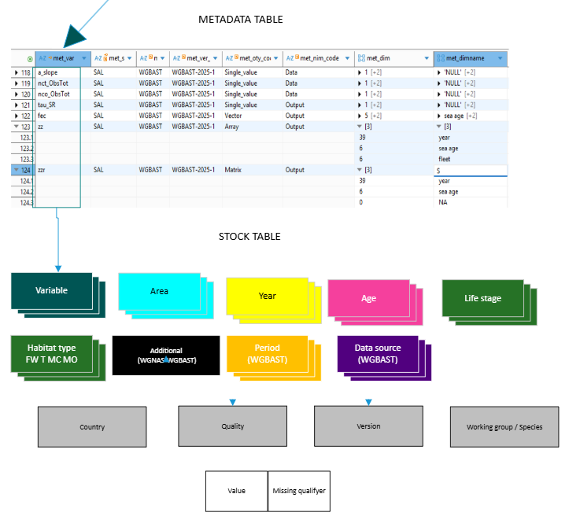{#fig-diad1.4}

<details>

<summary>SQL code to create tables</summary>

``` {.sql include="../SQL/4_dat_t_stock_sto.sql"}
```

</details>

The same table `t_stock_sto` is created in `datnas`. It is inherited, so
this means that all the column are coming from `dat.t_stock_sto` but we
have to recreate all the constraints, as constraints are never
inherited. Two additional check constraint are created, the value for
species will always be `127186` and the value for wkg (expert group) will
always be `WGNAS`.

<details>

<summary>SQL code to create tables</summary>

``` {.sql include="../SQL/5_datnas.t_stock_sto.sql"}
```

</details>

::: {.callout-caution appearance="simple"}
## duplicated values in archive

see github 
[duplicated values in archive DB](https://github.com/DIASPARAproject/WP3_migdb/issues/15)
:::

::: {.callout-caution appearance="simple"}
Some of the variables in salmoglob have no `year` dimension, this leads
to dropping the non null constraint on year. We need to check for
possible impact in the eel db see issue #14 : [NULL values allowed for
year](https://github.com/DIASPARAproject/WP3_migdb/issues/14)
:::

### Table of grouping for area and age : datnas.tg_additional_add {#sec-additional}

The year column does not always contain year. In fact the database that
we have created is not suited to store transfer matrix where the
dimensions have area x area. We only have one area column.

This will be for parameter `omega` [see location paragraph in WGNAS
database description](file:///C:/workspace/DIASPARA_WP3_migdb/R/wgnas_salmoglob_description.html#location).

Another problem is the age column. When looking at the analysis [see age in WGNAS
database description](https://projets_eabx.pages.mia.inra.fr/diaspara/fr/deliverables/wp3/p4/wgnas_salmoglob_description.html#age)

Only the variables `eggs`, `p_smolt`, `p_smolt_pr` and `prop_female` need an age.

This was solved using the tg_additional_add column. The stucture for WGBAST
indicates that they too could use this additional column to
store some of the matrix output.


<details>

<summary>SQL code to create tables</summary>

``` {.sql include="../SQL/4_refnas_tg_additional_add.sql"}
```

</details>


```{r}
#| label: tbl-tg_additional_add
#| echo: FALSE
#| eval: TRUE
#| warning: FALSE
#| message: FALSE
#| tbl-cap: Content of the refnas additional table

dbGetQuery(con_diaspara, "SELECT * FROM refnas.tg_additional_add;")|> 
knitr::kable() |> 
kable_styling(bootstrap_options = c("striped", "hover", "condensed"))

```


### Import the t_stock_sto


```{r datnas.t_stock_sto}
#| echo: TRUE
#| eval: FALSE
#| warning: FALSE
#| message: FALSE
#| code-fold: TRUE
#| code-summary: Code to import salmoglob main db into the new database.


dbExecute(con_diaspara,"ALTER SEQUENCE dat.t_stock_sto_sto_id_seq RESTART WITH 1;")
dbExecute(con_diaspara_admin,"DELETE FROM datnas.t_stock_sto;")
dbExecute(con_diaspara_admin,"INSERT INTO datnas.t_stock_sto
(sto_id, sto_met_var, sto_year, sto_spe_code, sto_value, sto_are_code, 
sto_cou_code, sto_lfs_code, sto_hty_code, sto_qal_code, 
sto_qal_comment, sto_comment, sto_datelastupdate, sto_mis_code, 
sto_dta_code, sto_wkg_code,sto_add_code)
SELECT 
nextval('dat.t_stock_sto_sto_id_seq'::regclass) AS sto_id
, d.var_mod AS sto_met_var
, d.year AS sto_year
, '127186' AS  sto_spe_code
, d.value AS sto_value
, d.area AS sto_are_code
, NULL AS sto_cou_code -- OK can be NULL
, CASE WHEN m.life_stage = 'Eggs' THEN 'E'
    WHEN m.life_stage = 'Adult' THEN 'A'
    WHEN m.life_stage = 'Multiple' THEN 'AL'
    WHEN m.life_stage = 'Adults' THEN 'A'
    WHEN m.life_stage = 'Smolts' THEN 'SM'
    WHEN m.life_stage = 'Non mature' THEN 'PS' -- IS THAT RIGHT ?
    WHEN m.life_stage = 'PFA' THEN 'PS' -- No VALUES
    WHEN m.life_stage = 'Spawners' THEN 'A' -- No values
    WHEN m.life_stage = '_' THEN '_'
   ELSE 'TROUBLE' END AS sto_lfs_code 
, NULL AS sto_hty_code
, 1 AS sto_qal_code -- see later TO INSERT deprecated values
, NULL AS sto_qal_comment 
, NULL AS sto_comment
, date(d.date_time) AS sto_datelastupdate
, NULL AS sto_mis_code
, 'Public' AS sto_dta_code
, 'WGNAS' AS sto_wkg_code
, CASE WHEN d.var_mod IN ('eggs','p_smolt', 'p_smolt_pr', 'prop_female') THEN d.age
       WHEN d.var_mod IN ('omega') THEN d.LOCATION
       END AS sto_add_code
FROM refsalmoglob.database d JOIN
refsalmoglob.metadata m ON m.var_mod = d.var_mod; ")# 45076
```

#### structure of the table datnas.t_stock_sto


```{r}
#| label: tbl-datnas.t_stock_sto
#| echo: TRUE
#| eval: TRUE
#| warning: FALSE
#| message: FALSE
#| code-fold: TRUE
#| code-summary: datnas.t_stock_sto table
#| tbl-cap: Content of the refnas t_stock_sto table

dbGetQuery(con_diaspara, "SELECT * FROM datnas.t_stock_sto limit 10;")|> 
  knitr::kable() |> 
  kable_styling(bootstrap_options = c("striped", "hover", "condensed"))

```


## WGEEL

The main difficulty in transfering the WGEEL database to the DIADROMOUS database
lies in the way the data are linked to areas in the marine habitat.
Currently we have kept all historical data with the "historical" EMU as
the reference. This might change once we start to build the model. If the data remain stuctured by EMU, then perhaps a data flow from the EMU might be used to aggregate / transfer data from EMUs to the stockunit. See habitat DB for the structure of [eel habitat](https://diaspara.bordeaux-aquitaine.inrae.fr/deliverables/wp3/p8hab/habitatdb.html#creating-a-hierarchical-structure-for-wgeel)

### Version (refeel.tr_version_ver)

See [metricDB report](https://diaspara.bordeaux-aquitaine.inrae.fr/deliverables/wp3/p11metric/metricdb.html#creating-the-version-table-refeel.tr_version_ver)


### Metadata (dateel.t_metadata_met)

<details>
<summary>SQL code to create table `dateel.t_metadata_met` </summary>

``` {.sql include="../SQL/6_dateel_t_metadata_met.sql"}
```
</details>

<!--
::: {.callout-note appearance="simple"}
We currently consider that SumH, and Biom are "Output", the result of model.
:::
-->
::: {.callout-note appearance="simple"}
type is not a referential, but used for legacy in WGNAS 
    see [type table](https://diaspara.bordeaux-aquitaine.inrae.fr/deliverables/wp3/p4/wgnas_salmoglob_description.html#tbl-globaldata2-4)
    so it's currently empty in the table
:::   


```{r dateel.t_metadata_met}
#| echo: TRUE
#| eval: FALSE
#| warning: FALSE
#| message: FALSE
#| code-fold: TRUE
#| code-summary: Code to import to metadata for eel work in progress ...


# t_metadata_met

eelstock <- dbGetQuery(con_diaspara_admin, "SELECT * FROM datwgeel.t_eelstock_eel WHERE eel_qal_id in (0,1,2,3,4) ")
nrow(eelstock) # 73730
unique(eelstock$eel_typ_id)
# 6  4  8  9 11 17 18 15 14 13 16 19 10 32 33 34
# View(eelstock[eelstock$eel_typ_id ==32,])


res <- dbGetQuery(con_diaspara, "SELECT * FROM dateel.t_metadata_met;")
clipr::write_clip(colnames(res))


typ <- dbGetQuery(con_diaspara_admin,"SELECT *  FROM refwgeel.tr_typeseries_typ")
# below I'm removing from typ as these values are not actually in the database
typ <- typ[!typ$typ_id %in% c(1,2,3),]  # remove series
typ <- typ[!typ$typ_id %in% c(16),]  # potential_availabe_habitat_production_ha
typ <- typ[!typ$typ_id %in% c(5, 7),]  # com_catch and rec_catch
typ <- typ[!typ$typ_id %in% c(26:31),]  # silver eel equivalents (deprecated)
# unique(metadata$metric)
# dbGetQuery(con_diaspara, "SELECT * FROM ref.tr_statistic_sta")
View(typ)
t_metadata_met <-
  data.frame(
    met_var = typ$typ_name,
    met_spe_code = "126281",
    met_wkg_code = "WGEEL",
    met_ver_code = "WGEEL-2025-1", 
    met_odi_code = "Single_value", # https://diaspara.bordeaux-aquitaine.inrae.fr/deliverables/wp3/p7stock/midb.html#object-type-tr_objectype_oty
    met_bty_code =  case_when(    
      typ$typ_id %in% c(4:12,32,33)   ~ "Data",
      .default = "Output"), # https://diaspara.bordeaux-aquitaine.inrae.fr/deliverables/wp3/p7stock/midb.html#type-of-parm-data-tr_bayestype_bty
    met_dim = paste0(
      "{", 1, ",",
       0, ",",
       0, "}"
    ),
    met_dimname = paste0(
      "{'year',NULL,NULL}"
    ),
    met_modelstage = NA,
    met_type = typ$typ_id, 
    # not a referential, used for legacy in WGNAS, and I'm using the old code in wgeel
    # see https://diaspara.bordeaux-aquitaine.inrae.fr/deliverables/wp3/p4/wgnas_salmoglob_description.html#tbl-globaldata2-4
    met_location = NA, # something line bef. Fisheries Aft fisheries.... not a referential
    met_fishery = NA, # not a referential
    met_sta_code = NA, # reference to tr_metrictype (bound, mean, SD, can be left empty)
    met_des_code = NA,
    met_uni_code = NA, # (TODO)
    met_cat_code = case_when(
typ$typ_name == "com_landings_kg" ~ "Catch",
typ$typ_name == "rec_landings_kg" ~ "Catch",
typ$typ_name == "other_landings_kg" ~ "Catch",
typ$typ_name == "other_landings_n" ~ "Catch",
typ$typ_name == "gee_n" ~ "Count",
typ$typ_name == "q_aqua_kg" ~ "Other" ,
typ$typ_name == "q_aqua_n" ~ "Other" ,
typ$typ_name == "q_release_kg" ~ "Release",
typ$typ_name == "q_release_n" ~ "Release",
typ$typ_name == "b0_kg" ~ "Biomass",
typ$typ_name == "bbest_kg" ~ "Biomass",
typ$typ_name == "b_current_without_stocking_kg" ~ "Biomass",
typ$typ_name == "bcurrent_kg" ~ "Biomass",
typ$typ_name == "suma" ~ "Mortality",
typ$typ_name == "sumf" ~ "Mortality",
typ$typ_name == "sumh" ~ "Mortality",
typ$typ_name == "sumf_com" ~ "Mortality",
typ$typ_name == "sumf_rec" ~ "Mortality",
typ$typ_name == "sumh_hydro" ~ "Mortality",
typ$typ_name == "sumh_habitat" ~ "Mortality",
typ$typ_name == "sumh_other" ~ "Mortality",
typ$typ_name == "sumh_release" ~ "Mortality",
.default = NA
    ),
met_definition = typ$typ_description,
met_deprecated = NA 
# not integrating any of the deprecated data
)

res <- dbWriteTable(con_diaspara_admin, "t_metadata_met_wgeel_temp", 
                    t_metadata_met, overwrite = TRUE)
dbExecute(con_diaspara_admin, "INSERT INTO dateel.t_metadata_met 
SELECT 
 met_var,
 met_spe_code,
 met_wkg_code,
 met_ver_code,
 met_odi_code, 
 met_bty_code,
 met_dim::INTEGER[], 
 met_dimname::TEXT[], 
 met_modelstage, 
 met_type,
 met_location, 
 met_fishery, 
 met_sta_code, 
 met_des_code, 
 met_uni_code,
 met_cat_code, 
 met_definition, 
 met_deprecated
FROM t_metadata_met_wgeel_temp") # 22

dbExecute(con_diaspara_admin, "DROP TABLE t_metadata_met_wgeel_temp CASCADE;")


```


### Stock (dateel.t_stock_sto)

<details>
<summary>SQL code to create table `dateel.t_stock_sto` </summary>

``` {.sql include="../SQL/7_dateel_t_stock_sto.sql"}
```
</details>


<details>
<summary>SQL code to insert values in table `dateel.t_stock_sto` </summary>

``` {.sql include="../SQL/8_dateel_t_stock_sto_insert.sql"}
```
</details>


::: {.callout-important appearance="simple"}

The full WGEEL database was imported in 2025. In 2026 there will be one last
datacall using the previous database and shiny interface before switching to the 
new format.

The remaining issues are here :

[Integrate the latest version of WGEEL database #29](https://github.com/DIASPARAproject/WP3_migdb/issues/29)

:::


## WGBAST

### Metadata (datbast.t_metadata_met)

<details>

<summary>SQL code to create table `datbast.t_metadata_met` </summary>

``` {.sql include="../SQL/9_datbast_t_metadata_met.sql"}
```
</details>

An analysis of the WGBAST dataset for landings shows that it could follow the structure
of the main t_stock_sto table, here is the list of changes needed.

* **gear**. The gear must be added to the dimension of the t_stock_sto table, it is one dimension
of the table.

* **Time period**. The data are not always reported by YEAR, unlike in eel or WGNAS. Other types of time
reporting e.g. Month, Half of year, Quarter need to be added to the t_stock_sto table. The table
is inherited in postgres and will have 3 more columns that the mother table. This is already the case for the WGNAS stock table which has one more column (to store some extra dimension)
than WGEEL. The three additional columns will be one for gear, one for time period type and one for time period.
* The metadata will allow by a simple join to get back to F_type (stored in column met_type). It should also for a simple division according to the destination column, allowing to separate dead fish from the living ones.

* **Effort, Numbers and Weights**. The database will be in long format while in the current structure, Effort, Weights and Numbers are reported in separate columns. A simple query will bring back the original format.

* Effort is reported in geardays only for driftnet, longline and trapnet fisheries. 

* When the data will be resubmitted in the final format (in a future data call) the following elements will require attention from WGBAST. There is an ALV ALL in gears, which is probably an error, and there are 138 rows without f_type we need to check that they can be attributed to COMM


### Version (refbast.tr_version_ver)

<details>

<summary>Creating the version referential for WGBAST</summary>

``` {.sql include="../SQL/11_refbast_tr_version_ver.sql"}
```

</details>


```{r }
#| label: refbast.tr_version_ver_insert
#| echo: TRUE
#| eval: FALSE
#| warning: FALSE
#| message: FALSE
#| code-fold: TRUE
#| code-summary: Code to insert values into the refbast.tr_version_ver table


tr_version_ver <- data.frame(
  ver_code = paste0("WGNAS-",2020:2024,"-1"),
  ver_year = 2020:2024,
  ver_spe_code = "127186",
  ver_wkg_code = "WGNAS",
  ver_datacalldoi=c(NA,NA,NA,NA,"https://doi.org/10.17895/ices.pub.25071005.v3"), 
  ver_stockkeylabel =c("sal.neac.all"), # sugested by Hilaire. 
  # TODO FIND other DOI (mail sent to ICES)
  ver_version=c(1,1,1,1,1), # TODO WGNAS check that there is just one version per year
  ver_description=c(NA,NA,NA,NA,NA)) # TODO WGNAS provide model description

DBI::dbWriteTable(con_diaspara_admin, "temp_tr_version_ver", tr_version_ver, 
                  overwrite = TRUE)
dbExecute(con_diaspara_admin, "INSERT INTO refnas.tr_version_ver(ver_code, ver_year, ver_spe_code, ver_stockkeylabel, ver_datacalldoi, ver_version, ver_description, ver_wkg_code) SELECT ver_code, ver_year, ver_spe_code, ver_stockkeylabel, ver_datacalldoi, ver_version::integer, ver_description, ver_wkg_code FROM temp_tr_version_ver;") # 5
DBI::dbExecute(con_diaspara_admin, "DROP TABLE temp_tr_version_ver;")

tr_version_ver <- data.frame(
  ver_code = paste0("WGBAST-",2024:2025,"-1"),
  ver_year = 2024:2025,
  ver_spe_code = NA,
  ver_wkg_code = "WGBAST",
  ver_datacalldoi=c("https://doi.org/10.17895/ices.pub.25071005.v3","https://doi.org/10.17895/ices.pub.28218932.v2"), 
  ver_stockkeylabel =c("sal.27.22–31"), 
  # TODO FIND other DOI (mail sent to ICES)
  ver_version=c(1,1), # TODO WGNAS check that there is just one version per year
  ver_description=c("Joint ICES Fisheries Data call for landings, discards, biological and effort data and other supporting information in support of the ICES fisheries advice in 2024.","Combined ICES Fisheries Data call for landings, discards, biological and effort data and other supporting information in support of the ICES fisheries advice in 2025.")) # TODO WGNAS provide model description

DBI::dbWriteTable(con_diaspara_admin, "temp_tr_version_ver", tr_version_ver, 
                  overwrite = TRUE)
dbExecute(con_diaspara_admin, "INSERT INTO refbast.tr_version_ver(ver_code, ver_year, ver_spe_code, ver_stockkeylabel, ver_datacalldoi, ver_version, ver_description, ver_wkg_code) SELECT ver_code, ver_year, ver_spe_code, ver_stockkeylabel, ver_datacalldoi, ver_version::integer, ver_description, ver_wkg_code FROM temp_tr_version_ver;") # 2
DBI::dbExecute(con_diaspara_admin, "DROP TABLE temp_tr_version_ver;")

```

## Estimation method (datbast.tr_estimationmethod_esm) {#sec-datbast.tr_estimationmethod_esm}

The development of referentials for datasource, databasis, and estimation method
is explained in the referential part. Here we provide the code for the estimation method table specific to WGBAST.

<details>

<summary>Creating the estimation method referential for WGBAST</summary>

``` {.sql include="../SQL/12_refbast_tr_estimationmethod_esm.sql"}
```

</details>


```{r import_refbast_tr_estimationmethod_esm}
#| echo: TRUE
#| eval: FALSE
#| warning: FALSE
#| message: FALSE
#| code-fold: TRUE
#| code-summary: Code to import estimation method codes


# 

esm <- data.frame(
  esm_id=1:8, 
  esm_code = paste0("SmoltEst",1:8), 
  esm_description = c("Estimate of smolt production from complete count of smolts.",
                      "Sampling of smolts and estimate of total smolt run size.",
                      "Estimate of smolt run from parr production by relation developed in the same river.",
                      "Estimate of smolt run from parr production by relation developed in another river.",
                      "Inference of smolt production from data derived from similar rivers in the region.",
                      "Estimate of smolt production from count of spawners.",
                      "Estimate of smolt production inferred from stocking of reared fish in the river.",
                      "Estimate of smolt production from salmon catch, exploitation and survival estimate."), 
  esm_icesvalue = NA,
  esm_icesguid = NA,
  esm_icestablesource =NA
)


DBI::dbWriteTable(con_diaspara_admin, "temp_esmr", esm, overwrite = TRUE)
DBI::dbExecute(con_diaspara_admin, "INSERT INTO refbast.tr_estimationmethod_esm
(esm_id, esm_code, esm_description, esm_icesvalue,  esm_icestablesource)
SELECT esm_id, esm_code, esm_description, esm_icesvalue, esm_icestablesource
FROM temp_esmr")# 8
DBI::dbExecute(con_diaspara_admin, "DROP table temp_esmr")

```


### Create datbast.t_metadata_met

Note that there is a slight difference between the metadata table between WGBAST and the two other working groups. We indeed need to integrate the same variables twice, first for salmon,
and then for trutta. These are no duplicates as the primary key is set on both 127187 (Salmo trutta)
and 127186 (Salmon salar). 

```{r datbast.t_metadata_met}
#| echo: TRUE
#| eval: FALSE
#| warning: FALSE
#| message: FALSE
#| code-fold: TRUE
#| code-summary: Code to import to metadata for wgbast.


# t_metadata_met


df_all <- readxl::read_xlsx(file.path(datawd, "WGBAST_2024_Catch_29-02-2024.xlsx"), sheet = "Catch data")
df_all <- janitor::clean_names(df_all)
# C. (Cedric) From there following henni's script : https://github.com/hennip/WGBAST/blob/main/02-data/catch-effort/CatchEffort.r
# Comments with C. are added by Cedric, otherwise taken from github
# quick fix to avoid logical I put char in subdiv_IC[1]
df_all$subdiv_ic[1] <- NA
df_all <- df_all |>
  mutate(tp_type=ifelse(tp_type=="QRT", "QTR", tp_type), 
         gear=ifelse(gear=="GNS", "MIS", gear), # Tapani comment
         w_type = ifelse(w_type %in% c('EXP','GST'), 'EXV', w_type),
         n_type = ifelse(n_type %in% c('EXP','GST'), 'EXV', n_type))
       
         
# Gears

#unique(df_all$gear)
#NA    "AN"  "LLD" "GND" "MIS" "FYK" "All" "ALV"
#table(df_all$gear)
#All  ALV   AN  FYK  GND  LLD  MIS 
#  93   29 1597 3432 1013 1541 9122 

# driftnet=GND, longline=LLD, trapnet=FYK, angling=AN, other=MIS, set gillnet (anchored, stationary)=GNS

df_all$gearICES <- case_when(df_all$gear == "AN" ~ "LHP", # CHECK THIS Handlines and hand-operated pole-and-lines
                             df_all$gear == "LLD" ~ "LLD",
                             df_all$gear == "GND" ~ "GND",
                             df_all$gear == "MIS" ~ "MIS",
                             df_all$gear == "FYK" ~ "FYK",
                             df_all$gear == "ALV" ~ "LHP")   # LV and FI, in river RECR
# ALV: discarded alive, BMS: below minimum landing size (dead)


# creating t_metadata_met
# 
# commercial=COMM, recreational=RECR, discard=DISC, sealdamage=SEAL, unreported=UNRP, ALV=released alive back in water, BMS= Below minimum landings size, BROOD=broodstock fishery

#table(df_all$f_type, useNA = "ifany")
#  ALV   BMS BROOD  COMM  DISC  RECR  SEAL <NA> 
#  537    77    39 12920   334  2473   980 368
#  
#table(df_all$w_type)
# there are missing values for f_type, correspond to SAL FI/SE, 1972-1999
# then SAL 2000 FI/SE, 24-31 logbooks weights
# then SAL 2001 SE, 2000
# 3000 logbooks weights
# then 2 lines SAL TRS 
# then lines for LT or LV
# 
# => I think all those lines are COMM, this would be consistent with f_type in scripts
# where COMM is never used (the default)
# 
#print(df_all[is.na(df_all$f_type), ], n ="Inf")

df_all <- 
  bind_rows(
  df_all |>
  filter(is.na(f_type)) |>
  mutate(tp_type=ifelse(fishery == "F", "REC", "COMM")),
    df_all |>
  filter(!is.na(f_type)))


#  EST   EXP   EXT   EXV   GST   LOG 
#  893    28   495  1218    30 14188 
# 
#  EST   EXP   EXT   EXV   GST   LOG 
#  944    28   335  1295     9 14117 
  
# table(df_all$n_type, df_all$w_type, useNA = "ifany")
  #       EST   EXT   EXV   LOG  <NA>
  # EST    679     2    26   181    56
  # EXP      0     0    28     0     0
  # EXT      2   256     0    75     2
  # EXV     51     0  1210     0    34
  # GST      1     0     8     0     0
  # LOG    106   237     0 13704    70
  # <NA>    54     0     4   228   714
  
# these are not used (f_type, w_type) => ignored or add to comments.
# 
 table(df_all$f_type, df_all$w_type, useNA = "ifany") 


#table(df_all$f_type)

saveRDS(df_all, file="data/wgbast_landings_modified.Rds")


# t_metadata_met  <-  dbGetQuery(con_diaspara, "SELECT * FROM datbast.t_metadata_met;")
# clipr::write_clip(colnames(t_metadata_met))
# head(t_metadata_met)
uktyp <- unique(df_all$f_type)
uktyp[is.na(uktyp)] <- "HIST" # historical data, check hopefully it's OK
typ <- outer(c("N","W","E"), paste0("_",uktyp ), FUN = "paste0")
dim(typ) <- NULL
#"N_HIST"  "W_HIST"  "E_HIST"  "N_COMM"  "W_COMM"  "E_COMM"  "N_ALV"   "W_ALV"   "E_ALV"   "N_RECR"  "W_RECR"  "E_RECR"  "N_DISC" 
#"W_DISC"  "E_DISC"  "N_SEAL"  "W_SEAL"  "E_SEAL"  "N_BMS"   "W_BMS"   "E_BMS"   "N_BROOD" "W_BROOD" "E_BROOD"
#typ <- outer(typ, c("_SAL", "_TRS"),  FUN = "paste0")
#dim(typ) <- NULL


#get the type back
met_type <- substring(typ, 3,nchar(typ)) #COMM COMM, ...., 

uni_code <- substring(typ, 1,1)
uni_code <- case_when(uni_code == "E" ~ "nd", 
                      uni_code == "W" ~ "kg",
                      uni_code == "N" ~ "nr") #see https://diaspara.bordeaux-aquitaine.inrae.fr/deliverables/wp3/p7stock/midb.html#unit-tr_units_uni


# vector with SAL ... then TRS
# The column species is repeated because the foreign key for t_stock_sto is on both TRS and SAL,
# so for instance we'll have two lines one with COMM_N for TRS one for SAL.
# It might seem weird but might allow for different metadata, and also most importantly
# later on, in the model some variables will be specific to SAL
# but when the variables are in common, then need to be repeated.
t_metadata_met_TRS  <- data.frame(
    met_var = typ,
    met_spe_code = "127187",
    met_wkg_code = "WGBAST",
    met_ver_code = "WGBAST-2025-1", 
    met_odi_code = "Single_value", #  https://diaspara.bordeaux-aquitaine.inrae.fr/deliverables/wp3/p7stock/midb.html#object-type-tr_objectype_oty
    met_bty_code =  "Data", # https://diaspara.bordeaux-aquitaine.inrae.fr/deliverables/wp3/p7stock/midb.html#type-of-parm-data-tr_bayestype_bty
    met_dim = paste0(
      "{", 1, ",",
       0, ",",
       0, "}"
    ),
    met_dimname = paste0(
      "{'NULL',NULL,NULL}"
    ),
    # Here unlike the eel, I cannot be sure the first dimension is year, might be MON, HYR ....
    met_modelstage = NA,
    met_type = met_type, 
    # not a referential, used for legacy in WGNAS, 
    # see https://diaspara.bordeaux-aquitaine.inrae.fr/deliverables/wp3/p4/wgnas_salmoglob_description.html#tbl-globaldata2-4
    met_location = NA, # something line bef. Fisheries Aft fisheries.... not a referential
    met_fishery = NA, # not a referential
    met_sta_code = NA, # reference to tr_metrictype (bound, mean, SD, can be left empty)
    met_des_code = case_when(
      met_type == "COMM" ~ "Removed",
      met_type == "ALV" ~ "Released",
      met_type == "RECR" ~ "Removed",
      met_type == "DISC" ~ "Discarded",
      met_type == "BROOD" ~ "Removed",
      met_type == "SEAL" ~ "Seal damaged",
      met_type == "BMS" ~ "Discarded",
      .default = NA),
      # https://diaspara.bordeaux-aquitaine.inrae.fr/deliverables/wp3/p7stock/midb.html#destination-tr_destination_dest
    met_uni_code = uni_code,
    met_cat_code = case_when(
       met_type == "COMM" ~ "Catch",
       met_type == "ALV" ~ "Release",
       met_type == "RECR" ~ "Catch",
       met_type == "DISC" ~ "Catch",
       met_type == "BROOD" ~ "Other",
       met_type == "SEAL" ~ "Other",
       met_type == "BMS" ~ "Catch",
       .default = NA),
met_definition = "TODO",
met_deprecated = NA 
# not integrating any of the deprecated data
)
t_metadata_met_SAL <- t_metadata_met_TRS
t_metadata_met_SAL$met_spe_code<- "127186"


t_metadata_met <- bind_rows(t_metadata_met_TRS,t_metadata_met_SAL)

DBI::dbWriteTable(con_diaspara_admin, "temp_wgbast_t_metadata_met", t_metadata_met, overwrite = TRUE)


DBI::dbExecute(con_diaspara_admin, "DELETE FROM datbast.t_metadata_met")
DBI::dbExecute(con_diaspara_admin, "INSERT INTO datbast.t_metadata_met(met_var, met_spe_code, met_wkg_code, met_ver_code, met_odi_code, met_bty_code, met_dim, met_dimname, met_modelstage, met_type, met_location, met_fishery, met_sta_code, met_des_code, met_uni_code, met_cat_code, met_definition, met_deprecated)
SELECT met_var, met_spe_code, met_wkg_code, met_ver_code, met_odi_code, met_bty_code, met_dim::integer[], met_dimname::text[], met_modelstage, met_type, met_location, met_fishery, met_sta_code, met_des_code, met_uni_code, met_cat_code, met_definition, met_deprecated FROM temp_wgbast_t_metadata_met") #48


```


```{r datbast.t_metadata_met2}
#| echo: TRUE
#| eval: FALSE
#| warning: FALSE
#| message: FALSE
#| code-fold: TRUE
#| code-summary: Code to import to metadata for wgbast (variables model)

# sent by Becky
scalar <- read_csv("data/WGBAST scalars1.csv")
scalar <- janitor::clean_names(scalar)
array <- read_csv("data/WGBAST vectors_arrays1.csv")
array <- janitor::clean_names(array)
t_metadata_met_a  <- data.frame(
    met_var = array$variable_name,
    met_spe_code = "127186",
    met_wkg_code = "WGBAST",
    met_ver_code = "WGBAST-2025-1", 
    met_odi_code = ifelse(is.na(array$dim2), "Vector",ifelse(is.na(array$dim3),"Matrix", "Array")), # Single_value Vector Matrix Array https://diaspara.bordeaux-aquitaine.inrae.fr/deliverables/wp3/p7stock/midb.html#object-type-tr_objectype_oty
    met_bty_code =  ifelse(array$type == "stockastic", "Data", "Output"), #scenarios or stockastic TODO check consistency with WGNAS https://diaspara.bordeaux-aquitaine.inrae.fr/deliverables/wp3/p7stock/midb.html#type-of-parm-data-tr_bayestype_bty
    met_dim = paste0(
      "{", array$dim1, ",",
       ifelse(is.na(array$dim2), 0,array$dim2), ",",
       ifelse(is.na(array$dim3), 0,array$dim3), "}"
    ),
    met_dimname = paste0(
      "{",array$dim1_description,",", ifelse(array$dim2_description=="NA", NULL,array$dim2_description),",", ifelse(array$dim3_description=="NA",NULL,array$dim3_description),"}"
    ),
    # Here unlike the eel, I cannot be sure the first dimension is year, might be MON, HYR ....
    met_modelstage = NA,
    met_type = NA,  # TODO
    # not a referential, used for legacy in WGNAS, 
    # see https://diaspara.bordeaux-aquitaine.inrae.fr/deliverables/wp3/p4/wgnas_salmoglob_description.html#tbl-globaldata2-4
    met_location = NA, # something line bef. Fisheries Aft fisheries.... not a referential
    met_fishery = NA, # not a referential
    met_sta_code = NA, # reference to tr_metrictype (bound, mean, SD, can be left empty)
    met_des_code = NA,
      # https://diaspara.bordeaux-aquitaine.inrae.fr/deliverables/wp3/p7stock/midb.html#destination-tr_destination_dest
    met_uni_code = NA,
    met_cat_code = NA, # TODO
met_definition = "TODO",
met_deprecated = NA 
# not integrating any of the deprecated data
)
t_metadata_met_s  <- data.frame(
    met_var = scalar$name,
    met_spe_code = "127186",
    met_wkg_code = "WGBAST",
    met_ver_code = "WGBAST-2025-1", 
    met_odi_code =  "Single_value",  
    met_bty_code =  ifelse(scalar$type == "stochastic", "Data", "Output"), #scenarios or stochastic TODO check consistency with WGNAS https://diaspara.bordeaux-aquitaine.inrae.fr/deliverables/wp3/p7stock/midb.html#type-of-parm-data-tr_bayestype_bty
    met_dim = paste0(
      "{", 1, ",",
       0, ",",
       0, "}"
    ),
    met_dimname = paste0(
      "{'NULL',NULL,NULL}"
    ),
    # Here unlike the eel, I cannot be sure the first dimension is year, might be MON, HYR ....
    met_modelstage = NA,
    met_type = NA,  # TODO
    # not a referential, used for legacy in WGNAS, 
    # see https://diaspara.bordeaux-aquitaine.inrae.fr/deliverables/wp3/p4/wgnas_salmoglob_description.html#tbl-globaldata2-4
    met_location = NA, # something line bef. Fisheries Aft fisheries.... not a referential
    met_fishery = NA, # not a referential
    met_sta_code = NA, # reference to tr_metrictype (bound, mean, SD, can be left empty)
    met_des_code = NA,
      # https://diaspara.bordeaux-aquitaine.inrae.fr/deliverables/wp3/p7stock/midb.html#destination-tr_destination_dest
    met_uni_code = NA,
    met_cat_code = NA, # TODO
met_definition = "TODO",
met_deprecated = NA 
# not integrating any of the deprecated data
)
t_metadata_met<- bind_rows(t_metadata_met_s, t_metadata_met_a)
DBI::dbWriteTable(con_diaspara_admin, "temp_wgbast_t_metadata_met", t_metadata_met, overwrite = TRUE)


DBI::dbExecute(con_diaspara_admin, "INSERT INTO datbast.t_metadata_met(met_var, met_spe_code, met_wkg_code, met_ver_code, met_odi_code, met_bty_code, met_dim, met_dimname, met_modelstage, met_type, met_location, met_fishery, met_sta_code, met_des_code, met_uni_code, met_cat_code, met_definition, met_deprecated)
SELECT met_var, met_spe_code, met_wkg_code, met_ver_code, met_odi_code, met_bty_code, met_dim::integer[], met_dimname::text[], met_modelstage, met_type, met_location, met_fishery, met_sta_code, met_des_code, met_uni_code, met_cat_code, met_definition, met_deprecated FROM temp_wgbast_t_metadata_met") #117
```


### datbast.t_stock_sto

There are three additional column in `databast.t_stock_sto` when compared to 
`dat.t_stock_sto`, the table from which it inherits.
This is similar to `datnas.t_stock_sto` where an additional column was
created to handle the extra dimension for some arrays stored in WGNAS.
The columns are :

* sto_tip_code  the time period, one of YR, HYR (half year),  QTR (Quarter), MON (Month). A vocabulary
has been created for checks on these time periods.
* sto_timeperiod integer, the value of the time period. Note : a trigger has
been created to handle different possible values for sto_tip_code (e.g. half of year can
be 1 or 2 , and month between 1 and 12).
* sto_datasourcecode. This column is not used in scripts, but discussion with
Henni have shown that this remains important. It will be adapted to ICES vocab
`DataSource` with additions for elements on the calculation of smolts in the Young fish database (see
@sec-datasource)
.


<details>
<summary>SQL code to create table `datbast.t_stock_sto` </summary>

``` {.sql include="../SQL/10_datbast_t_stock_sto.sql"}
```
</details>


Clearly the table of datasource will have to be revised and new methodologies
added and 

```{r datbast.t_stock_sto_landings}
#| echo: TRUE
#| eval: FALSE
#| warning: FALSE
#| message: FALSE
#| code-fold: TRUE
#| code-summary: Code to import to t_stock_sto for wgbast

df_all <- readRDS(file="data/wgbast_landings_modified.Rds")


# Modify some lines with comments (TO BE CHECKED BY WGBAST)
df_all[df_all$sub_div == "21" & ! is.na(df_all$sub_div) ,"Notes"] <- "ATTENTION THESE WERE MARKED AS 21 WHICH doesn't exist,They have been changed to 31, please check"

#Inversion of tp_type and n_type
df_all[df_all$tp_type=='COMM'& df_all$time_period!=0,"tp_type"] <- "MON" # 4 lines where COMM is obvioulsy not YEAR
# the other are year
id_err <- which(is.na(df_all$f_type)& df_all$tp_type=="COMM")
df_all[id_err,"tp_type"] <- "YR"
df_all[id_err,"f_type"] <- "COMM"
#Year without 0 as time_period one line with 2 in Estonia all other have 0
df_all[df_all$tp_type=='YR'& df_all$time_period!=0,"time_period"]<- 0 
# Year should be YR in the initial dataset
df_all[df_all$tp_type=="Year" & !is.na(df_all$tp_type),"tp_type"] <- "YR"
# missing tp_type
df_all[is.na(df_all$tp_type),"tp_type"] <- "YR" # 6 lines with historical data


# in Estonia there are both SAL&TRS and NA, which correspond to sea damage unspecified.
# I cannot have that, will report as Salmon, leave to the WGBAST to see how to handle this.
df_all[!is.na(df_all$species) & df_all$species =="SAL&TRS","species"]<- "127186"
df_all[is.na(df_all$species) ,"species"]<- "127186"
df_all[df_all$species=="NA" ,"species"]<- "127186"


# create table of rivernames in WGBAST, do queries and manual search to join them
# to our layer.
# tt <- table(df_all$river)
# tt <- tt[order(tt, decreasing =TRUE)]
# tt <- as.data.frame(tt)
# colnames(tt) <- c("riv_are_name", "number")
# dbWriteTable(con_diaspara_admin, "landings_wbast_river_names", tt,overwrite = TRUE)
# dbExecute(con_diaspara_admin, "ALTER TABLE landings_wbast_river_names set schema refbast;")
# dbExecute(con_diaspara_admin, "ALTER TABLE refbast.landings_wbast_river_names ADD COLUMN riv_are_code TEXT;")
# 
# For recreational fisheries, the river column is used.
# It will be used as the hierarchy level to enter the data
riv <- dbGetQuery(con_diaspara_admin, "SELECT * FROM refbast.landings_wbast_river_names 
                  JOIN refbast.tr_area_are on are_code = riv_are_code")
# get the are_code...
df_all <- df_all |> 
  left_join(riv |> select(riv_are_name, riv_are_code), by = join_by(river == riv_are_name)) 

gear <- dbGetQuery(con_diaspara_admin, "SELECT * FROM ref.tr_gear_gea WHERE gea_icesvalue is NOT NULL")

df_all <- df_all |> 
  left_join(gear |> select(gea_code, gea_icesvalue), by = join_by(gearICES == gea_icesvalue))  


# Insert Numbers
df_all_N <- df_all |>
  filter(!is.na(numb)) |>
  mutate(f_type = ifelse(is.na(f_type), "HIST", f_type)) |>
  mutate(sto_met_var = paste0("N_",f_type))

# unit allows to avoid having NA in strings ... Here we put additional info in the comment from the content
df_all_N$n_type2 <- df_all_N$n_type
df_all_N$n_type2[!is.na(df_all_N$n_type)]<-paste0("N_type=",df_all_N$n_type2[!is.na(df_all_N$n_type)])
df_all_N$n_type2[!is.na(df_all_N$notes)] <-paste0(", ",df_all_N$n_type2[!is.na(df_all_N$notes)])
df_all_N$n_type2[is.na(df_all_N$n_type)]<- ""
df_all_N$notes2 <- df_all_N$notes
df_all_N$notes2[is.na(df_all_N$notes2)] <- ""
df_all_N$notes2 <- paste0(df_all_N$notes2,df_all_N$n_type2)


t_stock_sto_N = data.frame(
  sto_met_var = df_all_N$sto_met_var,
  sto_year = df_all_N$year,
  sto_spe_code = df_all_N$species,
  sto_value = df_all_N$numb,
  # if it's a river get the code of the river otherwise get other codes....
  sto_are_code = case_when(!is.na(df_all_N$river) ~ df_all_N$riv_are_code,
                           df_all_N$sub_div == "22-32" ~ "27.3.d", # correct, 3 lines corresponding to national survey Estonia
                           df_all_N$sub_div == "200" ~ "27.3.d.22-29",
                           df_all_N$sub_div == "300" ~ "27.3.d.30-31",
                           df_all_N$sub_div == "32"  ~  "27.3.d.32",
                           df_all_N$sub_div == "31"  ~  "27.3.d.31",
                           df_all_N$sub_div == "30"  ~  "27.3.d.30",
                           df_all_N$sub_div == "29"  ~  "27.3.d.29",
                           df_all_N$sub_div == "27"  ~  "27.3.d.27",
                           df_all_N$sub_div == "26"  ~  "27.3.d.26",
                           df_all_N$sub_div == "25"  ~  "27.3.d.25",
                           df_all_N$sub_div == "24"  ~  "27.3.d.24",
                           df_all_N$sub_div == "23"  ~  "27.3.b.23",
                           df_all_N$sub_div == "22"  ~  "27.3.c.22",
                           df_all_N$sub_div == "21"  ~  "27.3.d.31",# 3 Lines for sweden comment added
                           # here we allow for the two subdivision in the Baltic
                           df_all_N$sub_div == "28" & df_all_N$subdiv_ic == '27.3.d.28.1' ~ '27.3.d.28.1',
                           df_all_N$sub_div == "28" & df_all_N$subdiv_ic == '27.3.d.28.2' ~ '27.3.d.28.2',
                           df_all_N$sub_div == "28"  ~  "27.3.d.28",
                           is.na(df_all_N$sub_div)   ~   "27.3.d" # 12 rows with with comments corresponds all catches of the country and year concerned
                           ),
  sto_cou_code = df_all_N$country,
  sto_lfs_code = 'A',
  sto_hty_code = case_when(df_all_N$fishery == "O" ~ "MO",
                           df_all_N$fishery == "C"~  "MC",
                           df_all_N$fishery == "R" ~ "FW"),
  sto_qal_code = 1,
  sto_comment = df_all_N$notes2,
  sto_datelastupdate = Sys.Date(),
  sto_mis_code = NA,
  sto_dta_code = "Public", # check this
  sto_wkg_code = "WGBAST",
  sto_ver_code = "WGBAST-2025-1",
  sto_gear_code  = df_all_N$gea_code,
  sto_tip_code  = case_when(df_all_N$tp_type == "YR" ~"Year",
                            df_all_N$tp_type == "HYR" ~ "Half of Year",
                            df_all_N$tp_type == "MON" ~ "Month",
                            df_all_N$tp_type == "MONTH" ~ "Month",
                            df_all_N$tp_type == "QTR" ~ "Quarter",
                            df_all_N$tp_type == "COMM" ~ "Quarter", # this is an error
                            is.na( df_all_N$tp_type) ~ "Year",
                            .default = "Troube this will fail at insertion"),
  sto_timeperiod = df_all_N$time_period,
  
  # in the notes some elements hint at surveys, but this will need a check up by WGBAST anyways.
  sto_dts_code = case_when(df_all_N$n_type == "LOG" ~ "Logb",
                                 df_all_N$n_type == "EXV" ~ "Exprt",
                                 df_all_N$n_type == "EST" & (grepl("survey",tolower(df_all_N$notes)) | 
                                                           grepl("question",tolower(df_all_N$notes)) |
                                                           grepl("query", tolower(df_all_N$notes)) |
                                                           grepl("web", tolower(df_all_N$notes))) ~ "SampDS", 
                                df_all_N$n_type == "EXT" ~ NA),
  sto_dtb_code = case_when(df_all_N$n_type == "LOG" ~ "Official",
                           df_all_N$n_type == "EXV"  ~  "Estimated",
                           df_all_N$n_type == "EST" ~ "Estimated",
                           df_all_N$n_type == "EXT" ~ "Estimated",
                           .default =  "Unknown"),
  sto_esm_code = NA
)  


#dbExecute(con_diaspara_admin, "drop table if exists temp_t_stock_sto_n")
dbExecute(con_diaspara_local, "drop table if exists temp_t_stock_sto_n")
system.time(dbWriteTable(con_diaspara_local, "temp_t_stock_sto_n", t_stock_sto_N)) # 27s
dbExecute(con_diaspara_local, "DELETE FROM datbast.t_stock_sto")
dbExecute(con_diaspara_local, "INSERT INTO datbast.t_stock_sto(sto_met_var, sto_year, sto_spe_code, sto_value, sto_are_code, sto_cou_code, sto_lfs_code, sto_hty_code, sto_qal_code, sto_comment, sto_datelastupdate, sto_mis_code, sto_dta_code, sto_wkg_code, sto_ver_code, sto_gear_code, sto_tip_code, sto_timeperiod, sto_dts_code, sto_dtb_code, sto_esm_code)
          SELECT sto_met_var, sto_year, sto_spe_code, sto_value, sto_are_code, sto_cou_code, sto_lfs_code, sto_hty_code, sto_qal_code, sto_comment, sto_datelastupdate, sto_mis_code, sto_dta_code, sto_wkg_code, sto_ver_code, sto_gear_code, sto_tip_code, sto_timeperiod, sto_dts_code, sto_dtb_code, sto_esm_code FROM temp_t_stock_sto_n") # 14402
dbExecute(con_diaspara_local, "drop table temp_t_stock_sto_n")


# Insert WEIGHTS-------------------------------------
# 
df_all_W <- df_all |>
  filter(!is.na(weight)) |>
  mutate(f_type = ifelse(is.na(f_type), "HIST", f_type)) |>
  mutate(sto_met_var = paste0("W_",f_type))

# unit allows to avoid having NA in strings ... Here we put additional info in the comment from the content
df_all_W$w_type2 <- df_all_W$w_type
df_all_W$w_type2[!is.na(df_all_W$w_type)]<-paste0("W_type=",df_all_W$w_type2[!is.na(df_all_W$w_type)])
df_all_W$w_type2[!is.na(df_all_W$notes)] <- paste0(", ",df_all_W$w_type2[!is.na(df_all_W$notes)])
df_all_W$w_type2[is.na(df_all_W$w_type)]<- ""
df_all_W$notes2 <- df_all_W$notes
df_all_W$notes2[is.na(df_all_W$notes2)] <- ""
df_all_W$notes2<- paste0(df_all_W$notes2,df_all_W$w_type2)
df_all_W$notes2[df_all_W$notes2==""] <- NA

t_stock_sto_W = data.frame(
  sto_met_var = df_all_W$sto_met_var,
  sto_year = df_all_W$year,
  sto_spe_code = df_all_W$species,
  sto_value = df_all_W$weight,
  # if it's a river get the code of the river otherwise get other codes....
  sto_are_code = case_when(!is.na(df_all_W$river) ~ df_all_W$riv_are_code,
                           df_all_W$sub_div == "22-32" ~ "27.3.d", # correct, 3 lines corresponding to national survey Estonia
                           df_all_W$sub_div == "200" ~ "27.3.d.22-29",
                           df_all_W$sub_div == "300" ~ "27.3.d.30-31",
                           df_all_W$sub_div == "32"  ~  "27.3.d.32",
                           df_all_W$sub_div == "31"  ~  "27.3.d.31",
                           df_all_W$sub_div == "30"  ~  "27.3.d.30",
                           df_all_W$sub_div == "29"  ~  "27.3.d.29",
                           df_all_W$sub_div == "27"  ~  "27.3.d.27",
                           df_all_W$sub_div == "26"  ~  "27.3.d.26",
                           df_all_W$sub_div == "25"  ~  "27.3.d.25",
                           df_all_W$sub_div == "24"  ~  "27.3.d.24",
                           df_all_W$sub_div == "23"  ~  "27.3.b.23",
                           df_all_W$sub_div == "22"  ~  "27.3.c.22",
                           df_all_W$sub_div == "21"  ~  "27.3.d.31",# 3 Lines for sweden comment added
                           # here we allow for the two subdivision in the Baltic
                           df_all_W$sub_div == "28" & df_all_W$subdiv_ic == '27.3.d.28.1' ~ '27.3.d.28.1',
                           df_all_W$sub_div == "28" & df_all_W$subdiv_ic == '27.3.d.28.2' ~ '27.3.d.28.2',
                           df_all_W$sub_div == "28"  ~  "27.3.d.28",
                           is.na(df_all_W$sub_div)   ~   "27.3.d" # 12 rows with with comments corresponds all catches of the country and year concerned
                           ),
  sto_cou_code = df_all_W$country,
  sto_lfs_code = 'A',
  sto_hty_code = case_when(df_all_W$fishery == "O" ~ "MO",
                           df_all_W$fishery == "C"~  "MC",
                           df_all_W$fishery == "R" ~ "FW"),
  sto_qal_code = 1,
  sto_comment = df_all_W$notes2,
  sto_datelastupdate = Sys.Date(),
  sto_mis_code = NA,
  sto_dta_code = "Public", # check this
  sto_wkg_code = "WGBAST",
  sto_ver_code = "WGBAST-2025-1",
  sto_gear_code  = df_all_W$gea_code,
  sto_tip_code  = case_when(df_all_W$tp_type == "YR" ~"Year",
                            df_all_W$tp_type == "HYR" ~ "Half of Year",
                            df_all_W$tp_type == "MON" ~ "Month",
                            df_all_W$tp_type == "MONTH" ~ "Month",
                            df_all_W$tp_type == "QTR" ~ "Quarter",
                            df_all_W$tp_type == "COMM" ~ "Quarter", # this is an error
                            is.na( df_all_W$tp_type) ~ "Year",
                            .default = "Troube this will fail at insertion"),
  sto_timeperiod = df_all_W$time_period,
  
  # in the notes some elements hint at surveys, but this will need a check up by WGBAST anyways.
  sto_dts_code = case_when(df_all_W$n_type == "LOG" ~ "Logb",
                                 df_all_W$n_type == "EXV" ~ "Exprt",
                                 df_all_W$n_type == "EST" & (grepl("survey",tolower(df_all_W$notes)) | 
                                                           grepl("question",tolower(df_all_W$notes)) |
                                                           grepl("query", tolower(df_all_W$notes)) |
                                                           grepl("web", tolower(df_all_W$notes))) ~ "SampDS", 
                                df_all_W$n_type == "EXT" ~ NA),
  sto_dtb_code = case_when(df_all_W$n_type == "LOG" ~ "Official",
                           df_all_W$n_type == "EXV"  ~  "Estimated",
                           df_all_W$n_type == "EST" ~ "Estimated",
                           df_all_W$n_type == "EXT" ~ "Estimated",
                           .default =  "Unknown"),
  sto_esm_code = NA
)  

#dbExecute(con_diaspara_admin, "drop table if exists temp_t_stock_sto_w")
dbExecute(con_diaspara_local, "drop table if exists temp_t_stock_sto_w")
system.time(dbWriteTable(con_diaspara_local, "temp_t_stock_sto_w", t_stock_sto_W)) # 0.14
dbExecute(con_diaspara_local, "INSERT INTO datbast.t_stock_sto(sto_met_var, sto_year, sto_spe_code, sto_value, sto_are_code, sto_cou_code, sto_lfs_code, sto_hty_code, sto_qal_code, sto_comment, sto_datelastupdate, sto_mis_code, sto_dta_code, sto_wkg_code, sto_ver_code, sto_gear_code, sto_tip_code, sto_timeperiod, sto_dts_code, sto_dtb_code, sto_esm_code)
          SELECT sto_met_var, sto_year, sto_spe_code, sto_value, sto_are_code, sto_cou_code, sto_lfs_code, sto_hty_code, sto_qal_code, sto_comment, sto_datelastupdate, sto_mis_code, sto_dta_code, sto_wkg_code, sto_ver_code, sto_gear_code, sto_tip_code, sto_timeperiod, sto_dts_code, sto_dtb_code, sto_esm_code FROM temp_t_stock_sto_w") #17334
dbExecute(con_diaspara_local, "drop table temp_t_stock_sto_w")

# Insert Effort


df_all_e <- df_all |>
  filter(!is.na(effort)) |>
  mutate(f_type = ifelse(is.na(f_type), "HIST", f_type)) |>
  mutate(sto_met_var = paste0("E_",f_type))

# unit allows to avoid having NA in strings ... Here we put additional info in the comment from the content
df_all_e$w_type2 <- df_all_e$w_type
df_all_e$w_type2[!is.na(df_all_e$w_type)]<-paste0("W_type=",df_all_e$w_type2[!is.na(df_all_e$w_type)])
df_all_e$w_type2[!is.na(df_all_e$notes)] <-paste0(", ",df_all_e$w_type2[!is.na(df_all_e$notes)])
df_all_e$w_type2[is.na(df_all_e$w_type)]<- ""
df_all_e$notes2 <- df_all_e$notes
df_all_e$notes2[is.na(df_all_e$notes2)] <- ""
df_all_e$notes2<- paste0(df_all_e$notes2,df_all_e$w_type2)
df_all_e$notes2[df_all_e$notes2==""] <- NA

t_stock_sto_e = data.frame(
  sto_met_var = df_all_e$sto_met_var,
  sto_year = df_all_e$year,
  sto_spe_code = df_all_e$species,
  sto_value = df_all_e$effort,
  # if it's a river get the code of the river otherwise get other codes....
  sto_are_code = case_when(!is.na(df_all_e$river) ~ df_all_e$riv_are_code,
                           df_all_e$sub_div == "22-32" ~ "27.3.d", # correct, 3 lines corresponding to national survey Estonia
                           df_all_e$sub_div == "200" ~ "27.3.d.22-29",
                           df_all_e$sub_div == "300" ~ "27.3.d.30-31",
                           df_all_e$sub_div == "32"  ~  "27.3.d.32",
                           df_all_e$sub_div == "31"  ~  "27.3.d.31",
                           df_all_e$sub_div == "30"  ~  "27.3.d.30",
                           df_all_e$sub_div == "29"  ~  "27.3.d.29",
                           df_all_e$sub_div == "27"  ~  "27.3.d.27",
                           df_all_e$sub_div == "26"  ~  "27.3.d.26",
                           df_all_e$sub_div == "25"  ~  "27.3.d.25",
                           df_all_e$sub_div == "24"  ~  "27.3.d.24",
                           df_all_e$sub_div == "23"  ~  "27.3.b.23",
                           df_all_e$sub_div == "22"  ~  "27.3.c.22",
                           df_all_e$sub_div == "21"  ~  "27.3.d.31",# 3 Lines for sweden comment added
                           # here we allow for the two subdivision in the Baltic
                           df_all_e$sub_div == "28" & df_all_e$subdiv_ic == '27.3.d.28.1' ~ '27.3.d.28.1',
                           df_all_e$sub_div == "28" & df_all_e$subdiv_ic == '27.3.d.28.2' ~ '27.3.d.28.2',
                           df_all_e$sub_div == "28"  ~  "27.3.d.28",
                           is.na(df_all_e$sub_div)   ~   "27.3.d" # 12 rows with with comments corresponds all catches of the country and year concerned
                           ),
  sto_cou_code = df_all_e$country,
  sto_lfs_code = 'A',
  sto_hty_code = case_when(df_all_e$fishery == "O" ~ "MO",
                           df_all_e$fishery == "C"~  "MC",
                           df_all_e$fishery == "R" ~ "FW"),
  sto_qal_code = 1,
  sto_comment = df_all_e$notes2,
  sto_datelastupdate = Sys.Date(),
  sto_mis_code = NA,
  sto_dta_code = "Public", # check this
  sto_wkg_code = "WGBAST",
  sto_ver_code = "WGBAST-2025-1",
  sto_gear_code  = df_all_e$gea_code,
  sto_tip_code  = case_when(df_all_e$tp_type == "YR" ~"Year",
                            df_all_e$tp_type == "HYR" ~ "Half of Year",
                            df_all_e$tp_type == "MON" ~ "Month",
                            df_all_e$tp_type == "MONTH" ~ "Month",
                            df_all_e$tp_type == "QTR" ~ "Quarter",
                            df_all_e$tp_type == "COMM" ~ "Quarter", # this is an error
                            is.na( df_all_e$tp_type) ~ "Year",
                            .default = "Troube this will fail at insertion"),
  sto_timeperiod = df_all_e$time_period,
  
  # in the notes some elements hint at surveys, but this will need a check up by WGBAST anyways.
  sto_dts_code = case_when(df_all_e$n_type == "LOG" ~ "Logb",
                                 df_all_e$n_type == "EXV" ~ "Exprt",
                                 df_all_e$n_type == "EST" & (grepl("survey",tolower(df_all_e$notes)) | 
                                                           grepl("question",tolower(df_all_e$notes)) |
                                                           grepl("query", tolower(df_all_e$notes)) |
                                                           grepl("web", tolower(df_all_e$notes))) ~ "SampDS", 
                                df_all_e$n_type == "EXT" ~ NA),
  sto_dtb_code = case_when(df_all_e$n_type == "LOG" ~ "Official",
                           df_all_e$n_type == "EXV"  ~  "Estimated",
                           df_all_e$n_type == "EST" ~ "Estimated",
                           df_all_e$n_type == "EXT" ~ "Estimated",
                           .default =  "Unknown"),
  sto_esm_code = NA
)  

#dbExecute(con_diaspara_admin, "drop table if exists temp_t_stock_sto_e")
dbExecute(con_diaspara_local, "drop table if exists temp_t_stock_sto_e")
system.time(dbWriteTable(con_diaspara_local, "temp_t_stock_sto_e", t_stock_sto_e)) # 0.14
dbExecute(con_diaspara_local, "INSERT INTO datbast.t_stock_sto(sto_met_var, sto_year, sto_spe_code, sto_value, sto_are_code, sto_cou_code, sto_lfs_code, sto_hty_code, sto_qal_code, sto_comment, sto_datelastupdate, sto_mis_code, sto_dta_code, sto_wkg_code, sto_ver_code, sto_gear_code, sto_tip_code, sto_timeperiod, sto_dts_code, sto_dtb_code, sto_esm_code)
          SELECT sto_met_var, sto_year, sto_spe_code, sto_value, sto_are_code, sto_cou_code, sto_lfs_code, sto_hty_code, sto_qal_code, sto_comment, sto_datelastupdate, sto_mis_code, sto_dta_code, sto_wkg_code, sto_ver_code, sto_gear_code, sto_tip_code, sto_timeperiod, sto_dts_code, sto_dtb_code, sto_esm_code FROM temp_t_stock_sto_e") #17334
dbExecute(con_diaspara_local, "drop table temp_t_stock_sto_e")


# Insert N_CI

# This is a bit too difficult, it's not always consistent. Could do when values are sepearated by a dash,
# but it's not always the case. There aren't that many values, should be checked.

# Insert W_CI

## WGBAST corrections made to the dataset 
#3 lines with area 21 (which do not exists) =>
#It's in sweden for TRS is it correct to assign it to 31 ?
# To be checked during integration.

#tp_type has 89 lines with COMM (it should be a time period) => Assigned to Year, please check

## TODO WGBAST : n_type and w_type
# Currently, we cannot easily translate all values "LOG" "EST" "EXV" "EXT"
# values with ICES vocab. While Logbook is OK. We think that you will need
# to create a dictionary of possible estimation methods (we could have more), and then
# resubmit your data while screening for the correct type. For instance, we don't have
# an equivalent for EXT (extrapolated) so has not been translated, but the f_type and
# w_type are provided in the column comment. 
# For "Est" when notes indicated "survey", we have assessed it as
# SampDS. If you look at the tr_datasource_dts you will see a table of 
# values in the ICES vocab. Among possible candidates are OthDF Other declarative forms (i.e. landing # declarations and national declarative forms),
# or SampDC	Commercial sampling data (sampling methodologies specific to each country). This refers to # sampling in commercial vessels, not only for commercial species, or SampDS	Survey sampling data # (sampling methodologies specific to each country).


```

# SERIES AND TRAITS

Alongside the Stock, another data structure was initially developped by WGEEL and called the Metrics Database. It stores information about time series of abundance, recruitment or escapement data collected at individual locations (or group of locations). Its purpose is to store biological traits and individual‑ or group‑level measurements, which are required to interpret population patterns and to support analyses of life‑history processes. In DIASPARA, these metrics include the Life History Traits (LHT) defined in WP2, but the scope is broader: the Metrics DB also holds biological data associated with monitoring activities typically undertaken in WGEEL and WGBAST. For instance, trap operations or parr surveys not only produce abundance indices (stored in the Stock DB) but also generate biological measurements—size, condition, sex, contaminant levels, parasite presence which belong in the Metrics DB (@fig-diad1).

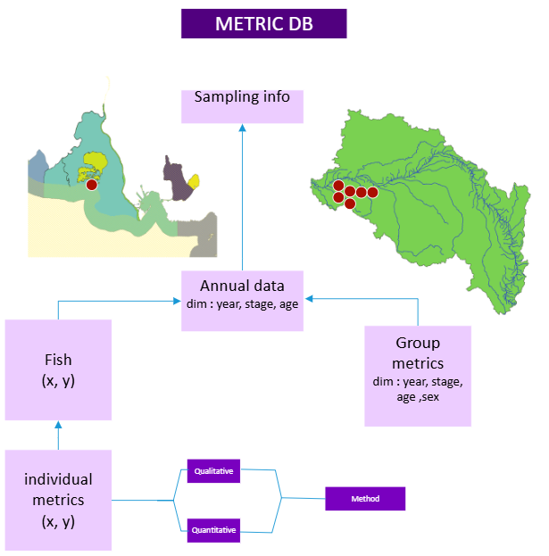{#fig-diad2}

In the wgeel database, two different data structure coexisted.

The first was developed initially to store data about the series used in recruitment data. In practice, it consisted of three tables, the `t_series_ser` (Figure @fig-series_diagram_wgeel - top in blue) table contains series id and description, with columns describing the sampling details, the stage used, the method... This was the main identifier of the series which was be used as a reference in all dependent tables. The second `t_dataseries_das` table  (Figure @fig-series_diagram_wgeel - on the right) held data about annual values in series. These were typically annual counts for recruitment, along with additional effort data. Linked to these were group metric series used to describe the series, mean age of eel, mean size, proportion of glass eel among the yellow eels, proportion of females ... (Figure @fig-series_diagram_wgeel - in orange)
Finally, individual metrics were all details for one fish. And they concerned metrics like size, weight, sex, but also can hold data about quality, contamination. So these are in essence the Life History traits analysed by WP2 in DIASPARA  (Figure @fig-series_diagram_wgeel - in pink).

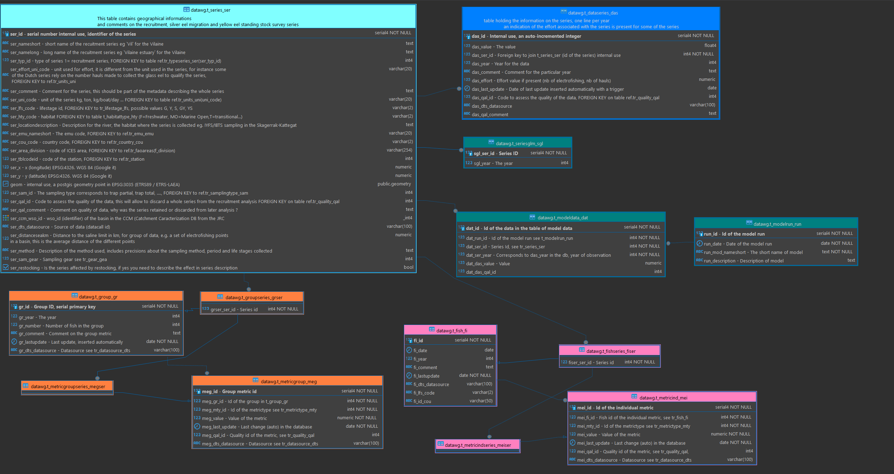{#fig-series_diagram_wgeel .lightbox}

The second type of data was developed to hold the data collected from the DCF. These were metrics collected from landings, data coming from the analysis of electrofishing data, or other experimental sampling that are not reported as series. Currently, sampling of commercial fisheries should be held in the RDBES, and any commercial sampling data in the WGEEL will be removed and replaced by a data
streaming from RDBES. The way to collect these data from the RDBES, and merge them with the actual trait data needs to be worked out in the future. 


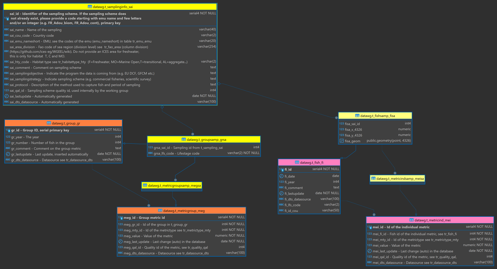{#fig-sampling_diagram_wgeel}

The difference in table structure is illustrated below in tables highlighted in yellow (Figure @fig-sampling_diagram_wgeel). 


In the WGEEL database, the two structures for series and sampling were very close, the only difference was that there was no annual number linked to the sampling data, and that they were not linked to a stage in the first table.
Since the two structures were very close, it was decided to merge them in a single dataset,
thereby simplifying the structure of the database for WGEEL. From this basis, the inclusion of data from the Trutta, and WP2 has been tested. So in practise, future data calls could support salmon data for the series and trait part of the database.


## Creating the station table

The trait data need to be related to sampling stations. See #


<details>

<summary>SQL code to create tables</summary>

``` {.sql include="../SQL/trait_01_StationDictionary.sql"}
```

</details>


Some of the constraints were adapted to enable the current loading of stations (issue 27)[https://github.com/ices-tools-prod/icesVocab/issues/27].
The following chunk creates a vocab with 14086 stations.


```{r ices_Station}
#| echo: TRUE
#| eval: FALSE
#| warning: FALSE
#| message: FALSE
#| code-fold: TRUE
#| code-summary: Code to import station

# tested 28/05/2025

library(icesStation)
system.time(
  station <- getListStation())
# user     system      spent
#    268.09        9.06     1402.47 
save(station, file = "data/station.Rdata")
# load(file = "data/station.Rdata")
initcap <- function(X) paste0(substring(X,1,1),tolower(substring(X,2, length(X))))


station <- station[station$Station_Name != 'TestBulkUload1',]
station$Station_Deprecated<- initcap(as.character(station$Station_Deprecated))

dbWriteTable(con_diaspara_admin, "temp_station", station, overwrite = TRUE)
dbExecute(con_diaspara_admin,'DELETE FROM "ref"."StationDictionary"')
dbExecute(con_diaspara_admin,'INSERT INTO "ref"."StationDictionary"
("Definition", 
"HeaderRecord", 
"Station_Code",
 "Station_Country",
 "Station_Name",
 "Station_LongName", 
"Station_ActiveFromDate", 
"Station_ActiveUntilDate",
 "Station_ProgramGovernance",
 "Station_StationGovernance", 
"Station_PURPM",
 "Station_DataType",
 "Station_WLTYP",
 "Station_MSTAT", 
"Station_Notes", 
"Station_Deprecated")
SELECT
"Definition", 
"HeaderRecord", 
"Station_Code"::INTEGER,
 "Station_Country",
 "Station_Name",
 "Station_LongName", 
"Station_ActiveFromDate", 
"Station_ActiveUntilDate",
 "Station_ProgramGovernance",
 "Station_StationGovernance", 
"Station_PURPM",
 "Station_DataType",
 "Station_WLTYP",
 "Station_MSTAT", 
"Station_Notes", 
"Station_Deprecated" 
 FROM temp_station') #14086
dbExecute(con_diaspara_admin, "DROP TABLE if exists temp_station")

```


```{r ices_Station_import}
#| echo: TRUE
#| eval: FALSE
#| warning: FALSE
#| message: FALSE
#| code-fold: TRUE
#| code-summary: Code to import station

# tested 28/05/2025

library(icesStation)
system.time(
  station <- getListStation())
#      user     system      spent
#    268.09        9.06     1402.47 
save(station, file = "data/station.Rdata")
# load(file = "data/station.Rdata")
initcap <- function(X) paste0(substring(X,1,1),tolower(substring(X,2, length(X))))


station <- station[station$Station_Name != 'TestBulkUload1',]
station$Station_Deprecated<- initcap(as.character(station$Station_Deprecated))

dbWriteTable(con_diaspara_admin, "temp_station", station, overwrite = TRUE)
dbExecute(con_diaspara_admin,'DELETE FROM "ref"."StationDictionary"')
dbExecute(con_diaspara_admin,'INSERT INTO "ref"."StationDictionary"
("Definition", 
"HeaderRecord", 
"Station_Code",
 "Station_Country",
 "Station_Name",
 "Station_LongName", 
"Station_ActiveFromDate", 
"Station_ActiveUntilDate",
 "Station_ProgramGovernance",
 "Station_StationGovernance", 
"Station_PURPM",
 "Station_DataType",
 "Station_WLTYP",
 "Station_MSTAT", 
"Station_Notes", 
"Station_Deprecated")
SELECT
"Definition", 
"HeaderRecord", 
"Station_Code"::INTEGER,
 "Station_Country",
 "Station_Name",
 "Station_LongName", 
"Station_ActiveFromDate", 
"Station_ActiveUntilDate",
 "Station_ProgramGovernance",
 "Station_StationGovernance", 
"Station_PURPM",
 "Station_DataType",
 "Station_WLTYP",
 "Station_MSTAT", 
"Station_Notes", 
"Station_Deprecated" 
 FROM temp_station') #14086
dbExecute(con_diaspara_admin, "DROP TABLE if exists temp_station")

```


:::{.callout-important appearance="simple"}
## Comment on Station import
Even though a table station exists in WGEEL, it really contains no actual code from ICES. 
To insert data into stations, the data providers will have to check that they have an EDMO code, and then we will have to bulk load stations.
:::


## Creating the version table refeel.tr_version_ver

<details>

<summary>SQL code to create table `refeel.tr_version_ver`</summary>

``` {.sql include="../SQL/trait_02_refeel_tr_version_ver.sql"}
```

</details>


This table is the same as in wgnas, it is inherited from ref. Currently working with inherited table will allow for more flexibility along the working groups, as foreign keys are refering to different tables - for instance stages for Salmon will be different from stages for eel. 


```{r }
#| label: refeel_tr_version_ver_insert
#| echo: TRUE
#| eval: FALSE
#| warning: FALSE
#| message: FALSE
#| code-fold: TRUE
#| code-summary: Code to insert values into the tr_version_ver table


# get the latest version from the server
ver <- dbGetQuery(con_wgeel_distant, "select * from ref.tr_datasource_dts")
save(ver, file= "data/tr_datasource_dts.Rdata")
ver <- ver[ver$dts_datasource != 'test',]
dc <- ver[grepl("dc", ver$dts_datasource), "dts_datasource"]
dcyear <- as.integer(lapply(strsplit(dc,"_"), function(X)X[2]))
wgeel <- ver[grepl("wgeel", ver$dts_datasource), "dts_datasource"]
wgeelyear <- as.integer(lapply(strsplit(wgeel,"_"), function(X)X[2]))
tr_version_ver <- data.frame(
  ver_code = paste0(rep("ANG-", 11),
                    c(wgeelyear, dcyear, 2025),c("-1","-2",rep("-1", 9))),
  ver_year = c(wgeelyear, dcyear, 2025,2025),
  ver_spe_code = "ANG",
  ver_datacalldoi=c(rep(NA, 10), 
                    "https://doi.org/10.17895/ices.pub.25816738.v2",
                    "https://doi.org/10.17895/ices.pub.25816738.v2",
                    "https://doi.org/10.17895/ices.pub.29254589"), 
  ver_stockkeylabel =c("ele.2737.nea"), 
  ver_version=c(1,2,rep(1,19),2), 
  ver_description=ver$dts_description) # 

DBI::dbWriteTable(con_diaspara_admin, "temp_tr_version_ver", tr_version_ver, 
                  overwrite = TRUE)
dbExecute(con_diaspara_admin, 
          "INSERT INTO refeel.tr_version_ver(ver_code,ver_year,ver_spe_code,
 ver_datacalldoi,ver_stockkeylabel,ver_version, ver_description) 
 SELECT ver_code,ver_year,ver_spe_code, ver_datacalldoi,
 ver_stockkeylabel,ver_version, ver_descriptio FROM temp_tr_version_ver;") # 5
DBI::dbExecute(con_diaspara_admin, "DROP TABLE temp_tr_version_ver;")


```


```{r}
#| label: tbl-version-refeel
#| echo: FALSE
#| eval: TRUE
#| warning: FALSE
#| message: FALSE
#| tbl-cap: Version

dbGetQuery(con_diaspara, "SELECT * FROM refeel.tr_version_ver;")|>
  knitr::kable()|>
  kable_styling(bootstrap_options = c("striped", "hover", "condensed"))

```

## series table t_series_ser


### Creating series main table for series


<details>

<summary>SQL code to create table `dat.t_series_ser` </summary>

``` {.sql include="../SQL/trait_10_dat_t_series_ser.sql"}
```

</details>

This table is inherited so the table created in dat will be empty, and will
only receive data by inheritance. It can be considered as a view for ICES (no 
inheritance in SQL server). The table will be replicated in each working group, and
there have specific foreign keys to tables that can be working group specific.

Since this table is inherited from dat.t_series_ser the wkg needs to be included. One table will be created per working group. These tables will be collated together.
Most details information about metadata will be in the metadata tables, either
to describe annual sampling or to describe individual trait collection.

<!-- HILAIRE : if this is a purely inherited table, with no specific data at all, then, why making it as a table and not a view? I don't get the benefit? -->
<!-- CEDRIC : In each schema, foreign keys refer to working group specific referential tables. This was handy for me, I don't know if ICES will choose to use the same code. -->

Monitoring stations (including fixed stations) that are used for recurring sampling or data collection are managed via the Station Code Request Application in ICES [@ices_vocab_2024].
This table will reference monitoring station but it might be NULL, as some sampling 
designs or data collection, for instance for the DCF, are not related to a station.

<!--
:::::: questionbox
:::: questionbox-header
::: questionbox-icon
:::

QUESTION ICES (Cédric via Teams meeting)
::::

::: questionbox-body
The ser_id might in some cases correspond to a fixed station but not only. For this reason 
the station is referenced here but another code will be created to reference the
sampling collection. Is this OK ?
:::
::::::


:::::: answerbox
:::: answerbox-header
::: answerbox-icon
:::

ANSWER ICES : Maria (20/05/2025)
::::

::: answerbox-body
Yes this makes sense,  I would advise 
to use both the stations and a unique identifier at the top. Using UUID will help
unicity there. It's not clear if it needs to 
be a vocabulary. 
There is a procedure to integrate stations, but for this we will probably do a bulk import.
:::
::::::


:::{.callout-note appearance="simple"}
## QUESTION to DIASPARA
I this that many of our series, and many of BAST or NAS would be related to fishways.
Shouldn't we need a fishway / fishway monitoring device vocab there ?
:::

:::{.callout-note appearance="simple"}
## QUESTION to WKEELDATA
Currently everything is in the same table, but it could be split by period
following exactly the station work. 
A description would then spans a limited amount of year from
date_begin to date_end. If the series description still hold the date_end is null.
If so we need to decide what fields could change over time (if any)
:::
-->

### Creating inherited series


<details>

<summary>SQL code to create table `dateel.t_series_ser`</summary>

``` {.sql include="../SQL/trait_11_dateel_t_series_ser.sql"}
```

</details>


### Import t_series_ser from wgeel

```{r refeel.t_series_ser_import}
#| echo: TRUE
#| eval: FALSE
#| warning: FALSE
#| message: FALSE
#| code-fold: TRUE
#| code-summary: Code to import to to refeel.tr_series_ser

res <- dbGetQuery(con_diaspara, "SELECT * FROM dateel.t_series_ser")
clipr::write_clip(colnames(res))

# temporarily remove area constraint

dbExecute(con_diaspara_admin, "ALTER TABLE dateel.t_series_ser drop constraint 
fk_ser_are_code")
dbExecute(con_diaspara_admin, "ALTER TABLE dateel.t_series_ser ALTER COLUMN  
ser_are_code DROP NOT NULL")
dbExecute(con_diaspara_admin, "ALTER TABLE dateel.t_series_ser ALTER COLUMN  
ser_cou_code DROP NOT NULL")
dbExecute(con_diaspara_admin, 
          "ALTER TABLE dateel.t_series_ser DROP CONSTRAINT uk_ser_name")

t_series_ser <-
  data.frame(
    "ser_id" = uuid::UUIDgenerate(n=nrow(ser)),
    "ser_code" = ser$ser_nameshort,
    "ser_name"  = ser$ser_namelong,
    "ser_spe_code" = "ANG",
    "ser_lfs_code" = ser$ser_lfs_code,
    "ser_are_code" = ser$ser_emu_nameshort,
    "ser_wkg_code" = "WGEEL",
    "ser_ver_code" = case_when(ser$ser_dts_datasource =="dc_2019" ~ "ANG-2019-1",
                               ser$ser_dts_datasource =="dc_2021" ~ "ANG-2021-1",
                               ser$ser_dts_datasource =="dc_2022" ~ "ANG-2022-1",
                               ser$ser_dts_datasource =="dc_2023" ~ "ANG-2023-1",
                               ser$ser_dts_datasource =="dc_2024" ~ "ANG-2024-1",
                               .default = "ANG-2018-1"),
    "ser_cou_code" = ser$ser_cou_code,
    "ser_hab_code" = NA,
    "ser_gea_code" = ser$gea_issscfg_code,
    "ser_fiw_code" = NA,
    "ser_mon_code" = NA,
    "ser_uni_code" = ser$ser_uni_code,
    "ser_effort_uni_code" = ser$ser_effort_uni_code,
    "ser_description" = ser$ser_comment,
    "ser_locationdescription" = ser$ser_locationdescription,
    "ser_wltyp_code" = case_when(ser$ser_hty_code == "T" ~ "T",
                                 ser$ser_hty_code == "C" ~ "MC",
                                 ser$ser_hty_code == "F" ~ "FW",
                                 ser$ser_hty_code == "MO" ~ "MO"),
    "ser_stocking" = ser$ser_restocking,
    "ser_stockingcomment" = NA,
    "ser_protocol" = ser$ser_method,
    "ser_samplingstrategy" = NA,
    "ser_datarightsholder" = NA,
    "ser_datelastupdate" = '2025-06-09',
    "geom" = ser$geom    
  )

res <- dbWriteTable(con_diaspara_admin, "t_series_ser_temp", 
                    t_series_ser, overwrite = TRUE)
dbExecute(con_diaspara_admin, "DELETE FROM  dateel.t_series_ser;")
dbExecute(con_diaspara_admin, "INSERT INTO dateel.t_series_ser 
SELECT 
 ser_id::uuid,
 ser_code,
 ser_name,
 ser_spe_code,
 ser_lfs_code,
 ser_are_code,
 ser_wkg_code,
 ser_ver_code,
 ser_cou_code,
 ser_hab_code,
 ser_gea_code,
 ser_fiw_code,
 ser_mon_code,
 ser_uni_code,
 ser_effort_uni_code,
 ser_description,
 ser_locationdescription,
 ser_wltyp_code,
 ser_stocking,
 ser_stockingcomment,
 ser_protocol,
 ser_samplingstrategy,
 ser_datarightsholder,
 ser_datelastupdate::date,
 geom
FROM t_series_ser_temp") # 294 

sai <- dbGetQuery(con_wgeel_distant, 
                  "SELECT sai.* FROM datawg.t_samplinginfo_sai sai;
")

t_series_ser2 <-
  data.frame(
    "ser_id" = uuid::UUIDgenerate(n=nrow(sai)),
    "ser_code" = sai$sai_id,
    "ser_name"  = sai$sai_name,
    "ser_spe_code" = "ANG",
    "ser_lfs_code" = NA,
    "ser_are_code" = NA, # TODO sai_emu_nameshort sai_area_division
    "ser_wkg_code" = "WGEEL",
    "ser_ver_code" = case_when(sai$sai_dts_datasource =="dc_2019" ~ "WGEEL-2019-1",
                               sai$sai_dts_datasource =="dc_2021" ~ "WGEEL-2021-1",
                               sai$sai_dts_datasource =="dc_2022" ~ "WGEEL-2022-1",
                               sai$sai_dts_datasource =="dc_2023" ~ "WGEEL-2023-1",
                               sai$sai_dts_datasource =="dc_2024" ~ "WGEEL-2024-1",
                               .default = "WGEEL-2018-1"),
    "ser_cou_code" = sai$sai_cou_code,
    "ser_hab_code" = NA,
    "ser_gea_code" = NA,
    "ser_fiw_code" = NA,
    "ser_mon_code" = NA,
    "ser_uni_code" = NA,
    "ser_effort_uni_code" = NA,
    "ser_description" = sai$sai_comment,
    "ser_locationdescription" = NA,
    "ser_wltyp_code" = case_when(sai$sai_hty_code == "T" ~ "T",
                                 sai$sai_hty_code == "C" ~ "MC",
                                 sai$sai_hty_code == "F" ~ "FW",
                                 sai$sai_hty_code == "MO" ~ "MO"),
    "ser_stocking" = NA,
    "ser_stockingcomment" = NA,
    "ser_protocol" = sai$sai_protocol,
    "ser_samplingstrategy" = sai$sai_samplingstrategy,
    "ser_datarightsholder" = NA,
    "ser_datelastupdate" = sai$sai_lastupdate,
    "geom" = NA # no geom in this table  
  )

res <- dbWriteTable(con_diaspara_admin, "t_series_ser_temp2", 
                    t_series_ser2, overwrite = TRUE)
dbExecute(con_diaspara_admin, "INSERT INTO dateel.t_series_ser 
SELECT 
 ser_id::uuid,
 ser_code,
 ser_name,
 ser_spe_code,
 ser_lfs_code,
 ser_are_code,
 ser_wkg_code,
 ser_ver_code,
 ser_cou_code,
 ser_hab_code,
 ser_gea_code,
 ser_fiw_code,
 ser_mon_code,
 ser_uni_code,
 ser_effort_uni_code,
 ser_description,
 ser_locationdescription,
 ser_wltyp_code,
 ser_stocking,
 ser_stockingcomment,
 ser_protocol,
 ser_samplingstrategy,
 ser_datarightsholder,
 ser_datelastupdate::date,
 NULL
FROM t_series_ser_temp2") # 252 

```

```{r}
#| label: tbl-dateel.t_series_ser
#| echo: FALSE
#| eval: TRUE
#| warning: FALSE
#| message: FALSE
#| code-fold: TRUE
#| code-summary: Code to show series table.
#| tbl-cap: Table t_series_ser for series first 20 lines
dbGetQuery(con_diaspara, "SELECT * FROM dateel.t_series_ser limit 20;")|>
  knitr::kable()|>
  kable_styling(bootstrap_options = c("striped", "hover", "condensed"))
```


## Annual series table

This table holds annual data from the series.

<details>

<summary>SQL code to create table `dat.t_serannual_san`</summary>

``` {.sql include="../SQL/trait_20_dat_t_serannual_san.sql"}
```

</details>


### Creating inherited table for annual series


<details>

<summary>SQL code to create tables `dateel.t_serannual_san`</summary>

``` {.sql include="../SQL/trait_21_dateel_t_serannual_san.sql"}
```

</details>


### Annual series (dateel.t_serannual_ser)

Data are imported from WGEEL `datawg.t_dataseries_das`table to `dateel.t_serannual_ser`.

```{r dateel.t_serannual_ser}
#| echo: TRUE
#| eval: FALSE
#| warning: FALSE
#| message: FALSE
#| code-fold: TRUE
#| code-summary: Code to import to dateel.t_serannual_ser

das0 <- dbGetQuery(con_wgeel_distant, "SELECT * FROM datawg.t_dataseries_das;
")

res <- dbGetQuery(con_diaspara, "SELECT * FROM dateel.t_serannual_san")
clipr::write_clip(colnames(res))

das0$das_dts_datasource[is.na(das0$das_dts_datasource)] <- "WGEEL-2016"
das0$das_dts_datasource <- 
  paste0(gsub(pattern = "dc_", replacement = "WGEEL-", 
              x= das0$das_dts_datasource), "-1")
das0$das_qal_id[is.na(das0$das_qal_id)] <- 1

nrow(das0) # 6523
das0 <- das0 |> filter(das0$das_qal_id <5)
nrow(das0) # 6402

ser <-  dbGetQuery(con_diaspara, 
                   "SELECT ser_id, ser_code FROM dateel.t_series_ser")
ser0 <- dbGetQuery(con_wgeel_distant, 
                   "SELECT ser_id, ser_nameshort as ser_code FROM datawg.t_series_ser ser;")

# adding ser_code to the series.
das <- das0 |> rename(ser_id = das_ser_id) |>
  inner_join(ser0) |> select(-ser_id) |> 
  inner_join(ser)
nrow(das) #6523

t_serannual_san_temp <-
  data.frame(
    "san_ser_id" = das$ser_id,
    "san_id" = das$das_id,
    "san_value"=das$das_value,
    "san_year" = das$das_year,
    "san_comment" = das$das_comment,
    "san_effort" = das$das_effort,
    "san_datelastupdate" = das$das_last_update,
    "san_qal_id" = das$das_qal_id,
    "san_qal_comment" = das$das_qal_comment,
    "san_wkg_code" = "WGEEL",
    "san_ver_code" = das$das_dts_datasource)


res <- dbWriteTable(con_diaspara_admin, "t_serannual_san_temp", 
                    t_serannual_san_temp, overwrite = TRUE)
dbExecute(con_diaspara_admin, "DELETE FROM  dateel.t_serannual_san;")
dbExecute(con_diaspara_admin, "INSERT INTO dateel.t_serannual_san 
SELECT 
    san_ser_id::uuid,
    san_id,
    san_value,
    san_year,
    san_comment,
    san_effort,
    san_datelastupdate,
    san_qal_id,
    san_qal_comment,
    san_wkg_code,
    san_ver_code 
FROM t_serannual_san_temp") # 6402

``` 


```{r}
#| label: tbl-dateel.t_serannual_san
#| echo: TRUE
#| eval: TRUE
#| warning: FALSE
#| message: FALSE
#| code-fold: TRUE
#| code-summary: Code to show series table.
#| tbl-cap: Table t_serannual_san for annual values  first 20 lines
dbGetQuery(con_diaspara, "SELECT * FROM dateel.t_serannual_san limit 20;")|>
  knitr::kable()|>
  kable_styling(bootstrap_options = c("striped", "hover", "condensed"))
```

## Creating table joining series and station

<!-- HILAIRE the benefit of using ICES stations is for easier integration with DATSU? might it be an option to ask them to release some contraints for continental stations? -->

The table is created but empty. We need the stations in ICES first.

<details>

<summary>SQL code to create table `dat.tj_seriesstation_ses`</summary>

``` {.sql include="../SQL/trait_12_dat.tj_seriesstation_ses.sql"}
```

</details>


### Creating inherited joining series and station


<details>

<summary>SQL code to create table `dateel.tj_seriesstation_ses`</summary>

``` {.sql include="../SQL/trait_13_dateel.tj_seriesstation_ses.sql"}
```

</details>

<!--
# Creating additional table for stock annex

## Creating table t_recruitmentmetadata

The code was developped during [WKEELDATA6](https://doi.org/10.17895/ices.pub.29290463)
Currently the table is not intended to be held in the db
There is still work to be done on the area referential for eel (starting summer 2025).
Some referentials are coming from the old db (emu, sampling type), and 
are currently not transfered.


<details>

<summary>SQL code to create table `dateel.t_recruitmentmetadata_met`</summary>

``` {.sql include="../SQL/trait_14_dateel_t_recruitmentmetadata_met.sql"}
```

</details>


```{r}
#| label: tbl-dateel.t_recruitmentmetadata_met
#| echo: FALSE
#| eval: TRUE
#| warning: FALSE
#| message: FALSE
#| code-fold: TRUE
#| code-summary: Code to show series metadata table.
#| tbl-cap: Table t_recruitmentmetadata_met for additional values collected during wkeeldata
dbGetQuery(con_diaspara, 
           "SELECT * FROM dateel.t_recruitmentmetadata_met limit 20;")|>
  knitr::kable()|>
  kable_styling(bootstrap_options = c("striped", "hover", "condensed"))
```

-->

## Creating group traits

Fish traits table aim to store information collected on individual fish. However, for various reasons, similar data are often collected and averaged on batches of individuals. We created a group trait to store those data

### Create group table

<!--
:::{.callout-note appearance="simple"}
## Note for group traits
Need a foreign key on both species and lfs code.
:::
-->

<details>

<summary>SQL code to create table `dat.t_group_gr`</summary>

``` {.sql include="../SQL/trait_22_dat_t_group_gr.sql"}
```
</details>

### Create group table for dateel

<details>

<summary>SQL code to create table `dateel.t_group_gr`</summary>

``` {.sql include="../SQL/trait_23_dateel_t_group_gr.sql"}
```

</details>

### Import data for group

The following scripts are used to import group trait from the two existing data formats, sampling and series. 


<details>

<summary>SQL code to Import data </summary>

``` {.sql include="../SQL/trait_24_dateel_t_group_gr_insert.sql"}
```

</details>


```{r}
#| label: tbl-dateel.t_group_gr
#| echo: FALSE
#| eval: TRUE
#| warning: FALSE
#| message: FALSE
#| code-fold: TRUE
#| code-summary: Code to show group table.
#| tbl-cap: Table t_group_gr, group related to annual values first 20 lines
dbGetQuery(con_diaspara, "SELECT * FROM dateel.t_group_gr limit 20;")|>
  knitr::kable()|>
  kable_styling(bootstrap_options = c("striped", "hover", "condensed"))
```

## Grouptrait table 

### Create table


<details>

<summary>SQL code to create tables `dat.t_grouptrait_grt` and `dateel.t_grouptrait_grt` </summary>

``` {.sql include="../SQL/trait_26_dat_t_grouptrait_grt.sql"}
```

</details>

### Import data 


<details>

<summary>SQL code to import data</summary>

``` {.sql include="../SQL/trait_27_dat_t_grouptrait_grt_import.sql"}
```

</details>

```{r}
#| label: tbl-dateel.t_grouptrait_grt
#| echo: FALSE
#| eval: TRUE
#| warning: FALSE
#| message: FALSE
#| code-fold: TRUE
#| code-summary: Code to show t_grouptrait_grt table.
#| tbl-cap: Table t_grouptrait_grt, group traits (t_grouptrait_grt)
dbGetQuery(con_diaspara, "SELECT * FROM dateel.t_grouptrait_grt limit 20;")|> 
  knitr::kable() |>
  kable_styling(bootstrap_options = c("striped", "hover", "condensed"))
```

## Creating ind traits 

### Fish table

<details>

<summary>SQL code to create tables `dat.t_fish_fi` and `dateel.t_fish_fi`</summary>

``` {.sql include="../SQL/trait_28_dat_t_fish_fi.sql"}
```

</details>

<details>

<summary>SQL code to import data tables</summary>

``` {.sql include="../SQL/trait_29_dat_t_fish_fi_insert.sql"}
```

</details>


```{r}
#| label: tbl-dateel.t_fish_fi
#| echo: FALSE
#| eval: TRUE
#| warning: FALSE
#| message: FALSE
#| code-fold: TRUE
#| code-summary: Code to show fish table.
#| tbl-cap: Table t_fish_fi, fish table
dbGetQuery(con_diaspara, "SELECT * FROM dateel.t_fish_fi limit 20;")|>
  knitr::kable()|>
  kable_styling(bootstrap_options = c("striped", "hover", "condensed"))
```

### Table t_indtrait_int

<details>

<summary>SQL code to create tables `dat.t_indivtrait_int` and `dateel.t_indivtrait_int` </summary>

``` {.sql include="../SQL/trait_30_dat_t_indivtrait_int.sql"}
```

</details>

<details>

<summary>SQL code to import individual trait tables</summary>

``` {.sql include="../SQL/trait_31_dat_t_indivtrait_int_insert.sql"}
```

</details>


```{r}
#| label: tbl-dateel.t_indivtrait_int
#| echo: FALSE
#| eval: TRUE
#| warning: FALSE
#| message: FALSE
#| code-fold: TRUE
#| code-summary: Code to show fish table.
#| tbl-cap: Table t_indivtrait_int, fish trait table
dbGetQuery(con_diaspara, "SELECT * FROM dateel.t_indivtrait_int limit 20;")|>
  knitr::kable()|>
  kable_styling(bootstrap_options = c("striped", "hover", "condensed"))
```


## WGBAST


### series table t_series_ser


#### Creating inherited series


<details>

<summary>SQL code to create table `dateel.t_series_ser`</summary>

``` {.sql include="../SQL/trait_40_datbast_t_series_ser.sql"}
```

</details>


#### Import t_series_ser from trutta database

```{r refeel.t_series_ser_import_trutta}
#| echo: TRUE
#| eval: FALSE
#| warning: FALSE
#| message: FALSE
#| code-fold: TRUE
#| code-summary: Code to import to to refeel.tr_series_ser

ser <- readxl::read_xlsx(file.path(datawd,
                                   "WGBAST_TRS_densities2024filled.xlsx"), sheet = "dane")
ser <- janitor::clean_names(ser)
ser <- ser[,1:9]
# res <- dbGetQuery(con_diaspara, "SELECT * FROM datbast.t_series_ser")
# clipr::write_clip(colnames(res))
riv <- dbGetQuery(con_diaspara_admin,
                  "SELECT are_code, riv_rivername  FROM refbast.tr_rivernames_riv 
                  JOIN refbast.tr_area_are on are_code = riv_are_code")
riv$riv = stringi::stri_trans_general(riv$riv_rivername, "latin-ascii")
ser$riv <-  stringi::stri_trans_general(ser$river, "latin-ascii")
ser <- ser |> inner_join(riv, by= join_by(riv))
# 584 on 10303 => 604 with stringi
# Need to add electrofishing types to gear
save(ser, file = "data/ser_wgbast.Rdata")
t_series_ser <-
  data.frame(
    "ser_id" = uuid::UUIDgenerate(n=nrow(ser)),
    "ser_code" = paste0(ser$country, "_", 
                        substr(stringi::stri_trans_general(ser$river, "latin-ascii"),1,4),"_P_TRS"),
    "ser_name"  = ser$river,
    "ser_spe_code" = "TRS",
    "ser_lfs_code" = "P",
    "ser_are_code" = ser$are_code,
    "ser_wkg_code" = "WGBAST",
    "ser_ver_code" = "WGBAST-2025-1",
    "ser_cou_code" = ser$country,
    "ser_hab_code" = NA, # TODO integrate habitats from eiunis https://eunis.eea.europa.eu/habitats-code-browser.jsp?expand=58,66,79,17#level_17
    "ser_gea_code" = '10.4', # electric fishing
    "ser_fiw_code" = NA,
    "ser_mon_code" = NA,
    "ser_uni_code" = "nr",
    "ser_effort_uni_code" = "nr/m2",
    "ser_description" = NA,
    "ser_locationdescription" = 
      paste0("main_river"=ser$main_river,", river = ",ser$river,",
     sub_div= ",ser$sub_div),
    "ser_wltyp_code" =  "FW",
    "ser_stocking" = NA,
    "ser_stockingcomment" = NA,
    "ser_protocol" = NA,
    "ser_samplingstrategy" = NA,
    "ser_datarightsholder" = NA,
    "ser_datelastupdate" = '2025-06-09' #,
    # geom
  )

res <- dbWriteTable(con_diaspara_admin, "t_series_ser_temp", 
                    t_series_ser, overwrite = TRUE)
dbExecute(con_diaspara_admin, "DELETE FROM  datbast.t_series_ser;")
dbExecute(con_diaspara_admin, "INSERT INTO datbast.t_series_ser 
SELECT distinct on (ser_code)
 ser_id::uuid,
 ser_code,
 ser_name,
 ser_spe_code,
 ser_lfs_code,
 ser_are_code::TEXT,
 ser_wkg_code,
 ser_ver_code,
 ser_cou_code,
 ser_hab_code,
 ser_gea_code,
 ser_fiw_code,
 ser_mon_code,
 ser_uni_code,
 ser_effort_uni_code,
 ser_description,
 ser_locationdescription,
 ser_wltyp_code,
 ser_stocking,
 ser_stockingcomment,
 ser_protocol,
 ser_samplingstrategy,
 ser_datarightsholder,
 ser_datelastupdate::date
FROM t_series_ser_temp") # 25 


```

The table t_series_ser contains an extract of the series. Only a few were joined when trying
to match the names. A data integration using the habitat referential would allow to 
integrate at sub basin level though maybe a table of subbasins (with geometries) would need to 
be created.

```{r}
#| label: tbl-datbast.t_series_ser
#| echo: FALSE
#| eval: TRUE
#| warning: FALSE
#| message: FALSE
#| code-fold: TRUE
#| code-summary: Code to show series table for wbast (this is just an example).
#| tbl-cap: Table t_series_ser for series first 20 lines
dbGetQuery(con_diaspara, "SELECT * FROM datbast.t_series_ser limit 20;")|> 
  knitr::kable()|>
  kable_styling(bootstrap_options = c("striped", "hover", "condensed"))
```

### Creating table joining series and station

The table is created but empty. We need the stations in ICES first.

<details>

<summary>SQL code to create table `datbast.tj_seriesstation_ses`</summary>

``` {.sql include="../SQL/trait_41_datbast.tj_seriesstation_ses.sql"}
```

</details>


### Creating inherited table for annual series


<details>

<summary>SQL code to create tables `datbast.t_serannual_san`</summary>

``` {.sql include="../SQL/trait_43_datbast_t_serannual_san.sql"}
```

</details>


### Import data for annual series 

Data are imported from the electrofishing trutta db to `datbast.t_serannual_ser`.
Data are structured not by stage but by age group.


```{r datbast.t_serannual_ser}
#| echo: TRUE
#| eval: FALSE
#| warning: FALSE
#| message: FALSE
#| code-fold: TRUE
#| code-summary: Code to import to datbast.t_serannual_ser

# start over from ser, previous chunk
load(file = "data/ser_wgbast.Rdata") #ser

ser0 <- dbGetQuery(con_diaspara_admin, "SELECT * FROM datbast.t_series_ser")
ser <- ser |> mutate(ser_code =  
                       paste0(ser$country, "_", substr(
                         stringi::stri_trans_general(ser$river, "latin-ascii"),1,4),"_P_TRS")) |>
  inner_join(ser0)

t_serannual_san_temp <-
  data.frame(
    "san_ser_id" = ser$ser_id,
    "san_id" = seq(along.with= ser$ser_id),
    "san_value"=ser$density_n_100m2,
    "san_year" = ser$year,
    "san_comment" = NA,
    "san_effort" = ser$number_of_sites,
    "san_datelastupdate" = Sys.Date(),
    "san_qal_id" = 1,
    "san_qal_comment" = NA,
    "san_wkg_code" = "WGBAST",
    "san_ver_code" = "WGBAST-2025-1",
    "san_agegroup" = ifelse(is.na(ser$age),"all",ser$age))


dbWriteTable(con_diaspara_admin, "t_serannual_san_temp", 
             t_serannual_san_temp, overwrite = TRUE)
dbExecute(con_diaspara_admin, "DELETE FROM  datbast.t_serannual_san;")
dbExecute(con_diaspara_admin, "INSERT INTO datbast.t_serannual_san 
SELECT 
    san_ser_id::uuid,
    san_id,
    san_value,
    san_year,
    san_comment,
    san_effort,
    san_datelastupdate,
    san_qal_id,
    san_qal_comment,
    san_wkg_code,
    san_ver_code,
    san_agegroup
FROM t_serannual_san_temp") # 604

``` 

:::{.callout-note appearance="simple"}
## Note for age
Here age needs to be part of a constraint, values are 0+, >0+ but all is necessary
to replace NULL.
:::

```{r}
#| label: tbl-datbast.t_serannual_san
#| echo: TRUE
#| eval: TRUE
#| warning: FALSE
#| message: FALSE
#| code-fold: TRUE
#| code-summary: Code to show series table.
#| tbl-cap: Table databast.t_serannual_san for annual values  first 20 lines
dbGetQuery(con_diaspara, "SELECT * FROM datbast.t_serannual_san limit 20;")|>
  knitr::kable()|>
  kable_styling(bootstrap_options = c("striped", "hover", "condensed"))
```


# Annex : Import data from WP2 

Here we import files from WP2, this section is meant to test the inclusion of salmon data in the database, the development is needed to test the format for salmon data.


## series table t_series_ser


### Creating inherited series


<details>

<summary>SQL code to create table `datnas.t_series_ser`</summary>

``` {.sql include="../SQL/trait_50_datnas_t_series_ser.sql"}
```

</details>


### Import t_series_ser example data (WP2)

```{r refnas.t_series_ser}
#| echo: TRUE
#| eval: FALSE
#| warning: FALSE
#| message: FALSE
#| code-fold: TRUE
#| code-summary: Code to import to to refnas.tr_series_ser

ser <- readxl::read_xlsx(file.path(datawd,
"../wgnas/burishoole.xlsx"),
sheet = "sampling_info",
col_types = c(rep("text",4),"numeric", rep("text", 8), rep("numeric", 2), "text")
)
# note I have manually added sai_x and sai_y to sampling_info
# below I'm getting the river code with a spatial query
ser <- ser[1:2,] 
ser <- st_as_sf(ser, coords = c("sai_x", "sai_y"), crs = 4326, remove = FALSE)

st_write(ser, con_diaspara, "series_temp")

temp = dbGetQuery(con_diaspara,
"SELECT * FROM series_temp join refnas.tr_area_are on 
          st_intersects(geometry, geom_polygon) WHERE
          are_lev_code = 'River'")$are_code

# Here check that we don't return two intersects or none (which might happen)

stopifnot(nrow(temp) == nrow(ser))
if (any(is.na(temp$are_code))) stop ("problem with projection, check location")


ser$are_code <- temp$are_code

# this was to get the name of the lfs code for name, I'm ignoring it currently
# stage = dbGetQuery(con_diaspara,
# "SELECT * FROM ref.tr_lifestage_lfs where lfs_spe_code = '127186'")

# ser$sai_lfs_code[ser$sai_lfs_code == 'S'] <- 'A'
# ser <- ser |> st_drop_geometry() |> left_join(stage|> select(lfs_code,lfs_name),
#  by = join_by(sai_lfs_code==lfs_code))

# create verion for diaspara
dbExecute(con_diaspara, "INSERT INTO refnas.tr_version_ver (ver_code,ver_year,ver_spe_code,ver_version,ver_description,ver_wkg_code)
	VALUES (
 'DIASPARA-2025-1',
 2025,
 'Salmo salar',
 1,
'WP2 data call for diaspara on LHT',
'WGNAS');"
)


# Need to add electrofishing types to gear
save(ser, file = "data/ser_burishoole.Rdata")
t_series_ser <-
data.frame(
"ser_id" = uuid::UUIDgenerate(n=nrow(ser)),
"ser_code" = ser$sai_name,
"ser_name"  = ser$sai_name,
"ser_spe_code" = "127186",
"ser_lfs_code" = ser$sai_lfs_code,
"ser_are_code" = ser$are_code, # got from spatial query
"ser_wkg_code" = "WGNAS",
"ser_ver_code" = "DIASPARA-2025-1",
"ser_cou_code" = ser$sai_cou_code,
"ser_hab_code" = NA, # TODO remove 
"ser_gea_code" = NA, # not used only monitoring
"ser_fiw_code" = NA,
"ser_mon_code" = "TR", -- both traps are TR, no fishway
"ser_uni_code" = "nr",
"ser_effort_uni_code" = NA,
"ser_description" = NA,
"ser_locationdescription" = NA, # TODO remove
"ser_wltyp_code" =  case_when(ser$sai_hty_code == "T" ~ "T",
ser$sai_hty_code == "C" ~ "MC",
ser$sai_hty_code == "F" ~ "FW",
ser$sai_hty_code == "MO" ~ "MO"),
"ser_stocking" = ser$"sai_riverorigin(0=reared,1=wild,2=mixed)" %in% c(0,2),
"ser_stockingcomment" = NA,
"ser_protocol" = ser$sai_protocol,
"ser_samplingstrategy" = ser$sai_samplingstrategy,
"ser_datarightsholder" = NA,
"ser_datelastupdate" = Sys.Date() #,
# geom
)

res <- dbWriteTable(con_diaspara, "t_series_ser_temp", 
t_series_ser, overwrite = TRUE)
dbExecute(con_diaspara_admin, "DELETE FROM  datnas.t_series_ser;")
dbExecute(con_diaspara_admin, "INSERT INTO datnas.t_series_ser 
SELECT distinct on (ser_code)
 ser_id::uuid,
 ser_code,
 ser_name,
 ser_spe_code,
 ser_lfs_code,
 ser_are_code::TEXT,
 ser_wkg_code,
 ser_ver_code,
 ser_cou_code,
 ser_hab_code,
 ser_gea_code,
 ser_fiw_code,
 ser_mon_code,
 ser_uni_code,
 ser_effort_uni_code,
 ser_description,
 ser_locationdescription,
 ser_wltyp_code,
 ser_stocking,
 ser_stockingcomment,
 ser_protocol,
 ser_samplingstrategy,
 ser_datarightsholder,
 ser_datelastupdate::date
FROM t_series_ser_temp") # 2


```

<!--
::: {.callout-note appearance="simple"}

## Notes to Viktor (WP2) :

Some of the columns (location, location description, protocol) will be removed 
from the exchange format currently developped with ICES as they cannot be standardized,
I'm keeping them
here while importing but in the future they will be in reports describing all the
series and attached to DOI.

For lifestages `S` spawner is `A` Adult 

The code of the area is the river.

:::


::: {.callout-caution appearance="simple"}

## TODO

Create Geom for x and Y

:::

-->


```{r}
#| label: tbl-datnas.t_series_ser
#| echo: TRUE
#| eval: TRUE
#| warning: FALSE
#| message: FALSE
#| code-fold: TRUE
#| code-summary: Code to show series table (burishoole example).
#| tbl-cap: Table datnas.t_series_ser first 20 lines
dbGetQuery(con_diaspara, "SELECT * FROM datnas.t_series_ser limit 20;")|>
  knitr::kable()|>
  kable_styling(bootstrap_options = c("striped", "hover", "condensed"))
```

### Import t_seriesannual_san

<details>

<summary> SQL code to create table `datnas.tj_seriesstation_ses`
</summary>

``` {.sql include="../SQL/trait_51_datnas.tj_seriesstation_ses.sql"}
```

</details>


## Creating inherited table for annual series


<details>

<summary>SQL code to create tables `datnas.t_serannual_san`</summary>

``` {.sql include="../SQL/trait_52_datnas_t_serannual_san.sql"}
```

</details>

::: {.callout-note appearance="simple"}

## Notes 

Currently there is no annual series in WP2 only group and individual traits,
 the the table is created but no import is done.

:::


## Creating group traits

### Create group table

:::{.callout-caution appearance="simple"}
## Note for group traits
Need a foreign key on both species and lfs code.
:::


## Create group table for datnas

<details>

<summary>SQL code to create table `datnas.t_group_gr`</summary>

``` {.sql include="../SQL/trait_53_datnas_t_group_gr.sql"}
```

</details>

### Import data for group


:::{.callout-caution appearance="simple"}
## Group traits
There are no group traits currently
:::


<details>

<summary>SQL code to create table `datnas.t_group_gr`</summary>

``` {.sql include="../SQL/trait_54_datnas_t_grouptrait_grt.sql"}
```

</details>


## Creating ind traits 


<details>

<summary>SQL code to import data tables</summary>

``` {.sql include="../SQL/trait_55_datnas_t_fish_fi.sql"}
```

</details>


```{r}
#| label: tbl-datnas.t_fish_fi
#| echo: FALSE
#| eval: TRUE
#| warning: FALSE
#| message: FALSE
#| code-fold: TRUE
#| code-summary: Code to show fish table.
#| tbl-cap: Table t_fish_fi, fish table
dbGetQuery(con_diaspara, "SELECT * FROM datnas.t_fish_fi limit 20;")|>
  knitr::kable()|>
  kable_styling(bootstrap_options = c("striped", "hover", "condensed"))
```


### Referential for numeric traits (refnas.tr_traitnumeric_trn)

<details>

<summary>SQL code to create table  `refnas.tr_traitnumeric_trn` </summary>

``` {.sql include="../SQL/trait_56_refnas_tr_traitnumeric_trn.sql"}
```

</details>


```{r}
#| label: refnas_tr_traitnumeric_trn_insert
#| echo: TRUE
#| eval: FALSE
#| warning: FALSE
#| message: FALSE
#| code-fold: TRUE
#| code-summary: Code to import numeric trait.

#tra <- dbGetQuery(con_diaspara, "SELECT * FROM ref.tr_traitnumeric_trn;")
# we will include group trait names later
# tra <- tra[tra$tra_id %in% c(1,2),]
# tra$tra_wkg_code <- "WGNAS"
# tra$tra_spe_code = "127186"


# df_to_tribble_code <- function(df) {
#   stopifnot(requireNamespace("tibble", quietly = TRUE))
  
  
#   cols <- names(df)
#   header <- paste0("tibble::tribble(\n  ~", paste(cols, collapse = ", ~"), ",\n")
  
#   row_lines <- apply(df, 1, function(row) {
#     vals <- Map(function(val) {
#       if (is.character(val)) {
#         dquote(val)
#       } else if (is.factor(val)) {
#         sprintf("%s", as.character(val))
#       } else if (is.logical(val)) {
#         ifelse(is.na(val), "NA", ifelse(val, "TRUE", "FALSE"))
#       } else if (is.numeric(val)) {
#         ifelse(is.na(val), "NA_real_", as.character(val))
#       } else if (inherits(val, "Date")) {
#         sprintf("as.Date("%s")", format(val, "%Y-%m-%d"))
#       } else if (inherits(val, "POSIXt")) {
#         sprintf("as.POSIXct("%s", tz = "%s")",
#                 format(val, "%Y-%m-%d %H:%M:%S"),
#                 attr(val, "tzone") %||% "UTC")
#       } else if (is.na(val)) {
#         "NA"
#       } else {
#         # Fallback to dput for unsupported types in a cell
#         paste(capture.output(dput(val)), collapse = "")
#       }
#     }, row)
#     paste0("  ", paste(vals, collapse = ", "), ",")
#   })
  
#   body <- paste(row_lines, collapse = "\n")
#   paste0(header, body, "\n)")
# }

# # Example
# library(tibble)
# df_to_tribble_code(tra)

tranum <- tibble::tribble(
  ~tra_id, ~tra_code, ~tra_description, ~tra_wkg_code, 
  ~tra_spe_code,  ~tra_indivorgroup, ~tra_qualitativeornumeric,
  ~trn_uni_code, ~trn_minvalue, ~trn_maxvalue,
  1, "Length_mm", 
  "Total body length in millimeters (mm) or mean total body length for group", 
  "WGNAS", "127186", "Both", "Numeric",
  "mm", NA, NA,
  2, "Weightg", "Weight (g) or mean weight for group", "WGNAS", 
  "127186", "Both", "Numeric",
  "g", NA, NA,
  3, "FreshwaterAge_year", 
  "Age at capture for juveniles or smolt age for adults in years. An individual aged in the same year as birth is 0.", 
  "WGNAS", "127186", "Both", "Numeric",
  "nr year", NA, NA,
  4, "SeaAge_year", 
  "Sea age at capture in years. Leave blank for juveniles.  An individual aged in the same year as its transition to salt water is 0", 
  "WGNAS", "127186", "Both", "Numeric", 
  "nr year", NA, NA,
  5, 
  "TotAge_year", 
  "Sea age at capture in years. Leave blank for juveniles. An individual aged in the same year as its transition to salt water is 0", 
  "WGNAS", "127186", "Both", "Numeric", 
  "nr year", NA, NA,  
  6, "ScalRad_mm", 
  "Scale reading radius in mm, if used provide a code for the ScalAnnCode method", 
  "WGNAS", "127186", "Individual", "Numeric", 
  "mm", NA, NA,  
  7, "Fec_negg", 
  "Fecundity in number of eggs", 
  "WGNAS", "127186", "Both", "Numeric",
   "nr", NA, NA,
  8, "Fec_uncertainty_sd",
  "Uncertainty in fecundity resulting from measures of egg samples. Standard deviation", 
  "WGNAS", "127186", "Both", "Numeric",
  "nr", NA, NA,
  9, "FemaleProportion", 
  "Proportion of female (in numbers) between 0 (all males) and 1 (all females).", 
  "WGNAS", "127186", "Group", "Numeric",
  )

tranum$trn_minvalue <- as.numeric(tranum$trn_minvalue)
tranum$trn_maxvalue <- as.numeric(tranum$trn_maxvalue)
dbWriteTable(con_diaspara_admin, "tr_traitnumeric_trn_temp", tranum, overwrite =TRUE)
dbExecute(con_diaspara_admin, "DELETE FROM refnas.tr_traitnumeric_trn")
dbExecute(con_diaspara_admin, "INSERT INTO refnas.tr_traitnumeric_trn(
tra_id,
tra_code,
tra_wkg_code,
tra_spe_code,
tra_description,
tra_indivorgroup,
trn_uni_code,
tra_qualitativeornumeric,
trn_minvalue,
trn_maxvalue)
SELECT 
tra_id,
tra_code,
tra_wkg_code,
tra_spe_code,
tra_description,
tra_indivorgroup,
trn_uni_code,
tra_qualitativeornumeric,
trn_minvalue::numeric,
trn_maxvalue::numeric
 FROM tr_traitnumeric_trn_temp") #8


```


```{r}
#| label: tbl-refnas.tr_traitnumeric_trn
#| echo: FALSE
#| eval: FALSE
#| warning: FALSE
#| message: FALSE
#| code-fold: TRUE
#| code-summary: Code to show trait numeric table.
#| tbl-cap: Quantitative parameters parameters
dbGetQuery(con_diaspara, "SELECT * FROM refnas.tr_traitnumeric_trn;") |>
  knitr::kable()|>
  kable_styling(bootstrap_options = c("striped", "hover", "condensed"))

```

<!--
:::{.callout-caution}
## Question for Viktor (WP2) ?
There is a method for winter measurement reading but no column to put the corresponding
data ? I'm not sure I understand. Do you have something you used ? 
Should it be a vector ?
:::


:::{.callout-caution}
## Question for Viktor (WP2) ?
Can you provide bounds for numeric values in the code above ?
:::

:::{.callout-note}
## Note Viktor (WP2) 
Currently you have two columns one juvenile_age which can be Smolt or juvenile age.
And then in group traits you have smolt age. 
I find it confusing. I'm proposing to call it a freshwater age.
Currently in the database the stage should never be null, so if it's a parr 
or a smolt the meaning would be different. Freshwater age for a smolt or and
adult is the smolt age.
:::
-->


### Referential for qualitative traits (refnas.tr_traitqualitative_trq)

<details>

<summary>SQL code to create table  `refnas.tr_traitqualitative_trq` </summary>

``` {.sql include="../SQL/trait_57_refnas_tr_traitqualitative_trq.sql"}
```

</details>


```{r}
#| label: refnas_tr_tr_traitqualitative_trq_insert
#| echo: TRUE
#| eval: FALSE
#| warning: FALSE
#| message: FALSE
#| code-fold: TRUE
#| code-summary: Code to import qualitative trait.

traqal <- tibble::tribble(
  ~tra_id, ~tra_code, ~tra_description, ~tra_wkg_code, 
  ~tra_spe_code,  ~tra_indivorgroup, ~tra_qualitativeornumeric,
  1, "Sex", 
  "Sex (F Female,H Hermaphordite, I Immature attempt made, M Male, T Transitional, U Undetermined no attempt made, X Mixed)", 
  "WGNAS", "127186", "Individual", "Qualitative",

  2, "AdiposeFinPresence", "Presence of adipose fin (0 = absent (reared), 1=present (wild))", "WGNAS", 
  "127186", "Individual", "Numeric"    
  )


dbWriteTable(con_diaspara_admin, "tr_traitqualitative_trq_temp", traqal, overwrite =TRUE)
dbExecute(con_diaspara_admin, "DELETE FROM refnas.tr_traitqualitative_trq")
dbExecute(con_diaspara_admin, "INSERT INTO refnas.tr_traitqualitative_trq(
tra_id,
tra_code,
tra_wkg_code,
tra_spe_code,
tra_description,
tra_indivorgroup,
tra_qualitativeornumeric
)
SELECT 
tra_id,
tra_code,
tra_wkg_code,
tra_spe_code,
tra_description,
tra_indivorgroup,
tra_qualitativeornumeric
 FROM tr_traitqualitative_trq_temp") #2

```


```{r}
#| label: tbl-refnas.tr_traitqualitative_trq
#| echo: FALSE
#| eval: TRUE
#| warning: FALSE
#| message: FALSE
#| code-fold: TRUE
#| code-summary: Code to show trait numeric table.
#| tbl-cap: Quantitative parameters parameters
dbGetQuery(con_diaspara, "SELECT * FROM refnas.tr_traitqualitative_trq;") |>
  knitr::kable()|>
  kable_styling(bootstrap_options = c("striped", "hover", "condensed"))

```

### Values of Qualitative fish trait (tr_traitvaluequal_trv)


<details>

<summary>SQL code to create tables `refnas.tr_traitvaluequal_trv` and `refeel.tr_traitvaluequal_trv`</summary>

``` {.sql include="../SQL/trait_58_refnas_tr_traitvaluequal_trv.sql"}
```
</details>


```{r tbl-refnas_tr_traitqualitative_trq}
#| echo: TRUE
#| eval: FALSE
#| warning: FALSE
#| message: FALSE
#| code-fold: TRUE
#| code-summary: Code to import trait values for qualitative parm.
#| tbl-cap: Table of possible qualitative trait values

#trve <- dbGetQuery(con_diaspara, "SELECT * FROM ref.tr_traitvaluequal_trv;")
trqn <- dbGetQuery(con_diaspara, "SELECT * FROM refnas.tr_traitqualitative_trq;")
#clipr::write_clip(colnames(trv))
trv <-  data.frame(
  "trv_id"=1:12,
  "trv_trq_code"=c(
    rep(trqn$tra_code[1],7),
    rep(trqn$tra_code[2],5)
    ),
  "trv_code"=c(
    c("F","I","M","T","U","X","H"), 
    c("Y","N","P","NA","U")
    ),
  "trv_description" = c(
    c("Female",
    "Immature - attempt made but sex could not be destinguished",
  "Male",
  "Transitional", 
  "Undetermined - no attempt made",
  "Mixed",
  "Hermaphrodite"
  ),
  c("Yes","No", "Probable","Not Applicable", "Unknown")
  ),
  "trv_spe_code" = "127186",
  "trv_wkg_code" = "WGNAS"
)
dbWriteTable(con_diaspara_admin, "tr_traitvaluequal_trv_temp", trv,
             overwrite =TRUE)
dbExecute(con_diaspara_admin, "DELETE FROM refnas.tr_traitvaluequal_trv");
dbExecute(con_diaspara_admin, "INSERT INTO refnas.tr_traitvaluequal_trv (
trv_id,
trv_trq_code,
trv_code,
trv_description,
trv_spe_code,
trv_wkg_code)
SELECT 
trv_id,
trv_trq_code,
trv_code,
trv_description,
trv_spe_code,
trv_wkg_code
 FROM tr_traitvaluequal_trv_temp;") #12

```

```{r}
#| label: tbl-refnas_tr_traitvalueqal_trv
#| echo: TRUE
#| eval: TRUE
#| warning: FALSE
#| message: FALSE
#| code-fold: TRUE
#| code-summary: Code to show trait value table.
#| tbl-cap: Values for qualitative parameters
dbGetQuery(con_diaspara, "SELECT * FROM refnas.tr_traitvaluequal_trv;") |>
  knitr::kable() |>
  kable_styling(bootstrap_options = c("striped", "hover", "condensed"))

```


### Referential for trait methods (refnas.tr_traitmethod_trm)


<details>

<summary>SQL code to create table  `refnas.tr_traitmethod_trm` </summary>

``` {.sql include="../SQL/trait_60_refnas_tr_traitmethod_trm.sql"}
```

</details>

```{r refnas_tr_traitmethod_trm_insert}
#| echo: TRUE
#| eval: FALSE
#| warning: FALSE
#| message: FALSE
#| code-fold: TRUE
#| code-summary: Code to import trait method.

trm <- tibble::tribble(
  ~trm_id, ~trm_code, ~trm_description, ~trm_wkg_code, 
  ~trm_spe_code,
  1, "GonadalInspection", 
  "Sex (F Female,H Hermaphordite, I Immature attempt made, M Male, T Transitional, U Undetermined no attempt made, X Mixed)", 
  "WGNAS", "127186", "Individual", "Qualitative",

  2, "PresenceAdiposeFin", "Presence of adipose fin (0 = absent (reared), 1=present (wild))", "WGNAS", 
  "127186", "Individual", "Numeric"    
  )

  6, 
  "ScalAnnCode", 
  "Scale reading annulus code for identifying the type of the corresponding scale radius measurement:
   0 means that the measurement corresponds to an annulus of the fish, 
   1 means salt water check (freshwater to saltwater transition) 
   and 2 means that the radius is a measurement from the center to the edge of the scale (radius at capture)", 
  "WGNAS", "127186", "Both", "Numeric", 

```


### Table t_indtrait_int

<details>

<summary>SQL code to create table  `datnas.t_indivtrait_int` </summary>

``` {.sql include="../SQL/trait_59_datnas_t_indivtrait_int.sql"}
```

</details>

```{r refnas.t_indivtrait_int}
#| echo: TRUE
#| eval: FALSE
#| warning: FALSE
#| message: FALSE
#| code-fold: TRUE
#| code-summary: Code to import to to refnas.t_indivtrait_int

ind <- readxl::read_xlsx(file.path(datawd,
"../wgnas/burishoole.xlsx"),
sheet = "new_individual_metrics",
col_types = c("text", "text", rep("date",2),"numeric", "text", rep("numeric",2),
 rep("text", 2), rep("numeric",8), "text", rep("numeric",3), 
 "text", rep("numeric",2), rep("text", 2))
) 
ind <- janitor::clean_names(ind)


st_write(ind, con_diaspara, "temp_ind")

temp = dbGetQuery(con_diaspara,
"SELECT * FROM temp_ind join datnas.t_series_ser on ser_code = sai_name")

stopifnot(nrow(ind)==nrow(temp))


# fi <- dbGetQuery(con_diaspara, 
# "SELECT * FROM datnas.t_fish_fi")
# paste(colnames(fi), collapse= ", ")
fi <- data.frame(
fi_ser_id =temp$ser_id, 
fi_wkg_code = temp$ser_wkg_code, 
fi_spe_code = temp$ser_spe_code, 
fi_lfs_code = case_when(temp$fi_lfs_code == "S" ~ "A",
is.na(temp$fi_lfs_code) ~ "SM"),
fi_date = temp$fi_datecapture, 
 fi_year = year(temp$fi_datecapture), 
 fi_comment = temp$fi_comment, 
 fi_lastupdate = today(), 
 fi_idsource = temp$fi_id_cou, 
 fi_ver_code = "DIASPARA-2025-1",
 fi_x_4326 = temp$fisa_x_4326, 
 fi_y_4326 = temp$fisa_y_4326)


dbWriteTable(con_diaspara,  "temp_fi", fi, overwrite =TRUE)

# create verion for diaspara
dbExecute(con_diaspara_admin, "INSERT INTO datnas.t_fish_fi (
fi_ser_id, fi_wkg_code, fi_spe_code, fi_lfs_code, fi_date, fi_year, 
fi_comment, fi_lastupdate, fi_idsource, fi_ver_code, fi_x_4326, fi_y_4326)
SELECT 
fi_ser_id::uuid, fi_wkg_code, fi_spe_code, fi_lfs_code, fi_date, fi_year, 
fi_comment, fi_lastupdate, fi_idsource, fi_ver_code, fi_x_4326, fi_y_4326 
from temp_fi")	# 2965

# process fi_geom

dbExecute(con_diaspara_admin, "UPDATE datnas.t_fish_fi set fi_geom = 
ST_SetSRID(ST_MakePoint(fi_x_4326, fi_y_4326),4326)") # 2965

t_series_ser <-
data.frame(
"ser_id" = uuid::UUIDgenerate(n=nrow(ser)),
"ser_code" = ser$sai_name,
"ser_name"  = ser$sai_name,
"ser_spe_code" = "127186",
"ser_lfs_code" = ser$sai_lfs_code,
"ser_are_code" = ser$are_code, # got from spatial query
"ser_wkg_code" = "WGNAS",
"ser_ver_code" = "DIASPARA-2025-1",
"ser_cou_code" = ser$sai_cou_code,
"ser_hab_code" = NA, # TODO remove 
"ser_gea_code" = NA, # electric fishing
"ser_fiw_code" = NA,
"ser_mon_code" = NA,
"ser_uni_code" = "nr",
"ser_effort_uni_code" = NA,
"ser_description" = NA,
"ser_locationdescription" = NA, # TODO remove
"ser_wltyp_code" =  case_when(ser$sai_hty_code == "T" ~ "T",
ser$sai_hty_code == "C" ~ "MC",
ser$sai_hty_code == "F" ~ "FW",
ser$sai_hty_code == "MO" ~ "MO"),
"ser_stocking" = ser$"sai_riverorigin(0=reared,1=wild,2=mixed)" %in% c(0,2),
"ser_stockingcomment" = NA,
"ser_protocol" = ser$sai_protocol,
"ser_samplingstrategy" = ser$sai_samplingstrategy,
"ser_datarightsholder" = NA,
"ser_datelastupdate" = Sys.Date() #,
# geom
)

res <- dbWriteTable(con_diaspara, "t_series_ser_temp", 
t_series_ser, overwrite = TRUE)
dbExecute(con_diaspara_admin, "DELETE FROM  datnas.t_series_ser;")
dbExecute(con_diaspara_admin, "INSERT INTO datnas.t_series_ser 
SELECT distinct on (ser_code)
 ser_id::uuid,
 ser_code,
 ser_name,
 ser_spe_code,
 ser_lfs_code,
 ser_are_code::TEXT,
 ser_wkg_code,
 ser_ver_code,
 ser_cou_code,
 ser_hab_code,
 ser_gea_code,
 ser_fiw_code,
 ser_mon_code,
 ser_uni_code,
 ser_effort_uni_code,
 ser_description,
 ser_locationdescription,
 ser_wltyp_code,
 ser_stocking,
 ser_stockingcomment,
 ser_protocol,
 ser_samplingstrategy,
 ser_datarightsholder,
 ser_datelastupdate::date
FROM t_series_ser_temp") # 2


```
<!--
::: {.callout-note appearance="simple"}

## Notes to Viktor (WP2) :

In the template there is a fi_daterelease. It's empty. Are you sure we need this ?

:::

::: {.callout-note appearance="simple"}

## Notes to Viktor (WP2) :

In the template there is a fi_tagnumber. 
Do you think the international database is
the place to hold information about the tag. 
Or should it be handled at the national level ?

:::
-->

```{r}
#| label: tbl-datnas.t_indivtrait_int
#| echo: FALSE
#| eval: FALSE
#| warning: FALSE
#| message: FALSE
#| code-fold: TRUE
#| code-summary: Code to show fish table.
#| tbl-cap: Table t_indivtrait_int, fish trait table
dbGetQuery(con_diaspara, "SELECT * FROM datnas.t_indivtrait_int limit 20;")|>
  knitr::kable()|>
  kable_styling(bootstrap_options = c("striped", "hover", "condensed"))
```


# Final diagram 


{#fig-ref .lightbox}


# Conclusions

A database was created for ICES working groups WGNAS, WGBAST, and WGEEL. It could easily
have a similar format for WGTRUTTA and other working groups working with diadromous fish species, such as lampreys and shads. It will allow for the integration of data call files using ICES DATSU and more generally, interoperable with 
other ICES processes (e.g. TAF), tools and databases (e.g. RDBES). The habitat database is currently
ported to RDBES and it has been proposed in RDBFIS to allow for the inclusion of data in the
continental part of the range for migratory fishes.

Starting with the creation of formats for metrics in the summer 2025, this database will progressively 
be handed over to ICES.
Since it was programmed in Postgres, some work will be required to match it with ICES SQL. 
In the long run, however, the use of a common database and ICES tools will:

1) simplify
the learning needs of experts and knowledge, when shifting between different diadromous expert and assessment groups,

2) allow to provide a more streamlined data flow between national and international level (e.g., data calls), and  enhance accessibility and interoperability, and

3) allow to benefit from further support from ICES Data Center and ensure the long term maintenance of the system

::: {.callout-caution appearance="simple"}
The shift to the new database will start in 2026 for WGEEL (metric DB) and
probably 2028 for WGNAS and WGBAST depending on ressources to make the change.
Changing from one database to another system will break links in the R codes used in the assessment groups, and the codes will will need to be reviewed. 
:::


::: {.callout-important appearance="simple"}
<h3> Breaking change for all working groups </h3>

From now on everywhere in the db: Atlantic salmon will be 127186 and eel 126281.


| spe_code | spe_commonname | 	spe_scientificname |
| ------| -------------| ----------------| 
|127186 |	Atlantic salmon |	Salmo salar |	
|126413 |	Twait shad |	Alosa alosa |	
|126415 |	Allis shad |	Alosa fallax |		
|101174 |	Sea lamprey |	Petromyzon marinus |
|101172 |	European river lamprey | Lampetra  fluviatilis |	
|126281 |	European eel |	Anguilla anguilla |
|127187 |	Sea trout |	Salmo trutta |	
:::


::: {.callout-warning  appearance="simple"}
<h3> Breaking change for WGEEL </h3>
To WGEEL values for quality, 3 (bad quality) and 4 (Warnings) have been inverted !
This means that all scripts will have to be adapted.
Also 2 (modified by wgeel becomes 5).
:::

::: {.callout-important appearance="simple"}
<h3>CREATE A STEERING GROUP IN WGDIAD</h3>
The most important vocabularies have been checked the working groups and a draft
of the stage referential has been created in ICES : [DIASPARA : Diadromous fish life stage \#885](https://github.com/ices-eg/DIG/issues/885).
However, as for some other new referential created in ICES, they will need to be validated. 
It was proposed during the final DIASPARA meeting 
that this steering group is created within WGDIAD to discuss these issues.
:::

# Acknowledgements and references

-  Data source : EuroGeographics and UN-FAO for countries
-  We would like to deeply thank ICES people, in particular Maria and Joana for 
their help, assistance when building the data structure and vocabularies, and 
also offer a special thank to Rui and Carlos for their support. 
